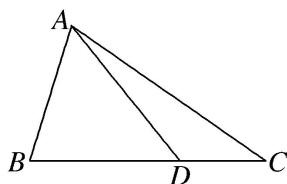

> [!faq]- 《专题8 多三角形问题-解三角形》例题解析
>
> > [!success]- **【答案】** 详见解析
>
> > [!note]- **【分析】**
> > 本题未单列分析。
>
> > [!note]- **【解析】**
> > (1)若 $\angle ADC = \frac{3\pi}{4}$ ，求 $AD$ 的长.
> > (2)若 $BD = 2DC$ ， $\triangle ACD$ 的面积为 $\frac{4}{3}\sqrt{2}$ ，求 $\frac{\sin\angle BAD}{\sin\angle CAD}$ 的值.
> > 
> > 解析 (1) 在 $\triangle ABC$ 中， $\because \cos B = \frac{1}{3}, \therefore \sin B = \frac{2\sqrt{2}}{3}.$ $\because \angle ADC = \frac{3\pi}{4}, \therefore \angle ADB = \frac{\pi}{4}.$
> > 在 $\triangle ABD$ 中，由正弦定理可得 $\frac{AD}{\frac{2\sqrt{2}}{3}} = \frac{2}{\frac{\sqrt{2}}{2}}, \therefore AD = \frac{8}{3}$ .
> > (2) $\because BD=2DC,\triangle ACD$ 的面积为 $\frac{4}{3}\sqrt{2},\therefore S_{\triangle ABC}=3S_{\triangle ACD}$ ，则 $4\sqrt{2}=\frac{1}{2}\times2\times BC\times\frac{2\sqrt{2}}{3}$
> > $\therefore BC = 6, DC = 2.$ $\therefore$ 由余弦定理得 $AC = \sqrt{4 + 36 - 2\times 2\times 6\times\frac{1}{3}} = 4\sqrt{2}.$
> > 由正弦定理可得 $\frac{4}{\sin\angle BAD} = \frac{2}{\sin\angle ADB},\therefore \sin \angle BAD = 2\sin \angle ADB.$
> > 又 $\because \frac{2}{\sin\angle CAD} = \frac{4\sqrt{2}}{\sin\angle ADC},\therefore \sin \angle CAD = \frac{\sqrt{2}}{4}\sin \angle ADC.\because \sin \angle ADB = \sin \angle ADC,\therefore \frac{\sin\angle BAD}{\sin\angle CAD} = 4\sqrt{2}.$
> > ## 【对点训练】
