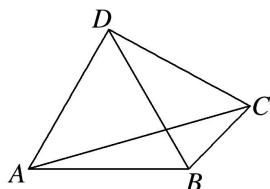

> [!faq]- 《专题8 多三角形问题-解三角形》例题解析
>
> > [!success]- **【答案】** 详见解析
>
> > [!note]- **【分析】**
> > 本题未单列分析。
>
> > [!note]- **【解析】**
> > (1)求证： $BC = 4\cos \angle CBD$
> > (2)点 C 移动时，判断 CD 是否为定长，并说明理由.
> > 
> > 4. 解析 (1) 在 $\triangle ABC$ 中, $AB = 2$ , $\angle ACB = 30^{\circ}$ , 由正弦定理可知, $\frac{BC}{\sin \angle BAC} = \frac{2}{\sin 30^{\circ}}$ , 所以 $BC = 4\sin \angle BAC$ . 又 $\angle ABD = 60^{\circ}$ , $\angle ACB = 30^{\circ}$ , 则 $\angle BAC + \angle CBD = 90^{\circ}$ , 则 $\sin \angle BAC = \cos \angle CBD$ , 所以 $BC = 4\cos \angle CBD$ .
> > (2) $CD$ 为定长, 因为在 $\triangle BCD$ 中, 由(1)及余弦定理可知,
> > $CD^{2}=BC^{2}+BD^{2}-2\times BC\times BD\times\cos\angle CBD=BC^{2}+4-4BC\cos\angle CBD=BC^{2}+4-BC^{2}=4$ ，所以 CD=2.
