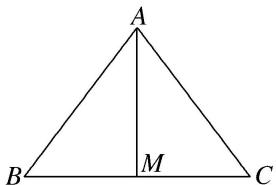

<!-- question-source:start -->
[例 1]在 $\triangle ABC$ 中，内角 A, B, C 的对边分别为 a, b, c，若 $b^{2}+c^{2}-a^{2}=bc$ .

(1)求角 A 的大小;

(2)若 $a = \sqrt{3}$ ，求 $BC$ 边上的中线 $AM$ 的最大值.

(1)由 $b^{2} + c^{2} - a^{2} = bc$ 及余弦定理，得 $\cos A = \frac{b^2 + c^2 - a^2}{2bc} = \frac{bc}{2bc} = \frac{1}{2}$ ，又 $0 < A < \pi$ ， $\therefore A = \frac{\pi}{3}$ .

(2)∵AM是BC边上的中线，∴BM=CM= $\frac{\sqrt{3}}{2}$ ，∴在△ABM中， $AM^{2}+\frac{3}{4}-2AM\cdot\frac{\sqrt{3}}{2}\cdot\cos\angle AMB=c^{2}$ ，①

在 $\triangle ACM$ 中， $AM^2 +\frac{3}{4} -2AM\cdot \frac{\sqrt{3}}{2}\cdot \cos \angle AMC = b^2$ ，②

又 $\angle AMB = \pi - \angle AMC, \therefore \cos \angle AMB = -\cos \angle AMC,$ 即 $\cos \angle AMB + \cos \angle AMC = 0,$

则①+②整理得 $AM^{2}=\frac{b^{2}+c^{2}}{2}-\frac{3}{4}$ . 又 $a=\sqrt{3}$ , $A=\frac{\pi}{3}$ , $\therefore b^{2}+c^{2}-3=bc\leq\frac{b^{2}+c^{2}}{2}$ ,

$\therefore b^{2} + c^{2}\leq 6,\therefore AM^{2} = \frac{b^{2} + c^{2}}{2} -\frac{3}{4}\leq \frac{9}{4},$ 即 $AM\leq \frac{3}{2},\therefore BC$ 边上的中线 $AM$ 的最大值为 $\frac{3}{2}$
<!-- question-source:end -->

![[高中/总复习/专题/解三角形/专题9 三角形中的最值(范围)问题-解三角形/考点02_三角形中与边或周长有关的最值_范围_/例题/answers/Q00044960A1.md]]
