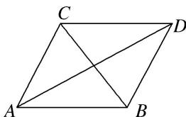

<!-- question-source:start -->
5. 如图，平面四边形 $ABDC$ 中， $\angle CAD = \angle BAD = 30^\circ$ .

(1)若 $\angle ABC=75^{\circ}$ ， $AB=10$ ，且 $AC//BD$ ，求 $CD$ 的长；

(2)若 $BC = 10$ ，求 $AC + AB$ 的取值范围.

<!-- question-source:end -->

![[高中/总复习/专题/解三角形/专题9 三角形中的最值(范围)问题-解三角形/考点02_三角形中与边或周长有关的最值_范围_/对点训练/answers/Q00044969A1.md]]
