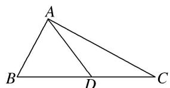

> [!faq]- 《专题9 三角形中的最值(范围)问题-解三角形》例题解析
>
> > [!success]- **【答案】** 详见解析
>
> > [!note]- **【分析】**
> > 本题未单列分析。
>
> > [!note]- **【解析】**
> > (1)若 $\cos \angle ADC = -\frac{\sqrt{2}}{10}, \angle B = \frac{\pi}{4}$ , 且 $AB = DC = 7$ , 求 $AC$ 的长;
> > (2)若 $\angle B = \frac{\pi}{6}$ , $AC = 2\sqrt{5}$ , 求 $\triangle ABC$ 面积的最大值.
> > 
> > 6. 解析
> > (1) 因为 $\cos \angle ADC = -\frac{\sqrt{2}}{10}$ , 所以 $\cos \angle ADB = \cos (\pi - \angle ADC) = -\cos \angle ADC = \frac{\sqrt{2}}{10}$ ,
> > 所以 $\sin \angle ADB = \frac{7\sqrt{2}}{10}$ 。在 $\triangle ABD$ 中，由正弦定理，得 $AD = \frac{AB \cdot \sin \angle B}{\sin \angle ADB} = \frac{7 \times \frac{\sqrt{2}}{2}}{\frac{7\sqrt{2}}{10}} = 5$
> > 所以在 $\triangle ACD$ 中，由余弦定理，得
> > $$
> > A C = \sqrt {A D ^ {2} + D C ^ {2} - 2 A D \cdot D C \cos \angle A D C} = \sqrt {5 ^ {2} + 7 ^ {2} - 2 \times 5 \times 7 \times \left(- \frac {\sqrt {2}}{1 0}\right)} = \sqrt {7 4 + 7 \sqrt {2}}.
> > $$
> > (2)在 $\triangle ABC$ 中，由余弦定理，得
> > $$
> > A C ^ {2} = 2 0 = A B ^ {2} + B C ^ {2} - 2 A B \cdot B C \cos \angle B = A B ^ {2} + B C ^ {2} - \sqrt {3} A B \cdot B C \geq (2 - \sqrt {3}) A B \cdot B C,
> > $$
> > 所以 $AB\cdot BC\leq \frac{20}{2 - \sqrt{3}} = 40 + 20\sqrt{3}$ ，所以 $S_{\triangle ABC} = \frac{1}{2} AB\cdot BC\sin \angle B\leq 10 + 5\sqrt{3},$
> > 所以 $\triangle ABC$ 面积的最大值为 $10+5\sqrt{3}$ .
