<!-- source-part:1 pages:1-200 -->

# 高考数学 培优40讲

# 函数与导数

## 内容简介

《高考数学培优 40 讲》针对高考数学中的重难点内容,分为四个分册:函数与导数;解析几何;三角、向量、数列、不等式与复数;立体几何与概率统计.全套书用高观点的视角、联系变化的眼光分析问题,洞悉问题背后的本质,达到“万理归一,大道至简”的境界.

本书为“函数与导数”分册,重点研究函数性质与思想、函数形态处理策略、导数三大主要问题,丰富的方法和技巧贯穿始末,精彩纷呈.本书适合数学成绩优秀的学生挑战高分甚至满分使用,也适合高中数学教师、高考数学研究者,以及广大数学爱好者参考使用.

本书封面贴有清华大学出版社防伪标签、封底贴有刮刮卡，无标签和刮刮卡者不得销售。

版权所有,侵权必究.举报:010-62782989,beiqinquan@tup.tsinghua.edu.cn.

图书在版编目(CIP)数据

高考数学培优 40 讲. 函数与导数/张永辉主编. — 北京: 清华大学出版社, 2022.12

ISBN 978-7-302-62221-5

I. ①高…
II. ①张…
III. ①中学数学课—高中—升学参考资料
IV. ①G634.603

中国版本图书馆 CIP 数据核字(2022)第 226429 号

责任编辑: 汪 操

封面设计:常雪影

责任校对:王淑云

责任印制: 沈露

出版发行:清华大学出版社

网址:http://www.tup.com.cn,http://www.wqbook.com

地址:北京清华大学学研大厦 A 座 邮编:100084

社总机:010-83470000

邮购:010-62786544

投稿与读者服务:010-62776969, c-service@tup.tsinghua.edu.cn

质量反馈:010-62772015, zhiliang@tup.tsinghua.edu.cn

印装者:三河市龙大印装有限公司

经销:全国新华书店

开 本:210mm×285mm

印 张:19

字 数:401 千字

版次:2022年12月第1版

印 次:2022年12月第1次印刷

定 价:69.00元

产品编号:098179-01

# 《高考数学培优 40 讲》编委会

主 编

张永辉

副主编

张宏卫 余臣

编委

彭剑平 章世骏 蒋新峰 高艳山 张喜金 李拴柱

何龙 董家兴 周逸飞 于明辉 孙光磊 黄垠超

袁 志 颜亚冰 张 潇 李明红 赵晓翠 李艳丽

## 前言

《高考数学培优 40 讲》是一套诞生于新高考时代,面向数学培优的教辅作品.

自 2017 年教育部实行新课程标准以来,我国高中数学的教学和考试发生了根本性的变化.新课程标准明确提出将“学科素养”作为培养人、选拔人的最重要指标,无论是教学还是考试都贯穿“基础性、综合性、创新性和应用性”四大特征,这意味着未来的数学考题,将从偏重经验归纳,转向加强思维品质考查,加强考查思维的灵活性,发挥数学学科的高考选拔功能.如何在教学中渗透对数学思维的培养?这对广大教师和学生提出了新的要求.

2019 年起新教材在部分省市被陆续使用. 由于各地教学规划不同, 近几年出现了新教材新高考、老教材老高考、新教材老高考等多种教学现状, 这无疑进一步增加了教学备考的复杂度. 与此同时, 数学高考也从过去的多省市独自命题, 逐步转向教育部统一命题. 随着山东省、江苏省、浙江省等一大批高考强省陆续加入全国卷的队伍, 高考大军竞争异常激烈.

在过去的两年中,我们团队的老师们深入全国10多个省份,陆续为接近100所重点高中作了300多场数学培优讲座.在与广大一线师生的交流中,很多教师最关心的问题就是:“未来高考会怎么考,我们的数学课堂该如何教,高考培优应该讲什么?”由此可见,在新的时代背景下,如何能组织好教学过程,真正的培养出国家需要的人才让学生具备较高的数学素养进而在高考中脱颖而出,成为了最核心的问题.

这套书最大的亮点就是完全出自教学实践。由于我们的课程是面向数学功底较好的学生开展进行，所以在300多场讲座中经历了无数次教师和学生之间、学生和学生之间的思想交锋。甚至在一些互动交流过程中，出现了学生和老师分成不同阵营，相互辩论的场面。而每一次的交流辩论都让我们更加接近数学解题的本质，更加明白数学培优课程应该讲什么、怎么讲。所以书中的内容既包含了团队老师的辛勤付出，也包含了很多一线教师和数学尖子生的集体智慧。综上所述，本套图书的内容不是一蹴而就的，它经历了原创研发——教学实践——反思优化，再教学实践——反思优化……这样一个又一个的轮回，在这样螺旋式上升的迭代过程中，内容的质量与实用性都达到了我们前所未有的高度。

本套图书的另一大亮点便是其深邃的思想性,主要体现在以下几个方面:

## 1. 启迪智慧, 知所以然

好的教育永远都不是告知,而是启发引导.在本套讲义的编写过程中充分尊重了这一规律,例如通过分而治之的策略拆分函数实现不等式证明时,我们没有止步于题目本身的解答,而是设置了一系列的问题进行反思,甚至陪同读者一起走过错路与弯路,在知识的探索与内化过程中,这些都是必经之路,通过抛出一系列的问题,引导学生的思维步步深入,达到知其然也知其所以然的境界.

## 2. 深入本质, 返璞归真

比勤奋更重要的是深度思考的能力,在纷繁复杂的题目背后抽丝剥茧或追本溯源以接近问题的本质,这是数学精神,也是在书中带领并帮助读者习得的一项能力.例如在解析几何的开篇,讲义一针见血地点明了数与形的辩证关系,即以形助数和以数化形,抓住这一本源如同获取一把钥匙.大道至简,衍化至繁,本套图书一直在通往道的层面上前进不息.

## 3. 引申触类, 远见卓识

在学习过程中,有纵向的“深”与横向的“伸”两个维度,本书兼顾这两个维度并加以挖掘和拓展.在许多例题后面设置了探究总结等版块,引申出了更多的定理与推论,它们将带领读者进入一个更广阔的领域.

## 4. 高数视角, 知己知彼

会当凌绝顶,一览众山小.当我们身处高一级的层面,再反观原有的层面时,我们会发现问题的布局或背景等原来看不到的事物.本书中有的内容,例如泰勒展开、极点极线等专题就是在高等数学的视角下来俯视问题,进入命题人的思维,这样真是知己知彼,百战不殆.

《高考数学培优 40 讲》共含《函数与导数》《解析几何》《三角、向量、数列、不等式与复数》以及《立体几何与概率统计》四本分册。从初稿到出版，我们不断在教学实践中调整、完善，历经了四个版本的迭代，积极采纳各方意见，数易其稿。同时，为了满足部分尖子生的学习需要，我们在内容编写的过程中，有选择的加入了一定比例的清北强基考试题目。这部分题目与高考题目相结合，呈现出更加完整且富于变化的知识体系，对培养数学思维能力和综合能力大有裨益。

在本书的创作过程中,团队的老师们付出了很多,感谢张宏卫、余臣、孙光磊、李艳丽、张潇等各位老师的不懈努力,也感谢清华大学出版社给予的大力支持.

路漫漫其修远兮，吾将上下而求索。

在追求教学创新和培优精进的道路上, 注定没有尽头. 限于编写水平有限, 书中错漏难免. 欢迎各位读者帮我们纠正错误, 我们也将在后续版本中不断修订、调整.

张永辉

2022年8月

## 目录

第1讲 函数的性质及延拓 …… 1
1.1 对称性及延拓 …… 2
1.2 单调性及延拓 …… 6
1.3 周期性及延拓 …… 10
训练 1 …… 16

第2讲 函数的图像及延拓 …… 18
2.1 函数图像的变换 …… 19
2.2 等高线问题 …… 21
2.3 含参函数零点问题 …… 25
2.4 复合函数零点问题 …… 30
2.5 分段函数零点问题 …… 33
训练 2 …… 34

第3讲 函数构造与函数方程思想 …… 36
函数构造 …… 37
3.1 转化等量关系 …… 37
3.2 转化不等关系 …… 40
函数与方程思想 …… 42
3.3 函数思想 …… 42
3.4 方程思想 …… 43
训练 3 …… 46

第4讲 三次函数的图像与性质 …… 47
4.1 三次函数的图像 …… 48
三次函数的性质 …… 49
4.2 对称性 …… 49
4.3 切线问题 …… 54
4.4 等分面积 …… 56

4.5 单调性与最值 …… 58
三次函数的零点问题…… 60
4.6 极值点与零点 …… 60
4.7 韦达定理与判别式 …… 63
训练 4 …… 65
第5讲 含指数、对数函数形式的变形技巧 …… 66
单一含有指数或对数函数不等式的变形技巧…… 67
5.1 指数找朋友，对数单独走…… 67
含有 $\ln x, e^x$ 混合形式的不等式的变形技巧…… 70
5.2 从数与形看变形转化 …… 70
5.3 凹凸反转 …… 72
5.4 设而不求隐零点 …… 78
5.5 切线放缩 …… 82
5.6 指数对数同构 …… 86
训练 5 …… 90
第6讲 导数中含有三角函数形式的处理策略…… 93
6.1 借助导数研究三角函数性质 …… 94
6.2 “三看”原则 …… 95
6.3 含三角函数不等式的证明 …… 100
6.4 三角函数不等式恒成立问题 …… 107
训练 6 …… 111
第7讲 函数中含绝对值形式的问题探究 …… 114
7.1 函数中含绝对值形式的最值问题 …… 115
7.2 函数中含绝对值形式的参数取值范围问题 …… 122
训练 7 …… 126
第8讲 函数零点问题的研究 …… 128
8.1 插值法 …… 129
分类讨论结合放缩法 …… 132
8.2 含参指数型函数的零点赋值 …… 132
8.3 含参对数型函数的零点赋值 …… 138
8.4 含参三角型函数的零点赋值 …… 143
训练 8 …… 145

第9讲 导数中的不等式恒成立问题的解题策略 …… 148
9.1 分离自变量与参变量…… 149
9.2 不分离自变量与参变量…… 155
训练9 …… 173

第10讲 极值点偏移问题的深度研究…… 175
10.1 极值点偏移与拐点偏移 …… 176
10.2 非常规类型极值点偏移问题 …… 183
10.3 极值点偏移问题的加强 …… 188
10.4 切割线的放缩与应用 …… 190
训练10 …… 193

第11讲 导数中双变量问题的处理策略…… 195
11.1 主元变更法 …… 196
11.2 韦达定理法 …… 199
11.3 同构法 …… 200
11.4 参数法 …… 203
训练11 …… 221

第12讲 泰勒展开在高考压轴题中的应用…… 224
12.1 求解不等式 …… 225
12.2 估值计算 …… 238
训练12 …… 240

第13讲 导数中常见的放缩与估值…… 241
13.1 基本不等式放缩 …… 242
13.2 指数、对数、三角函数不等式放缩 …… 244
13.3 几何放缩 …… 248
13.4 估值分析 …… 250
训练13 …… 255

参考答案 …… 257

![[高中/总复习/专题/高考数学培优40讲/高考数学培优40讲-01-函数与导数/第1讲_函数的性质及延拓/第1讲_函数的性质及延拓.md]]
![[高中/总复习/专题/高考数学培优40讲/高考数学培优40讲-01-函数与导数/第2讲_函数的图像及延拓/第2讲_函数的图像及延拓.md]]
![[高中/总复习/专题/高考数学培优40讲/高考数学培优40讲-01-函数与导数/第3讲_函数构造与函数方程思想/第3讲_函数构造与函数方程思想.md]]
![[高中/总复习/专题/高考数学培优40讲/高考数学培优40讲-01-函数与导数/第4讲_三次函数的图像与性质/第4讲_三次函数的图像与性质.md]]
![[高中/总复习/专题/高考数学培优40讲/高考数学培优40讲-01-函数与导数/第5讲_含指数_对数函数形式的变形技巧/第5讲_含指数_对数函数形式的变形技巧.md]]
![[高中/总复习/专题/高考数学培优40讲/高考数学培优40讲-01-函数与导数/第6讲_导数中含有三角函数形式的处理策略/第6讲_导数中含有三角函数形式的处理策略.md]]
![[高中/总复习/专题/高考数学培优40讲/高考数学培优40讲-01-函数与导数/第7讲_函数中含绝对值形式的问题探究/第7讲_函数中含绝对值形式的问题探究.md]]
![[高中/总复习/专题/高考数学培优40讲/高考数学培优40讲-01-函数与导数/第8讲_函数零点问题的研究/第8讲_函数零点问题的研究.md]]
![[高中/总复习/专题/高考数学培优40讲/高考数学培优40讲-01-函数与导数/第9讲_导数中的不等式恒成立问题的解题策略/第9讲_导数中的不等式恒成立问题的解题策略.md]]
![[高中/总复习/专题/高考数学培优40讲/高考数学培优40讲-01-函数与导数/第10讲_极值点偏移问题的深度研究/第10讲_极值点偏移问题的深度研究.md]]
![[高中/总复习/专题/高考数学培优40讲/高考数学培优40讲-01-函数与导数/第11讲_导数中双变量问题的处理策略/第11讲_导数中双变量问题的处理策略.md]]
![[高中/总复习/专题/高考数学培优40讲/高考数学培优40讲-01-函数与导数/第12讲_泰勒展开在高考压轴题中的应用/第12讲_泰勒展开在高考压轴题中的应用.md]]
![[高中/总复习/专题/高考数学培优40讲/高考数学培优40讲-01-函数与导数/第13讲_导数中常见的放缩与估值/第13讲_导数中常见的放缩与估值.md]]
![[高中/总复习/专题/高考数学培优40讲/高考数学培优40讲-01-函数与导数/参考答案/参考答案.md]]

## 训练 1

1. 【解析】如图所示, 因为 $f(x)$ 是偶函数, 所以 $f(-x) = f(x)$ , 又 $f(x)$ 的图像关于点 $(1,0)$ 对称, 所以 $f(x)$ 是 $T = 4$ 的周期函数. 当 $x \in [0,1]$ 时, $f(x) = 2 - 2^x$ , 如图所示, 则 $f(0) = 1$ , $f(1) = f(-1) = f(3) = 0$ , $f(2) = -f(0) = -1$ . 所以 $f(0) + f(1) + f(2) + f(3) = 0$ , 即 $f(0) + f(1) + \cdots + f(2022) = 0 \times 505 + f(0) + f(1) + f(2) = 0$ . 故选 C.

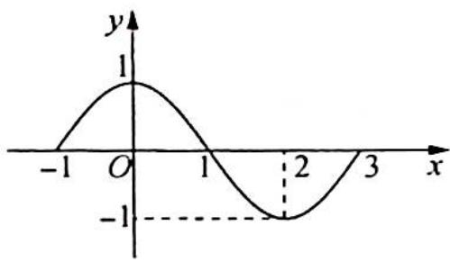

2.【解析】 $\frac{f(x_{1})-f(x_{2})}{x_{1}-x_{2}}> - 1$ ，等价于 $\frac{\left[f(x_{1})+x_{1}\right]-\left[f(x_{2})+x_{2}\right]}{x_{1}-x_{2}}>0$ 。令 $g(x)=f(x)+x$ ，即 $\frac{g(x_{1})-g(x_{2})}{x_{1}-x_{2}}>0$ ，故 $g(x)$ 在R上单调递增。由 $f(1)=1$ ，则原不等式等价于 $f(\log_{2}|3^{x}-1|)+\log_{2}|3^{x}-1|<2=f(1)+1$ ，即 $g(\log_{2}|3^{x}-1|)<g(1)$ 。

由 $g(x)$ 的单调性可知 $\log_{2}|3^{x}-1|<1$ ，即 $0<|3^{x}-1|<2$ ，解得 x<1 且 $x\neq0$ 。故选 D.

3.【解析】 $y=x^{2}-4x+3$ 的对称轴是x=2，该函数在 $(-∞,0]$ 上单调递减，所以 $y=x^{2}-4x+3≥3$ 。同样可知函数 $y=-x^{2}-2x+3$ 在 $(0,+∞)$ 上单调递减，所以 $y=-x^{2}-2x+3<3$ 。即 $f(x)$ 在R上单调递减。
由 $f(x+a)>f(2a-x)$ 可得 $x+a<2a-x$ ，即 a>2x 在 $[a,a+1]$ 上恒成立，所以 $2(a+1)<a$ ，解得 a<-2。故选 A.

4.【解析】令 $f(x)=x-\mathrm{e}^{5-x}$ ，函数单调递增，又 $f(a)=f(2+\ln b)=0$ ，结合单调性可知 $a=2+\ln b$ 。 $a=\mathrm{e}^{5-a}\Rightarrow\ln a=5-a$ ，代入 $a=2+\ln b$ ，则 $5-\ln a=2+\ln b\Rightarrow\ln ab=3\Rightarrow ab=\mathrm{e}^{3}$ 。故选 C.

5.【解析】因为 $f(x)$ 是 R 上的偶函数，且当 x>0 时， $f(x)$ 是单调函数，则由 $f\left(\frac{x+3}{x+4}\right)=f(x)$ ，可得 $|x|=\left|\frac{x+3}{x+4}\right|\Rightarrow(x^{2}+4x)^{2}=(x+3)^{2}\Rightarrow(x^{2}+5x+3)(x^{2}+3x-3)=0$ ，于是 $x^{2}+5x+3=0$ 或 $x^{2}+3x-3=0$ 。不妨设方程 $x^{2}+5x+3=0$ 的两根为 $x_{1}, x_{2}$ ，则 $x_{1}+x_{2}=-5$ ；方程 $x^{2}+3x-3=0$ 的两根为 $x_{3}, x_{4}$ ，则 $x_{3}+x_{4}=-3$ ，即 $x_{1}+x_{2}+x_{3}+x_{4}=-8$ 。故选 C。

6.【解析】考查抽象函数的性质.

令 $y = 1$ ，得 $4f(x)f(1) = f(x + 1) + f(x - 1) = f(x)$ ，因此 $f(x + 2) + f(x) = f(x + 1)$ ，则 $f(x + 2) + f(x - 1) = 0$ ，即 $f(x + 3) = -f(x),f(x + 6) = -f(x + 3) = f(x)$ ，函数 $f(x)$ 的周期 $T = 6.$ 令 $x = 1,y = 0$ ，得 $4f(1)f(0) = 2f(1)$ ，故 $f(0) = 2f(1) = \frac{1}{2}$

又由函数 $f(x)$ 的最小正周期 $T = 6, f(2020) = f(336 \times 6 + 4) = f(4) = f(3) - f(2) = f(2) - f(1)$ $f(2) = -f(1) = -\frac{1}{4}$ . 故选 BCD.

7.【分析】以原点为中心,作 $x < 0$ 时函数图像的中心对称图形,有两个友情点对,说明对称后的图像和 $x \geqslant 0$ 时函数图像有两个交点,再进一步转化为 $a = -\frac{x}{\mathrm{e}^{x}}$ 有两个解即可.

【解析】根据题意,若要求“友情点对”,可把 x<0 时的函数图像关于原点对称,研究对称过去的图像和 $x \geqslant 0$ 时的图像有两交点即可.

$y=ax^{2}(x<0)$ 关于原点对称的解析式为 $y=-ax^{2}(x>0)$ ，考查 $y=\frac{x^{3}}{\mathrm{e}^{x}}$ 的图像和 $y=-ax^{2}(x>0)$ 的交点，可得 $\frac{x^{3}}{\mathrm{e}^{x}}=-ax^{2},a=-\frac{x}{\mathrm{e}^{x}}$ . 令 $g(x)=-\frac{x}{\mathrm{e}^{x}}$ ，则 $g'(x)=\frac{x-1}{\mathrm{e}^{x}}$ .

所以当 $x \in (0,1)$ 时， $g'(x) < 0$ ， $g(x)$ 为减函数；当 $x \in (1, +\infty)$ 时， $g'(x) > 0$ ， $g(x)$ 为增函数， $g(x)_{\min} = g(1) = -\frac{1}{e}$ ，其图像如图所示。

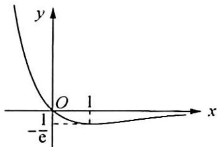

若要 $a = -\frac{x}{\mathrm{e}^x}$ 有两解，只要 $-\frac{1}{\mathrm{e}} < a < 0$ 即可，故实数 $a$ 的取值范围是 $\left(-\frac{1}{\mathrm{e}}, 0\right)$ .

8.【解析】显然 $f(x)$ 是 R 上的偶函数, 打开绝对值符号可画出 $f(x)$ 的图像, 如图所示. 可以看出, 当 x > 0 时, $f(x)$ 单调递增, 则由 $f(a^{2} - 3a + 2) = f(a - 1)$ , 得 $\left|a^{2} - 3a + 2\right| = \left|a - 1\right|$ ①.

由式①可得 $(a^2 - 4a + 3)(a^2 - 2a + 1) = 0$ ，于是 $a^2 - 4a + 3 = 0$ 或 $a^2 - 2a + 1 = 0$ ，因为 $a^2 - 4a + 3 = 0$ 得两根 $a_1 = 1, a_2 = 3, a^2 - 2a + 1 = 0$ 得两根 $a_3 = 1, a_4 = 1$ ，因此满足 $|a^2 - 3a + 2| = |a - 1|$ 的 $a$ 只有 $a = 3, a = 1$ .

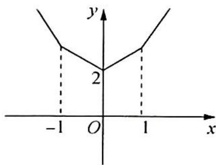

综上所述,满足条件的 a 之和为 $3+1=4$ .

9.【分析】函数迭代问题的常用方法是归纳法,或用数列求通项的方法,主要考查函数的周期性. 【解析】解法一:根据题意,得

$$
f _ {1} (x) = \frac {1 + \sqrt {3} x}{\sqrt {3} - x}; f _ {2} (x) = \frac {1 + \sqrt {3} \left(\frac {1 + \sqrt {3} x}{\sqrt {3} - x}\right)}{\sqrt {3} - \frac {1 + \sqrt {3} x}{\sqrt {3} - x}} = \frac {\sqrt {3} + x}{1 - \sqrt {3} x};
$$

$$
f _ {3} (x) = \frac {1 + \sqrt {3} \left(\frac {\sqrt {3} + x}{1 - \sqrt {3} x}\right)}{\sqrt {3} - \left(\frac {\sqrt {3} + x}{1 - \sqrt {3} x}\right)} = - \frac {1}{x}; f _ {4} (x) = \frac {1 + \sqrt {3} \left(- \frac {1}{x}\right)}{\sqrt {3} - \left(- \frac {1}{x}\right)} = \frac {x - \sqrt {3}}{1 + \sqrt {3} x};
$$

$$
f _ {5} (x) = \frac {1 + \sqrt {3} \left(\frac {x - \sqrt {3}}{1 + \sqrt {3} x}\right)}{\sqrt {3} - \left(\frac {x - \sqrt {3}}{1 + \sqrt {3} x}\right)} = \frac {\sqrt {3} x - 1}{\sqrt {3} + x}; f _ {6} (x) = \frac {1 + \sqrt {3} \left(\frac {\sqrt {3} x - 1}{\sqrt {3} + x}\right)}{\sqrt {3} - \left(\frac {\sqrt {3} x - 1}{\sqrt {3} + x}\right)} = x,
$$

所以 $f_{n + 6}(x) = f_n(x), T = 6$ ，即 $f_{2023}(2023) = f_1(2023) = \frac{1 + 2023\sqrt{3}}{\sqrt{3} - 2023}$ . 故选 D.

解法二: $f(x)=\frac{1+\sqrt{3}x}{\sqrt{3}-x}=\frac{\frac{\sqrt{3}}{3}+x}{1-\frac{\sqrt{3}}{3}x}=\tan\left(\frac{\pi}{6}+\theta\right)$ (构造函数).

令 $x = \tan \theta$ ，则 $T = \pi = \frac{\pi}{6} \times 6$ ，故 $f_{n+6}(x) = f_n(x)$ ，所以 $T = 6, f_{2023}(2023) = f_1(2023) = \frac{1 + 2023\sqrt{3}}{\sqrt{3} - 2023}$ . 故选D.

解法三：设数列 $\{a_{n}\}$ 中， $a_0 = x,a_1 = \frac{1 + \sqrt{3}x}{\sqrt{3} - x},a_{n + 1} = \frac{1 + \sqrt{3}a_n}{\sqrt{3} - a_n}$ ，则 $f_{2023}(x) = a_{2023}$

一次分式递推数列常用不动点法求解通项公式, 令 $f(x)=x$ , 得 $x^{2}=-1$ , 无实数根.

由 $x^{2} = -1$ ，得 $x = \pm \mathrm{i}$ （i为虚数单位），则 $\left\{ \begin{array}{l}a_{n + 1} + \mathrm{i} = \frac{1 + \sqrt{3}a_n}{\sqrt{3} - a_n} +\mathrm{i} = \frac{(\sqrt{3} - \mathrm{i})(a_n + \mathrm{i})}{\sqrt{3} - a_n}\\ a_{n + 1} - \mathrm{i} = \frac{1 + \sqrt{3}a_n}{\sqrt{3} - a_n} -\mathrm{i} = \frac{(\sqrt{3} + \mathrm{i})(a_n - \mathrm{i})}{\sqrt{3} - a_n} \end{array} \right.$

两式相除, 可得 $\frac{a_{n+1} + \mathrm{i}}{a_{n+1} - \mathrm{i}} = \frac{\sqrt{3} - \mathrm{i}}{\sqrt{3} + \mathrm{i}} \cdot \frac{a_n + \mathrm{i}}{a_n - \mathrm{i}} = \left(\frac{1}{2} - \frac{\sqrt{3}}{2}\mathrm{i}\right) \cdot \frac{a_n + \mathrm{i}}{a_n - \mathrm{i}}$ , 所以 $\left\{\frac{a_n + \mathrm{i}}{a_n - \mathrm{i}}\right\}$ 是以 $\frac{a_1 + \mathrm{i}}{a_1 - \mathrm{i}}$ 为首项, $\frac{1}{2} - \frac{\sqrt{3}}{2}\mathrm{i}$ 为公比的等比数列, 则 $\frac{a_n + \mathrm{i}}{a_n - \mathrm{i}} = \frac{a_1 + \mathrm{i}}{a_1 - \mathrm{i}} \cdot \left(\frac{1}{2} - \frac{\sqrt{3}}{2}\mathrm{i}\right)^{n-1}, n \in \mathbb{N}^*$ , $\frac{a_{2023} + \mathrm{i}}{a_{2023} - \mathrm{i}} = \frac{a_1 + \mathrm{i}}{a_1 - \mathrm{i}} \cdot \left(\frac{1}{2} - \frac{\sqrt{3}}{2}\mathrm{i}\right)^{2022}$ .

又 $\left(\frac{1}{2} -\frac{\sqrt{3}}{2}\mathrm{i}\right)^6 = 1,2022 = 6\times 337$ ，所以 $\frac{a_{2023} + \mathrm{i}}{a_{2023} - \mathrm{i}} = \frac{a_1 + \mathrm{i}}{a_1 - \mathrm{i}},a_{2023} = a_1 = \frac{1 + \sqrt{3}x}{\sqrt{3} - x}$ 则 $f_{2023}(2023) =$ $f_{1}(2023) = \frac{1 + 2023\sqrt{3}}{\sqrt{3} - 2023}.$ 故选D.

10.【分析】大数原理一般与函数的周期性相关,又 $f(x)$ 为偶函数,所以考虑引入 $f(-x)$ .

【解析】解法一: 因为 $f(x)$ 是定义在 R 上的偶函数, 所以 $f(x)$ 的图像关于 y 轴对称, 且

$$
f (1 - x) = \frac {1}{2} + \sqrt {f (- x) - f ^ {2} (- x)} = \frac {1}{2} + \sqrt {f (x) - f ^ {2} (x)} = f (1 + x).
$$

故函数 $f(x)$ 的图像关于直线 x=1 轴对称, 所以 $f(x)$ 是 T=2 的周期函数, 则

$$
f \left(\frac {2 0 2 3}{2}\right) = f \left(1 0 1 2 - \frac {1}{2}\right) = f \left(- \frac {1}{2}\right) = f \left(\frac {1}{2}\right).
$$

由已知有 $f\left(1 - \frac{1}{2}\right) = \frac{1}{2} +\sqrt{f\left(-\frac{1}{2}\right) - f^2\left(-\frac{1}{2}\right)} = \frac{1}{2} +\sqrt{f\left(\frac{1}{2}\right) - f^2\left(\frac{1}{2}\right)}$ ，解得 $f\left(\frac{1}{2}\right) = \frac{2 + \sqrt{2}}{4},$ $f\left(\frac{1}{2}\right) = \frac{2 - \sqrt{2}}{4} <  \frac{1}{2} (\text{舍去})$ ，所以 $f\left(\frac{2023}{2}\right) = \frac{2 + \sqrt{2}}{4}.$

解法二:本题也可以考虑特殊函数,即常数函数 $f(x)=c$ 也符合题意.

故只需求解不动点 $c = \frac{1}{2} +\sqrt{c - c^2}$ ，解得 $c = \frac{1}{2} +\frac{\sqrt{2}}{4}$ 或 $c = \frac{1}{2} -\frac{\sqrt{2}}{4}$ （舍去），所以 $f(x) = \frac{1}{2} +\frac{\sqrt{2}}{4}$ 符合

题意, 可得 $f\left(\frac{2023}{2}\right)=\frac{2+\sqrt{2}}{4}$ .

## 训练 2

1.【分析】由已知得 $F(x)$ 关于 x=2 对称，再由 $f(x)$ 关于 x=1 对称，可得 $g(x)=x^{2}-ax+b$ 关于 x=3 对称，且 $f(1)=g(3)$ ，得 a=6, b=9。作出 $F(x)$ 图像，得出 $m\in(0,1)$ ，表示 $|BC|\cdot m=2m-2m\sqrt{m}$ ，根据函数的性质可求得答案。

【解析】由 $F(x)=F(4-x)$ 可得， $F(x)$ 关于 x=2 对称，因为 $f(x)=x^{2}-2x+1$ ，

所以 $f(x)$ 关于 x=1 对称，即 $g(x)=x^{2}-ax+b$ 关于 x=3 对称，且 $f(1)=g(3)$ ，得 a=6, b=9。 $F(x)$ 图像如图所示，则 $m\in(0,1)$ ， $x_{B}=1+\sqrt{m}$ ， $x_{C}=3-\sqrt{m}$ ，所以 $|BC|\cdot m=2m-2m\sqrt{m}$ 。

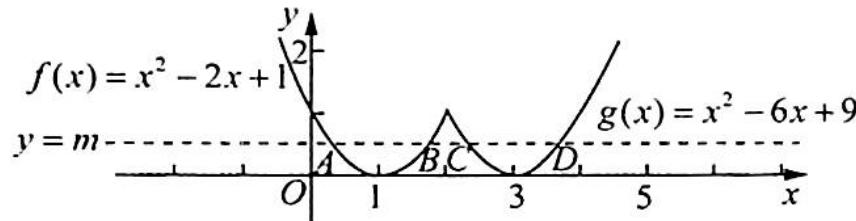

令 $t = \sqrt{m}\in (0,1)$ ，则 $\vert BC\vert \cdot m = 2t^2 -2t^3$ ；令 $h(t) = 2t^{2} - 2t^{3}$ ，则 $h^{\prime}(t) = 4t - 6t^{2} = 2t(2 - 3t).$

由 $h^{\prime}(t) > 0$ 得 $0 < t < \frac{2}{3}$ ; 由 $h^{\prime}(t) < 0$ 得 $\frac{2}{3} < t < 1$ , 所以 $h(t)$ 在 $\left(0, \frac{2}{3}\right)$ 上单调递增, 在 $\left(\frac{2}{3}, 1\right)$ 上单调递减, 即 $h(t)_{\max} = h\left(\frac{2}{3}\right) = \frac{8}{27}, g(t) \in \left(0, \frac{8}{27}\right]$ . 故选 A.

2.【分析】作出函数图像,可得 $x_{2}+x_{3}=2$ ,且 $0<x_{2}<1$ ,将 $\frac{x_{2}f(x_{1})}{x_{2}+x_{3}}$ 化简为关于 $x_{2}$ 的函数即可求出.

【解析】作出函数图像如图所示.

观察图像可得 $\frac{x_2 + x_3}{2} = 1$ ，即 $x_{2} + x_{3} = 2$ ，且 $0 <   x_{2} <   1$ ，则

$$
\frac {x _ {2} f (x _ {1})}{x _ {2} + x _ {3}} = \frac {x _ {2} f (x _ {2})}{2} = \frac {x _ {2} | x _ {2} - 1 |}{2} = - \frac {1}{2} x _ {2} ^ {2} + \frac {1}{2} x _ {2}.
$$

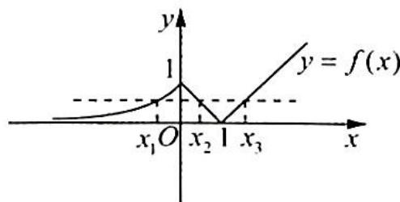

因为 $0 < x_{2} < 1$ ，所以 $0 < -\frac{1}{2} x_{2}^{2} + \frac{1}{2} x_{2} \leqslant \frac{1}{8}$ ，即 $\frac{x_{2} f(x_{1})}{x_{2} + x_{3}}$ 的取值范围为 $\left(0, \frac{1}{8}\right]$ . 故选 A.

3.【解析】解法一:当 $x \in [-2, -1)$ 时, $f(x) = x + 2$ ; 当 $x \in [-1, 0]$ 时, $f(x) = -x$ ; 又当 $x > 0$ 时, $f(x) = 2f(x - 2)$ , 所以函数 $f(x)$ 在 $[-2, 4]$ 的图像如图所示.

函数 $g(x) = f(x) - x - 2m + 1$ 在区间 $[-2,4]$ 内有3个零点，所以函数 $y = f(x)$ 与 $y = x + 2m - 1$ 在区间 $[-2,4]$ 内有3个不同交点，

由图像可得 $2m - 1 = 1$ 或 $-2 < 2m - 1 < 0$ ，即 $m = 1$ 或 $-\frac{1}{2} < m < \frac{1}{2}$ 故选D.

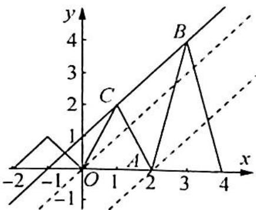

解法二: 令 $F(x)=f(x)-x=\left\{\begin{aligned}&\frac{|x^{2}-1|}{x-1}+1-x,&-2\leqslant x\leqslant0\\&2f(x-2)-x,&x>0\end{aligned}\right.$

即 $F(x)=\left\{\begin{aligned}&2,&-2\leqslant x\leqslant-1\\&-2x,&-1<x\leqslant0\\&x,&0<x\leqslant1\\&-3x+4,&1<x\leqslant2\\&3x-8,&2<x\leqslant3\\&-5x+16,&3<x\leqslant4\end{aligned}\right.$ ，其图像如图所示.

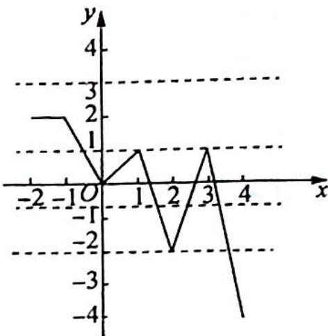

因为 $g(x)=f(x)-x-2m+1$ 在区间 $[-2,4]$ 内有 3 个零点，所以 $F(x)=2m-1$ 在区间 $[-2,4]$ 内有 3 个不等实根，所以 2m-1=1 或 -2<2m-1<0，解得 m=1 或 $-\frac{1}{2}<m<\frac{1}{2}$ . 故选 D.

4.【解析】由题意得 $f(x)=\left\{\begin{aligned}&\mathrm{e}^{x},&x\in[-3,1)\\&-x^{2}+\frac{5}{2},&x\in[1,3]\end{aligned}\right.$ ，作出函数的图像如图所示.
若 $f(x)=g(x)=m,\quad x\in[-3,3]$ 恰有两个零点，则 m 的取值范围为 $\left[e^{-3},\frac{3}{2}\right]$ .

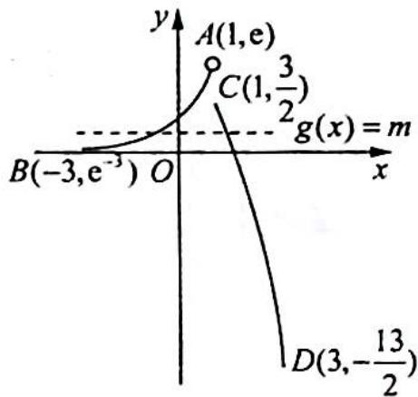

5.【解析】作出 $f(x)$ 的函数图像如图所示.

(1) 若 $b = 0$ , 则 $[f(x)]^2 + af(x) < 0$ , 当 $a = 0$ 时, $[f(x)]^2 < 0$ 无解; 当 $a < 0$ 时, $0 < f(x) < -a$ , $f(1) = f(-1) = 1$ , 由图像可知 $0 < f(x) < -a$ 不可能只有一个整数解; 当 $a > 0$ 时, $-a < f(x) < 0$ , 若 $-a < f(x) < 0$ 只有一个整数解, 由图像可知此整数解必为 $x = 3$ .

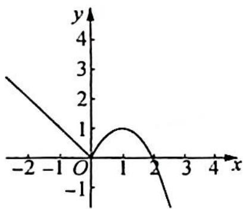

又 $f(3) = -3$ ， $f(4) = -8$ ，故而 $-8\leqslant -a <   - 3$ ，即 $3 <   a\leqslant 8$

(2) 若 $b \neq 0$ , 由 $[f(x)]^2 + af(x) - b^2 < 0$ , 可得 $\frac{-a - \sqrt{a^2 + 4b^2}}{2} < f(x) < \frac{-a + \sqrt{a^2 + 4b^2}}{2}$ , 无论 $a$ 取何值, 均有 $\frac{-a - \sqrt{a^2 + 4b^2}}{2} < 0 < \frac{-a + \sqrt{a^2 + 4b^2}}{2}$ .

由图像可知 $f(x) = 0$ 有两个整数解 $x = 0, x = 2$ , 所以 $\frac{-a - \sqrt{a^2 + 4b^2}}{2} < f(x) < \frac{-a + \sqrt{a^2 + 4b^2}}{2}$ 至少含有两个整数解, 不符合题意.

综上所述， $a$ 的最大值为8.

## 训练 3

1.【解析】因为 a>0, b>0，所以 $e^{a}+2a=e^{b}+3b=e^{b}+2b+b>e^{b}+2b$ .

构造函数 $y = \mathrm{e}^{x} + 2x (x > 0)$ ，因为 $y' = \mathrm{e}^{x} + 2 > 0$ ，所以 $y = \mathrm{e}^{x} + 2x$ 在 $(0, +\infty)$ 上单调递增，因为 $f(a) > f(b)$ ，所以 $a > b$ 成立。故选 A.

2.【解析】由 $9^{m} = 10$ 得 $m = \log_910 > 1, a = 10^m - 11 = 10^{\log_910} - 11.$

构造函数 $f(x) = \frac{\ln(x + 1)}{\ln x} (x > 1), f'(x) = \frac{\frac{\ln x}{x + 1} - \frac{\ln(x + 1)}{x}}{\ln^2 x} = \frac{x\ln x - (x + 1)\ln(x + 1)}{x(x + 1)\ln^2 x} < 0, f(x)$ 在

$(1, + \infty)$ 上单调递减，所以 $f(8) > f(9) > f(10)$ ，即 $\log_8 9 > \log_9 10 > \log_{10} 11$

$a=10^{m}-11=10^{\log_{9}10}-11>10^{\log_{10}11}-11=0,b=8^{m}-9=8^{\log_{9}10}-9<8^{\log_{8}9}-9=0$ ，所以a>0>b.故选A.

【评注】本题以构造函数比较大小,不落俗套.曾经在历年高考中考查过比较大小的经典试题,如全国卷中出现过比较 $\frac{\ln2}{2}$ , $\frac{\ln3}{3}$ 和 $\frac{\ln5}{5}$ 的大小,其实本题构造函数之前,需要有广阔的视野,发现共性.

3.【解析】由 \( \left\{\begin{aligned}x^{3}+\cos\left(x+\frac{3\pi}{2}\right)+2a=0\\4y^{3}+\sin y\cos y-a=0\end{aligned}\right. \) 可得 \( \left\{\begin{aligned}x^{3}+\sin x+2a=0\\4y^{3}+\frac{1}{2}\sin 2y-a=0\end{aligned}\right. \) ，即 \( \left\{\begin{aligned}x^{3}+\sin x=-2a\\(2y)^{3}+\sin 2y=2a\end{aligned}\right. \)

令 $f(x) = x^3 + \sin x$ ，则 $f'(x) = 3x^2 + \cos x, f(x)$ 为 $\mathbb{R}$ 上的奇函数，故可只考虑 $(0, +\infty)$ 上的情形。通过多次求导的方法可得 $f(x)$ 在 $(0, +\infty)$ 上单调递增，由于 $f(x)$ 为 $\mathbb{R}$ 上的奇函数，所以 $f(x)$ 在 $\mathbb{R}$ 上单调递增。 $f(x) + f(2y) = 0$ ，所以 $x + 2y = 0$ ，即 $\cos (x + 2y) = 1$ 。

4.【解析】因为 $a+b=1-c, ab=c^{2}-c$ ，可将 a, b 视为关于 x 的方程 $x^{2}+(c-1)x+c^{2}-c=0$ 的两个大于 c 的

根，故 $\left\{ \begin{array}{l} -\frac{c - 1}{2} > c \\ \Delta = (c - 1)^2 - 4(c^2 - c) > 0 \\ c^2 + (c - 1)c + c^2 - c > 0 \end{array} \right. \Rightarrow \left\{ \begin{array}{l} c < \frac{1}{3} \\ -\frac{1}{3} < c < 1 \\ c < 0 \text{或} c > \frac{2}{3} \end{array} \right. \Rightarrow -\frac{1}{3} < c < 0$ ，所以 $c$ 的取值范围是 $\left(-\frac{1}{3}, 0\right)$ .

5.【分析】由已知条件考虑将两个等式转化为统一的结构形式,令 $\ln x_{2} - 2 = t, x_{2} = e^{t + 2}$ , 得 $t e^{t} = e^{3}$ , 研究函数 $f(x) = x e^{x}$ 的单调性, 求出 $x_{1}, t$ 的关系, 即可求解.

【解析】解法一: 实数 $x_{1}, x_{2}$ 满足 $x_{1}e^{x_{1}} = e^{3}, x_{2}(\ln x_{2} - 2) = e^{5}, x_{1} > 0, x_{2} > e^{2}$ ，令 $\ln x_{2} - 2 = t > 0, x_{2} = e^{t + 2}$ ，则 $te^{t + 2} = e^{5}$ ，即 $te^{t} = e^{3}$ .

$f(x)=xe^{x}(x>0)$ , $f'(x)=(x+1)e^{x}>0(x>0)$ ，所以 $f(x)$ 在 $(0,+\infty)$ 上单调递增，而 $f(x_{1})=f(t)=e^{3}$ ，因此 $x_{1}=t=\ln x_{2}-2$ ，即 $x_{1}x_{2}=x_{2}(\ln x_{2}-2)=e^{5}$ .

解析二: 对 $x_{1}e^{x_{1}}=e^{3}$ 两边取自然对数得 $\ln x_{1}+x_{1}=3$ ; 对 $x_{2}(\ln x_{2}-2)=e^{5}$ 两边取自然对数得 $\ln x_{2}+\ln(\ln x_{2}-2)=5$ .

为使两式结构相同,将上式进一步变形为 $(\ln x_{2}-2)+\ln(\ln x_{2}-2)=3$ .

设 $f(x) = \ln x + x (x > 0)$ ，则 $f'(x) = \frac{1}{x} + 1 > 0$ ，所以 $f(x)$ 在 $(0, +\infty)$ 上单调递增， $f(x) = 3$ 的解只有一个。

因此 $x_{1} = \ln x_{2} - 2$ ，即 $x_{1}x_{2} = (\ln x_{2} - 2)x_{2} = \mathrm{e}^{5}$

6.【解析】令 $t=x+2y$ ，则 $x+2y-t=0$ ，由 $\frac{|-t|}{\sqrt{1^{2}+2^{2}}}\leqslant1$ ，可得 $-\sqrt{5}\leqslant t\leqslant\sqrt{5}$ .

设 $f(t) = |t - a| + |6 + a - t| = |t - a| + |t - (6 + a)|$ ，因为它的值为常数，所以 $a \leqslant t \leqslant 6 + a$ ，则 $a \leqslant -\sqrt{5} \leqslant t \leqslant \sqrt{5} \leqslant 6 + a$ ，即 $\left\{ \begin{array}{l} a \leqslant -\sqrt{5} \\ \sqrt{5} \leqslant 6 + a \end{array} \right.$ ，解得 $\sqrt{5} - 6 \leqslant a \leqslant -\sqrt{5}$ ，即 $a$ 的取值范围是 $[\sqrt{5} - 6, -\sqrt{5}]$ .

7.【解析】由 $a^{k}+b^{k}=c^{k}$ 得 $\left(\frac{a}{c}\right)^{k}+\left(\frac{b}{c}\right)^{k}=1<\left(\frac{a}{c}\right)^{1}+\left(\frac{b}{c}\right)^{1}$ ，令 $f(x)=\left(\frac{a}{c}\right)^{x}+\left(\frac{b}{c}\right)^{x}$ .

(1) 若 $c$ 为最大边, 则 $0 < \frac{a}{c} < 1$ , $0 < \frac{b}{c} < 1$ , $f(x)$ 在 $\mathbb{R}$ 上单调递减, 由 $\left(\frac{a}{c}\right)^k + \left(\frac{b}{c}\right)^k < \left(\frac{a}{c}\right)^1 + \left(\frac{b}{c}\right)^1$ , 即 $f(k) < f(1)$ , 所以 $k > 1$ .

(2) 若 $c$ 不为最大边, 则 $\frac{a}{c}$ 和 $\frac{b}{c}$ 至少有一个大于 $1, \left(\frac{a}{c}\right)^k + \left(\frac{b}{c}\right)^k = 1$ , 又 $\left(\frac{a}{c}\right)^k, \left(\frac{b}{c}\right)^k \in (0,1)$ , 则 $k < 0$ , 且 $c$ 为最小边.

综上所述，k<0 或 k>1。

## 训练 4

1. 【解析】解法一: 易知当 $0 \leqslant x \leqslant 2$ 时, $f(x)$ 单调递增; 当 $2 \leqslant x \leqslant 2\sqrt{3}$ 时, $f(x)$ 单调递减; 当 $x \geqslant 2\sqrt{3}$ 时, $f(x)$ 单调递增, 且 $f(2) = f(4) = 16$ .

(1) 当 $0 < m \leqslant 2$ 时, $f(x)$ 在区间 $[0, m]$ 上单调递增, 所以 $-m(m^2 - 12) = am^2$ , $a = -m + \frac{12}{m} \in [4, +\infty)$ .

(2) 当 $2 < m \leqslant 4$ 时, $am^2 = 16, a = \frac{16}{m^2} \in [1, 4)$ .

(3) 当 $m > 4$ 时, $m(m^2 - 12) = am^2$ , $a = m - \frac{12}{m} \in (1, +\infty)$ .

综上所述， $a \geqslant 1$ .

解法二:仅考虑函数 $f(x)$ 在 $x \geqslant 0$ 时的情况, 可知 $f(x) = \begin{cases} 12x - x^{3}, & 0 \leqslant x < 2\sqrt{3} \\ x^{3} - 12x, & x \geqslant 2\sqrt{3} \end{cases}$ ,

函数 $f(x)$ 在 $x = 2$ 时取得极大值16. 令 $x^{3} - 12x = 16$ , 解得 $x = 4$ , 作出函数的图像如图所示.

函数 $f(x)$ 的定义域为 $[0, m]$ , 值域为 $[0, am^2]$ , 分为以下情况考虑:

(1) 当 0 < m < 2 时，函数的值域为 $[0, m(12 - m^{2})]$ ，有 $m(12 - m^{2}) = am^{2}$ ，
所以 $a=\frac{12}{m}-m$ ，又 0<m<2，所以 a>4。

(2) 当 $2 \leqslant m \leqslant 4$ 时, 函数的值域为 $[0, 16]$ , 有 $am^2 = 16$ , 所以 $a = \frac{16}{m^2}$ , 因为 $2 \leqslant m \leqslant 4$ , 所以 $1 \leqslant a \leqslant 4$ .

(3) 当 $m > 4$ 时, 函数的值域为 $[0, m(m^2 - 12)]$ , 有 $m(m^2 - 12) = am^2$ , 所以 $a = m - \frac{12}{m}$ , 又 $m > 4$ , 所以 $a > 1$ .

综上所述,实数 a 的取值范围是 $a \geqslant 1$ .

2.【分析】先根据对称中心求解出 a 的值, 再根据 $f(-1)=2$ 求解出 b 的值, 由此可求 $f(x)$ 的解析式; 根据不

等式恒成立,通过分离参数得到 $m \leqslant \frac{\frac{e^{x}}{x^{e}} - x - e - 1}{\ln x + 1}$ ，借助不等式 $e^{x} > x + 1$ 得到 $\frac{e^{x}}{x^{e}} - x - e - 1 \geqslant -e \ln x - e$ ,

由此求解出 m 的范围并判断.

【解析】因为 $f'(x)=3x^{2}+2ax+1$ ，所以 $f''(x)=6x+2a$ ，又因为 $(-1,2)$ 是 $f(x)$ 的对称中心，所以 $f''(-1)=2a-6=0, a=3$ ，故 A 正确；

又 $f(x) = x^{3} + 3x^{2} + x + b$ ，则 $f(-1) = -1 + 3 + (-1) + b = 2$ ，所以 $b = 1$ ，故B错误.

$f(x)=x^{3}+3x^{2}+x+1$ ，因为 $e^{x}-mx^{c}(\ln x+1)\geqslant[f(x)-x^{3}-3x^{2}+e]x^{c}$ 对任意 $x\in(1,$ $+\infty)$ 恒成立，所以 $m\leqslant\frac{\frac{e^{x}}{x^{c}}-x-e-1}{\ln x+1}$ 对任意 $x\in(1,+\infty)$ 恒成立.

令 $g(x)=\mathrm{e}^{x}-x-1(x>0)$ , $g'(x)=\mathrm{e}^{x}-1>0$ , 所以 $g(x)$ 在 $(0,+\infty)$ 上单调递增, 因此 $g(x)>g(0)=0$ , $e^{x}>x+1$ , 即 $\frac{\mathrm{e}^{x}}{x^{\mathrm{e}}} = x^{-\mathrm{e}}\mathrm{e}^{x} = \mathrm{e}^{\ln(x^{-\mathrm{e}})+x} = \mathrm{e}^{-\mathrm{e}\ln x+x} \geqslant -\mathrm{e}\ln x+x+1$ , 当 x=e 时取等号.

又 $\ln x + 1 > 0$ ，所以 $\frac{\frac{e^x}{x^c} - x - e - 1}{\ln x + 1} \geqslant \frac{-\mathrm{e}\ln x + x + 1 - x - 1 - \mathrm{e}}{\ln x + 1} = \frac{-\mathrm{e}\ln x - \mathrm{e}}{\ln x + 1} = -\mathrm{e}$ ，当 $x = \mathrm{e}$ 时取等号，所以 $\left(\frac{\mathrm{e}^x}{x^c} - x - \mathrm{e} - 1\right)_{\min} = -\mathrm{e}$ ，即 $m \leqslant -\mathrm{e}$ ，CD均错误。

故选 A.

## 训练 5

1. 【解析】 $f(x)=xe^{ax-1}-\ln x-ax=e^{ax+\ln x-1}-\ln x-ax\geqslant ax+\ln x-1+1-\ln x-ax=0$ ，切点满足条件 $ax+\ln x=1$ ，即 $a=\frac{1-\ln x}{x}$ .

令 $g(x) = \frac{1 - \ln x}{x}$ , 则 $g'(x) = \frac{\ln x - 2}{x^2}$ , 由导数法易知 $g(x)_{\min} = g(\mathrm{e}^2) = -\frac{1}{\mathrm{e}^2}$ , 显然 $a = g(x)$ 时可以获得相切取等条件, 所以 $M$ 的最小值为 0. 故选 C.

2.【解析】设 $f(x)=x+e^{x}$ ，显然 $f(x)$ 是增函数.

不等式 $ax + \mathrm{e}^{\alpha x}\geqslant \ln x + x$ 变形为 $ax + \mathrm{e}^{\alpha x}\geqslant \ln x + \mathrm{e}^{\ln x}$ ，即 $f(ax)\geqslant f(\ln x)$ ，所以 $ax\geqslant \ln x$ ，即 $a\geqslant \frac{\ln x}{x}$ 令 $g(x) = \frac{\ln x}{x}$ 则 $g^{\prime}(x) = \frac{1 - \ln x}{x^{2}}.$

当 $0 < x < \mathrm{e}$ 时, $g'(x) > 0$ , $g(x)$ 单调递增; $x > \mathrm{e}$ 时, $g'(x) < 0$ , $g(x)$ 单调递减, 所以 $g(x)_{\max} = g(\mathrm{e}) = \frac{1}{\mathrm{e}}$ , 不等式 $a \geqslant \frac{\ln x}{x}$ 恒成立, 则 $a \geqslant \frac{1}{\mathrm{e}}$ , 即 $a$ 的最小值是 $\frac{1}{\mathrm{e}}$ . 故选 A.

3.【解析】 $x^{3}e^{x-4}+2\ln x-4=0\Rightarrow e^{3\ln x+x-4}+3\ln x+x-4=\ln x+x=e^{\ln x}+\ln x.$

设 $f(x) = \mathrm{e}^{x} + x, f'(x) = \mathrm{e}^{x} + 1 > 0$ 恒成立，故 $f(x)$ 单调递增.

由 $f(3\ln x + x - 4) = f(\ln x)$ 得 $3\ln x + x - 4 = \ln x$ ，所以 $2\ln x = 4 - x$ ，即 $x = e^{\frac{4 - x}{2}}$ ，所以 $e^{\frac{4 - x_{0}}{2}} + 2\ln x_{0} = x_{0} + 2\ln x_{0} = 4$ 。故选 B.

4.【解析】 $e^{x}>x^{2}-2ax+1\Leftrightarrow\frac{x^{2}-2ax+1}{e^{x}}-1<0$ . 设 $g(x)=\frac{x^{2}-2ax+1}{e^{x}}-1$ ,

则 $g^{\prime}(x) = \frac{-(x - 1)(x - 2a - 1)}{\mathrm{e}^{x}}.$

(1) $a=-\frac{1}{2}$ ，当0<x<1时， $g'(x)>0$ ， $g(x)$ 单调递增，注意到 $g(0)=0$ ，所以当 $x\in(0,1)$ 时， $g(x)>g(0)=0$ ，不满足题意.

(2)当 $0 < 2a + 1 < 1$ ，即 $-\frac{1}{2} < a < 0$ 时， $g(x)$ 在 $(0, 2a + 1), (1, +\infty)$ 上单调递减，在 $(2a + 1, 1)$ 上单调递增。又因为 $g(0) = 0$ ，所以 $g(x) < 0$ 对任意的 $x > 0$ 恒成立等价于 $g(1) < 0$ ，解得 $a > 1 - \frac{\mathrm{e}}{2}$ 。所以 $1 - \frac{\mathrm{e}}{2} < a < 0$ 。

(3)当 $2a + 1 = 1$ ，即 $a = 0$ 时， $g^{\prime}(x) <   0,g(x)$ 在 $(0, + \infty)$ 上单调递减， $g(x) <   g(0) = 0$ ，满足题意.

(4)当 $2a + 1 > 1$ ，即 $a > 0$ 时， $g(x)$ 在 $(0,1),(2a + 1, + \infty)$ 上单调递减，在 $(1,2a + 1)$ 上单调递增。又因为 $g(0) = 0$ ，所以 $g(x) < 0$ 对任意的 $x > 0$ 恒成立等价于 $g(2a + 1) < 0$ ，即 $\frac{2a + 2}{\mathrm{e}^{2a + 1}} - 1 < 0$ 。由经典不等式 $\mathrm{e}^x > x + 1$ 可得 $\mathrm{e}^{2a + 1} > 2a + 2$ ，故 $\frac{2a + 2}{\mathrm{e}^{2a + 1}} - 1 < 0$ 成立，所以 $a > 0$ 满足题意。

综上所述，a 的取值范围是 $\left(1-\frac{e}{2},+\infty\right)$ .

5.【解析】原不等式等价于 $\ln x - \frac{m(x - 1)^2 + (x - 1)}{x^2} \geqslant 0$ .

令 $f(x) = \ln x - \frac{m(x - 1)^2 + (x - 1)}{x^2}, x \geqslant 1$ ，则 $f'(x) = \frac{(x - 1)[x - (2m - 2)]}{x^3}$ ，令 $f'(x) = 0$ ，得 $x_1 = 1$ ， $x_2 = 2m - 2$ .

(1) 当 $2m - 2 \leqslant 1$ , 即 $m \leqslant \frac{3}{2}$ 时, 对 $x \geqslant 1, f'(x) \geqslant 0, f(x)$ 在 $[1, +\infty)$ 上单调递增, 所以 $f(x) \geqslant f(1) = 0$ , 满足题意.

(2)当 $2m - 2 > 1$ ，即 $m > \frac{3}{2}$ 时，对 $x\in (1,2m - 2),f'(x) <   0,f(x)$ 在 $(1,2m - 2)$ 上单调递减，所以 $f(2m - 2) <   f(1) = 0$ ，不合题意.

综上所述,实数 m 的取值范围为 $\left(-\infty, \frac{3}{2}\right]$ .

6.【解析】 $f(x)\geqslant\frac{k}{x+1}\Leftrightarrow\frac{1+\ln(x+1)}{x}\geqslant\frac{k}{x+1}\Leftrightarrow k\leqslant\frac{(x+1)[1+\ln(x+1)]}{x},x>0.$

令 $g(x) = \frac{(x + 1)[1 + \ln(x + 1)]}{x}$ , 则 $g'(x) = \frac{x - 1 - \ln(x + 1)}{x^2}$ ;

令 $t(x) = x - 1 - \ln (x + 1)$ ，则 $t'(x) = \frac{x}{x + 1} > 0$ ，所以 $t(x)$ 在 $(0, +\infty)$ 上单调递增.

又 $t(2) = 1 - \ln 3 < 0, t(3) = 2 - \ln 4 > 0$ ，所以 $t(x)$ 在 $(0, +\infty)$ 上有唯一的零点 $x_0$ ，且 $x_0 \in (2,3)$ ，可知 $g'(x)$ 在 $(0, x_0)$ 上小于 0，在 $(x_0, +\infty)$ 上大于 0，所以 $g(x)$ 在 $(0, x_0)$ 上单调递减，在 $(x_0, +\infty)$ 上单调递增，则有 $g(x)_{\min} = g(x_0) = \frac{(x_0 + 1)[1 + \ln(x_0 + 1)]}{x_0}$ .

注意到 $x_0$ 满足 $x_0 - 1 - \ln (x_0 + 1) = 0$ ，所以 $x_0 = 1 + \ln (x_0 + 1)$ ，则 $g(x)_{\min} = g(x_0) = \frac{(x_0 + 1)[1 + \ln(x_0 + 1)]}{x_0} = 1 + x_0 \in (3,4)$ .

又 $k \leqslant \frac{(x + 1)[1 + \ln(x + 1)]}{x}$ 恒成立, $k$ 为正整数, 所以 $k$ 的最大值为 3.

【评注】也可看必要条件, 当 $x = 1$ 时有 $1 + \ln 2 \geqslant \frac{k}{2}$ , 即 $k \leqslant 2 + \ln 4 < 4$ , 从而 $k$ 的最大值猜想为 3, 再进一步证明. 或先由不等式放缩估计范围. $k \leqslant \frac{(x + 1)[1 + \ln(x + 1)]}{x} < \frac{(x + 1)(x + 1)}{x} = x + \frac{1}{x} + 2$ . 由 $x + \frac{1}{x} + 2 \geqslant 4$ , 故 $k < 4$ , 猜想 $k$ 的最大值为 3.

7.【解析】(1)当 $a = 1$ 时, $f(x) = x - \ln (x + 1)$ , 求导得 $f'(x) = 1 - \frac{1}{x + 1} = \frac{x}{x + 1}$ .

当-1<x<0时， $f'(x)<0$ ， $f(x)$ 单调递减；当x>0时， $f'(x)>0$ ， $f(x)$ 单调递增，从而 $f(x)_{\min}=f(0)=0$ .

(2)由(1)知 $x \geqslant \ln (x + 1)$ , 即有 $x - 1 \geqslant \ln x$ , 要证 $\frac{\mathrm{e}^x}{x^2} - x \geqslant 1 - 2\ln x$ , 即证 $\frac{\mathrm{e}^x}{x^2} - 1 \geqslant x - 2\ln x = \ln \frac{\mathrm{e}^x}{x^2}$ . 显然是成立的.

8.【解析】 $x\mathrm{e}^{x}-2\mathrm{e}\ln x\geqslant\mathrm{e}(x^{2}-2x+2)\Leftrightarrow x\mathrm{e}^{x-1}-2\ln x\geqslant x^{2}-2x+2\Leftrightarrow\frac{\mathrm{e}^{x-1}}{x}-1\geqslant\frac{2\ln x-2(x-1)}{x^{2}}$

由熟知的不等式 $\mathrm{e}^{x - 1}\geqslant x,\ln x\leqslant x - 1$ 得 $\frac{\mathrm{e}^{x - 1}}{x} -1\geqslant 0\geqslant \frac{2\ln x - 2(x - 1)}{x^2}.$

或按如下方法证: 因为 $e^{x-1} \geqslant x, \ln x \leqslant x-1$ ，定义域为 $(0, +\infty)$ ，所以 $xe^{x}-2\ln x = xe \cdot e^{x-1}-2\ln x \geqslant e x^{2}-2e(x-1)=e(x^{2}-2x+2)$ 。得证。

9.【解析】要证 $e^{x}>x^{2}-(2-e)\ln(x+1)+1$ ，等价于证 $ex+x^{2}-2x+1\geqslant x^{2}-(2-e)\ln(x+1)+1$ （当且仅当 x=0 时，等号成立）。为此先证明 $e^{x}>ex+x^{2}-2x+1$ 。

设 $g(x) = \mathrm{e}^{x} - x^{2} + (2 - \mathrm{e})x - 1$ ，则 $g^{\prime}(x) = \mathrm{e}^{x} - 2x + (2 - \mathrm{e})$ ，再令 $h(x) = \mathrm{e}^{x} - 2x + (2 - \mathrm{c})$ ，则 $h^{\prime}(x) = \mathrm{e}^{x} - 2$ .

因为 $x > 1$ ，所以 $h^{\prime}(x) > h^{\prime}(1) > 0,h(x)$ 在 $(1, + \infty)$ 上单调递增， $h(x) > h(1) = 0$ ，即 $g(x)$ 在 $(1, + \infty)$ 上单调递增，所以 $g(x) > g(1) = 0$ ，因此 $\mathrm{e}^x >\mathrm{e}x + x^2 -2x + 1$

问题转化为证明 $ex + x^2 - 2x + 1 \geqslant x^2 - (2 - e)\ln(x + 1) + 1$ . $ex - 2x \geqslant (e - 2)\ln(x + 1) \Rightarrow x(e - 2) \geqslant (e - 2)\ln(x + 1) \Rightarrow x \geqslant \ln(x + 1)$ (当且仅当 $x = 0$ 时等号成立).

10.【分析】首先将指对函数分列两侧, 将 $x \ln x$ 变形为 $\ln x e^{\ln x}$ , 形成相同的结构, 构造函数, 再用经典不等式即可证出.

【解析】 $x\ln x+\ln x\leqslant(x-1)(e^{x-1}+1)\Leftrightarrow\ln x\cdot e^{\ln x}+\ln x\leqslant(x-1)e^{x-1}+x-1$ ，构造函数 $f(t)=te^{t}+t(t>0)$ 。由 $f'(t)=e^{t}(t+1)+1>0$ ，所以 $f(t)$ 为增函数。

又由经典不等式得 $\ln x \leqslant x - 1$ ，所以 $f(\ln x) \leqslant f(x - 1)$ ，即 $\ln x \cdot e^{\ln x} + \ln x \leqslant (x - 1)e^{x - 1} + x - 1$ ，则原不等式得证.

11.【解析】(1) $f(x)=xe^{x}$ ，则 $f'(x)=(x+1)e^{x}$ ，函数 $f(x)$ 的图像在 $(0,f(0))$ 处的切线l的方程为 $y-f(0)$

$= f^{\prime}(0)(x - 0)$ ，化简得 $y = x$

(2) $x = \frac{\ln x + 1}{x\mathrm{e}^x}\Leftrightarrow x^2\mathrm{e}^x = \ln x + 1\Leftrightarrow \frac{\mathrm{e}^x}{x} = \frac{\ln x + 1}{x^3}$ , 两个函数 $f_{1}(x) = \frac{\mathrm{e}^{x}}{x}$ 和 $f_{2}(x) = \frac{\ln x + 1}{x^3}$ , 其函数的极值点可求.

$$
f _ {1} ^ {\prime} (x) = \frac {\mathrm{e} ^ {x} \cdot x - \mathrm{e} ^ {x}}{x ^ {2}} = \frac {\mathrm{e} ^ {x} (x - 1)}{x ^ {2}}, f _ {1} (x) _ {\min} = f _ {1} (1) = \mathrm{e}; f _ {2} ^ {\prime} (x) = \frac {\frac {1}{x} \cdot x ^ {3} - (\ln x + 1) \cdot 3 x ^ {2}}{x ^ {6}} =
$$

$\frac{1 - 3\ln x - 3}{x^4} = \frac{-2 - 3\ln x}{x^4} = 0, x = e^{-\frac{2}{3}}, f_2(x)_{\max} = f_2(e^{-\frac{2}{3}}) = \frac{\frac{1}{3}}{e^{-2}} = \frac{e^2}{3}$ , 又 $e > \frac{e^2}{3}$ , 故 $f_1(x) > f_2(x)$ .

综上所述, 直线 l 与函数 $g(x)$ 图像的交点个数为 0.

12.【解析】(1) $f'(x)=\mathrm{e}^{x}-\frac{1}{x+m},x=0$ 是 $f(x)$ 的极值点,所以 $f'(0)=1-\frac{1}{m}=0$ ,解得 m=1,经检验 m=1 符合题意.

(2)由(1)知 $f(x) = \mathrm{e}^{x} - \ln (x + 1) + 1$ ，定义域为 $(-1, +\infty)$ ，则 $f'(x) = \mathrm{e}^{x} - \frac{1}{x + 1} = \frac{\mathrm{e}^{x}(x + 1) - 1}{x + 1}$ .

令 $g(x)=\mathrm{e}^{x}(x+1)-1$ ，则 $g'(x)=\mathrm{e}^{x}(x+1)+\mathrm{e}^{x}=\mathrm{e}^{x}(x+2)>0$ ，所以 $g(x)$ 在 $(-1,+\infty)$ 上为增函数。又因为 $g(0)=0$ ，所以当 x>0 时， $g(x)>0$ ，即 $f'(x)>0$ ；当 -1<x<0 时， $g(x)<0$ ，即 $f'(x)<0$ 。

所以 $f(x)$ 在 $(-1,0)$ 上为减函数；在 $(0, +\infty)$ 上为增函数；因此 $f(x) \geqslant f(0) = 2$ ，即 $f(x)$ 的最小值为 2，所以 $k \leqslant 2$ 。

(3)要证: $f(x)=\mathrm{e}^{x}-\ln(x+m)+m>m$ ,即证: $\mathrm{e}^{x}-\ln(x+m)>0.$

设 $F(x) = \mathrm{e}^{x} - \ln (x + m)$ ，即证： $F(x) > 0$

当 $m \leqslant 2, x \in (-m, +\infty)$ 时， $\ln (x + m) \leqslant \ln (x + 2)$ ，故只需证明当 $m = 2$ 时， $F(x) > 0$ .

当 $m = 2$ 时， $F(x) = \mathrm{e}^x - \ln (x + 2) = \mathrm{e}^x - x - 1 + x + 2 - 1 - \ln (x + 2) = \mathrm{e}^x - x - 1 + \mathrm{e}^{\ln (x + 2)} - \ln (x + 2) - 1.$

令 $g(x)=\mathrm{e}^{x}-x-1$ ，由经典不等式知 $g(x)\geqslant0$ ，则 $F(x)=g(x)+g(\ln(x+2))\geqslant0$ 。由于取等条件不一致，故 $F(x)>0$ 。得证。

## 训练 6

1. 【解析】(1) $f(x)=\cos x+\frac{x^{2}}{2}-1(x\geqslant0)$ ，则 $f'(x)=x-\sin x$ .

当 $x \geqslant 0$ 时, $f''(x) = 1 - \cos x \geqslant 0$ , 即 $f'(x) = x - \sin x$ 为增函数, 所以 $f'(x) \geqslant f'(0) = 0$ .

故 $f(x)$ 在 $(0, +\infty)$ 上为增函数， $f(x) \geqslant f(0) = 0$

(2)解法一:由(1)知,当 $x \geqslant 0$ 时, $x \geqslant \sin x$ , $\frac{x^{2}}{2} - 1 \geqslant -\cos x$ , 所以 $\frac{x^{2}}{2} + x + 1 \geqslant \sin x - \cos x + 2$ , 只需要证明 $e^{x}\geqslant\frac{x^{2}}{2}+x+1.$

设 $G(x) = \mathrm{e}^{x} - \frac{x^{2}}{2} - x - 1$ ，则 $G'(x) = \mathrm{e}^{x} - x - 1$ ；设 $g(x) = \mathrm{e}^{x} - x - 1$ ，则 $g'(x) = \mathrm{e}^{x} - 1$ .

当 $x \geqslant 0$ 时, $g'(x) = e^x - 1 \geqslant 0$ , 所以 $g(x) = e^x - x - 1$ 为增函数, 则 $g(x) \geqslant g(0) = 0$ , $G(x)$ 为增函数, $G(x) \geqslant G(0) = 0$ , 所以 $e^x \geqslant \frac{x^2}{2} + x + 1 \geqslant \sin x - \cos x + 2$ 对任意的 $x \geqslant 0$ 恒成立.

又当 $x \geqslant 0, m \geqslant 1$ 时, $\mathrm{e}^{m x} \geqslant \mathrm{e}^{x}$ , 所以 $m \geqslant 1$ 时, $\mathrm{e}^{m x} \geqslant \sin x - \cos x + 2$ 对任意的 $x \geqslant 0$ 恒成立. 当 $m < 1$ 时, 设 $h(x) = \mathrm{e}^{m x} - \sin x + \cos x - 2$ , 则 $h'(x) = m \mathrm{e}^{m x} - \cos x - \sin x$ , $h'(0) = m - 1 < 0$ , 所以存在实数 $x_0 > 0$ , 使得任意 $x \in (0, x_0)$ , 均有 $h'(x) < 0$ , 即 $h(x)$ 在 $(0, x_0)$ 上为减函数, $h(x) < h(0) = 0, m < 1$ 不符合题意.

综上所述,实数 m 的取值范围为 $[1, +\infty)$ .

解法二： $e^{mx}\geqslant\sin x-\cos x+2$ 等价于 $mx\geqslant\ln(\sin x-\cos x+2)$ .

设 $g(x) = mx - \ln (\sin x - \cos x + 2)$ , 则 $g'(x) = m - \frac{\sin x + \cos x}{\sin x - \cos x + 2}$ , 可求 $\frac{\sin x + \cos x}{\sin x - \cos x + 2} \in [-1, 1]$ , 所以当 $m \geqslant 1$ 时, $g'(x) \geqslant 0$ 恒成立, $g(x)$ 在 $[0, +\infty)$ 是增函数, 即 $g(x) \geqslant g(0) = 0$ , $mx \geqslant \ln (\sin x - \cos x + 2)$ , $e^{mx} \geqslant \sin x - \cos x + 2$ .

所以当 $m \geqslant 1$ 时， $\mathrm{e}^{mx} \geqslant \sin x - \cos x + 2$ 对任意 $x \geqslant 0$ 恒成立.

当 $m < 1$ 时, 一定存在 $x_0 > 0$ , 满足在 $(0, x_0)$ 时, $g'(x) < 0$ , 所以 $g(x)$ 在 $(0, x_0)$ 上是减函数, 此时一定有 $g(x) < g(0) = 0$ , 即 $mx < \ln(\sin x - \cos x + 2)$ , $e^{mr} < \sin x - \cos x + 2$ , 不符合题意, 故 $m < 1$ 不能满足题意.

综上所述， $m \geqslant 1$ 时， $e^{mx} \geqslant \sin x - \cos x + 2$ 对任意 $x \geqslant 0$ 恒成立.

【评注】利用导数研究不等式恒成立或存在型问题,首先要构造函数,利用导数研究函数的单调性,求出最值,进而得出相应的含参不等式,从而求出参数的取值范围;也可分离变量,构造函数,直接把问题转化为函数的最值问题.

2.【解析】(1)因为 $f(x)=\mathrm{e}^{x}\sin x$ ，所以 $f'(x)=\mathrm{e}^{x}\sin x+\mathrm{e}^{x}\cos x=\mathrm{e}^{x}(\sin x+\cos x)=\sqrt{2}\mathrm{e}^{x}\sin\left(x+\frac{\pi}{4}\right)$ .

当 $x + \frac{\pi}{4} \in (2k\pi, 2k\pi + \pi)$ , 即 $x \in \left(2k\pi - \frac{\pi}{4}, 2k\pi + \frac{3\pi}{4}\right)$ 时, $f'(x) > 0$ ; 当 $x + \frac{\pi}{4} \in (2k\pi + \pi, 2k\pi + 2\pi)$ , 即 $x \in \left(2k\pi + \frac{3\pi}{4}, 2k\pi + \frac{7\pi}{4}\right)$ 时, $f'(x) < 0$ .

所以 $f(x)$ 的单调递增区间为 $\left(2k\pi-\frac{\pi}{4},2k\pi+\frac{3\pi}{4}\right)$ ，单调递减区间为 $\left(2k\pi+\frac{3\pi}{4},2k\pi+\frac{7\pi}{4}\right), k\in\mathbf{Z}$ .

(2) 令 $g(x) = f(x) - kx = \mathrm{e}^x\sin x - kx$ ，要使 $f(x) \geqslant kx$ 总成立，只需 $x \in \left[0, \frac{\pi}{2}\right]$ 时， $g(x)_{\min} \geqslant 0$ .

对 $g(x)$ 求导，得 $g^{\prime}(x) = \mathrm{e}^{x}(\sin x + \cos x) - k$ ，令 $h(x) = \mathrm{e}^{x}(\sin x + \cos x)$ ，则 $h^{\prime}(x) = 2\mathrm{e}^{x}\cos x > 0$ $(x\in [0,\frac{\pi}{2} ])$ ，所以 $h(x)$ 在 $[0,\frac{\pi}{2} ]$ 上为增函数，则 $h(x)\in [1,\mathrm{e}^{\frac{\pi}{2}}]$ .

对 $k$ 分类讨论: ①当 $k \leqslant 1$ 时, $g'(x) \geqslant 0$ 恒成立, 所以 $g(x)$ 在 $\left[0, \frac{\pi}{2}\right]$ 上为增函数, $g(x)_{\min} = g(0) = 0$ , 即 $g(x) \geqslant 0$ 恒成立;

②当 $1 < k < e^{\frac{\pi}{2}}$ 时， $g'(x) = 0$ 在 $\left[0, \frac{\pi}{2}\right]$ 上有实根 $x_{0}$ ，因为 $h(x)$ 在 $\left(0, \frac{\pi}{2}\right)$ 上为增函数，所以当 $x \in (0,$

$x_{0}$ )时, $g'(x)<0$ ,即 $g(x_{0})<g(0)=0$ ,不符合题意;

③当 $k \geqslant e^{\frac{\pi}{2}}$ 时, $g'(x) \leqslant 0$ 恒成立, 所以 $g(x)$ 在 $\left(0, \frac{\pi}{2}\right)$ 上为减函数, 则 $g(x) < g(0) = 0$ , 不符合题意. 综合①②③可得, 所求的实数 $k$ 的取值范围是 $(- \infty, 1]$ .

3.【解析】(1)要证当 $x \in [0, 1]$ 时， $(1 + x)e^{-2x} \geqslant 1 - x$ ，只需证明： $(1 + x)e^{-x} \geqslant (1 - x)e^x$ .

记 $h(x) = (1 + x)e^{-x} - (1 - x)e^x$ ，则 $h'(x) = x(e^x - e^{-x})$ 。当 $x \in [0, 1]$ 时， $h'(x) > 0$ ，因此 $h(x)$ 在 $[0, 1]$ 上是增函数，故 $h(x) \geqslant h(0) = 0$ ，所以 $f(x) \geqslant 1 - x, x \in [0, 1]$ 。

要证当 $x \in [0,1]$ 时， $(1+x)\mathrm{e}^{-2x} \leqslant \frac{1}{1+x}$ ，只需证明 $\mathrm{e}^x \geqslant x+1$ ，此为经典不等式，在 $[-1,+\infty)$ 上成立。所以 $f(x) \leqslant \frac{1}{1+x}, x \in [0,1]$ 。

综上所述， $1 - x\leqslant f(x)\leqslant \frac{1}{1 + x},x\in [0,1].$

(2) $f(x) - g(x) = (1 + x)e^{-2x} - \left(ax + \frac{x^3}{2} + 1 + 2x\cos x\right) \geqslant 1 - x - ax - 1 - \frac{x^3}{2} - 2x\cos x = -x\left(a + 1 + \frac{x^2}{2} + 2\cos x\right).$

设 $G(x)=\frac{x^{2}}{2}+2\cos x$ ，则 $G'(x)=x-2\sin x$ ；记 $H(x)=x-2\sin x$ ，则 $H'(x)=1-2\cos x$ 。

当 $x \in [0,1]$ 时， $H'(x) < 0$ ，于是 $G'(x)$ 在 $[0,1]$ 上是减函数，从而当 $x \in [0,1]$ 时， $G'(x) < G'(0) = 0$ ，故 $G(x)$ 在 $[0,1]$ 上是减函数， $G(x) \leqslant G(0) = 2$ ，从而 $a + 1 + G(x) \leqslant a + 3$ .

所以，当 $a \leqslant -3$ 时， $f(x) \geqslant g(x)$ 在 $[0,1]$ 上恒成立.

下面证明, 当 $a > -3$ 时, $f(x) \geqslant g(x)$ 在 $[0,1]$ 上不恒成立, $f(x) - g(x) \leqslant \frac{1}{1 + x} - 1 - ax - \frac{x^3}{2} - 2x\cos x = \frac{-x}{1 + x} - ax - \frac{x^3}{2} - 2x\cos x = -x\left(\frac{1}{1 + x} + a + \frac{x^2}{2} + 2\cos x\right)$ .

记 $I(x) = \frac{1}{1 + x} + a + \frac{x^2}{2} + 2\cos x = \frac{1}{1 + x} + a + G(x)$ , 则 $I'(x) = \frac{-1}{(1 + x)^2} + G'(x)$ , 当 $x \in [0,1]$ 时, $I'(x) < 0$ , 故 $I(x)$ 在 $[0,1]$ 上是减函数, 于是 $I(x)$ 在 $[0,1]$ 上的值域为 $[a + 1 + 2\cos 1, a + 3]$ .

因为当 $a > -3$ 时， $a + 3 > 0$ ，所以存在 $x_0 \in (0,1)$ ，使得 $I(x_0) > 0$ ，此时 $f(x_0) < g(x_0)$ ，即 $f(x) \geqslant g(x)$ 在 $[0,1]$ 上不恒成立。

综上所述,实数 a 的取值范围是 $(-∞,-3]$ .

【评注】求证不等式 $f(x) \geqslant g(x)$ , 一种常见思路是用图像法来说明函数 $f(x)$ 的图像在函数 $g(x)$ 图像的上方, 但通常不易说明. 于是常构造函数 $F(x) = f(x) - g(x)$ , 通过导数研究函数 $F(x)$ 的性质, 进而证明欲证不等式.

4.【解析】(1)设 $g(x)=f'(x)$ ，则 $g(x)=\cos x+x\sin x-1$ ，从而 $g'(x)=x\cos x$ .

当 $x \in (0, \frac{\pi}{2})$ 时， $g'(x) > 0$ ；当 $x \in \left(\frac{\pi}{2}, \pi\right)$ 时， $g'(x) < 0$ ，所以 $g(x)$ 在 $\left(0, \frac{\pi}{2}\right)$ 上单调递增，在 $\left(\frac{\pi}{2}, \pi\right)$ 上单调递减。

又 $g(0) = 0, g\left(\frac{\pi}{2}\right) > 0, g(\pi) = -2$ ，故 $g(x)$ 在 $(0, \pi)$ 存在唯一零点，所以 $f'(x)$ 在 $(0, \pi)$ 存在唯一零点.

(2)由(1)知, $f'(x)$ 在 $(0,\pi)$ 只有一个零点,设为 $x_0$ ,且当 $x\in(0,x_0)$ 时, $f'(x)>0$ ; 当 $x\in(x_0,\pi)$ 时, $f'(x)<0$ ,所以 $f(x)$ 在 $(0,x_0)$ 单调递增,在 $(x_0,\pi)$ 单调递减.

又 $f(0) = 0, f(\pi) = 0$ ，故当 $x \in [0, \pi]$ 时， $f(x) \geqslant 0$ .

根据题意, 当 $x \in [0, \pi]$ 时, $f(x) \geqslant ax$ . 因此, $a$ 的取值范围是 $(- \infty, 0]$ .

5.【解析】(1)因为 $f'(x)=\frac{1}{a+x}-1=\frac{1-a-x}{a+x}$ ，令 $f'(x)=0$ ，得 x=1-a，所以当 $x\in(-a,1-a)$ 时， $f'(x)>0$ ；当 $x\in(1-a,+\infty)$ 时， $f'(x)<0$ 。

所以 $f(x)$ 在 $(-a,1-a)$ 上单调递增，在 $(1-a,+\infty)$ 上单调递减.

(2) 令 $g(x) = f(x) + \frac{x^2}{1 + x} = \ln (x + a) + \frac{x^2}{1 + x} - x = \ln (x + a) - \frac{x}{1 + x} > 0$ ，所以 $x + a > e^{\frac{x}{x + 1}}$ ，即 $a > e^{\frac{x}{x + 1}} - x$ 恒成立.

令 $t = \frac{x}{x + 1} \in (0,1)$ , 则 $a > \mathrm{e}^t + \frac{t}{t - 1}$ 恒成立.

令 $\varphi(t) = \mathrm{e}^t + \frac{t}{t-1}, 0 < t < 1$ ，则 $\varphi'(t) = \mathrm{e}^t - \frac{1}{(t-1)^2} = \frac{1}{\mathrm{e}^{-t}} - \frac{1}{(t-1)^2}$ ，下面证明 $\varphi'(t) < 0$ .

因为 $e^{-t} > -t + 1$ (由经典不等式易知)，且 $t \in (0,1)$ 时， $(t-1)^{2} - (-t+1) = t^{2} - t < 0$ ，所以 $e^{-t} > -t + 1 > (t-1)^{2} > 0$ ，即 $\varphi'(t) = e^{t} - \frac{1}{(t-1)^{2}} < 0$ ，则 $\varphi(t)$ 单调递减。

故 $a \geqslant \varphi(0) = 1, a$ 的取值范围是 $[1, +\infty)$ .

6.【解析】(1) $f'(x)=\frac{1}{x}-1+2\cos x$ , $f''(x)=-\frac{1}{x^{2}}-2\sin x<0$ , $0<x<\pi$ , 因此 $f'(x)$ 在 $(0,\pi)$ 上单调递减.
当 $x \to 0, f'(x) \to +\infty, f'\left(\frac{\pi}{2}\right) = \frac{2}{\pi} - 1 < 0.$

所以根据零点存在定理, $\exists \xi \in \left(0, \frac{\pi}{2}\right)$ , 使得 $f'(\xi) = 0$ , 且当 $0 < x < \xi$ 时, $f'(x) > 0$ , $f(x)$ 单调递增; 当 $\xi < x < \pi$ 时, $f'(x) < 0$ , $f(x)$ 单调递减.

因此 $f(x)$ 在区间 $(0,\pi)$ 上存在唯一极大值点.

(2)由(1)知,当 $0 < x < \xi$ 时, $f(x)$ 单调递增; 当 $\xi < x < \pi$ 时, $f(x)$ 单调递减, 且 $\xi \in \left(0, \frac{\pi}{2}\right)$ , 当 $x \to 0$ , $f(0) \to -\infty$ , $f\left(\frac{\pi}{2}\right) = \ln \frac{\pi}{2} - \frac{\pi}{2} + 2 \sin \frac{\pi}{2} > 0$ , $f(\xi) > f\left(\frac{\pi}{2}\right) > 0$ , $f(\pi) = \ln \pi - \pi + 2 \sin \pi < 0$ , 所以 $f(x)$ 在 $(0, \xi)$ 及 $(\xi, \pi)$ 上各有一个零点.

当 $\pi < x < 2\pi$ 时, $f(x) = \ln x - x + 2\sin x < \ln x - x < -1$ , 因此 $f(x)$ 在 $(\pi, 2\pi)$ 上没有零点; 当 $x \geqslant 2\pi$ 时, $y = \ln x - x$ 在 $[1, +\infty)$ 上单调递减.

因此 $\ln x - x + 2\sin x < \ln 4 - 4 + 2 = 2\ln 2 - 2 < 0$ ，所以 $f(x)$ 在 $[2\pi, +\infty)$ 上没有零点.

综上所述， $f(x)$ 有且仅有两个零点.

7.【解析】 $f'(x)=\frac{e^{x}\cdot x-e^{x}}{x^{2}}-2\cos x=\frac{e^{x}(x-1)-2x^{2}\cos x}{x^{2}}$ ，当 $-\frac{\pi}{2}<x<0$ 时， $\cos x>0,f'(x)<0$ ，函数 $f(x)$ 在 $\left(-\frac{\pi}{2},0\right)$ 上单调递减.

当 $-\pi < x < -\frac{\pi}{2}$ 时，设 $g(x) = \mathrm{e}^{x}(x - 1) - 2x^{2}\cos x$ ，则 $g'(x) = x\mathrm{e}^{x} - 4x\cos x + 2x^{2}\sin x = x(\mathrm{e}^{x} - 4\cos x + 2x\sin x)$ .

当 $-\pi < x < -\frac{\pi}{2}$ 时, $e^x > 0$ , $\cos x < 0$ , $x \sin x > 0$ , 因此 $g'(x) < 0$ , $g(x)$ 在 $\left(-\pi, -\frac{\pi}{2}\right)$ 上单调递减.

又 $g(-\pi) = \mathrm{e}^{-\pi}(-\pi -1) - 2\pi^2\cos (-\pi) = -\mathrm{e}^{-\pi}(\pi +1) + 2\pi^2 >0,g\left(-\frac{\pi}{2}\right) = \mathrm{e}^{-\frac{\pi}{2}}\left(-\frac{\pi}{2} -1\right) <   0,$ 故

$g(x)$ 在 $\left(-\pi, -\frac{\pi}{2}\right)$ 上存在唯一零点 $x_{0}$ ，即当 $-\pi < x < x_{0}$ 时， $g(x) > 0$ ，即 $f'(x) > 0$ ， $f(x)$ 单调递增；

当 $x_0 < x < -\frac{\pi}{2}$ 时， $g(x) < 0$ ，即 $f'(x) < 0, f(x)$ 单调递减.

于是 $x_0$ 是 $f(x)$ 唯一的极大值点， $f(x_0) > f\left(-\frac{\pi}{2}\right) = \frac{e^{-\frac{\pi}{2}}}{-\frac{\pi}{2}} + 2 = 2 - \frac{2}{\pi} e^{-\frac{\pi}{2}}, f(x_0) = \frac{e^{x_0}}{x_0} - 2 \sin x_0 < -2 \sin x_0 < 2.$

8.【解析】(1) $f'(x)=\mathrm{e}^{x}-a\cos x$ ，所以 $f'(0)=\mathrm{e}^{0}-a=1-a$ 。又 $f(0)=1$ ，所以切线方程为 $y-1=(1-a)x$ ，即 $(1-a)x-y+1=0$ 。

(2)①当 a=0 时， $f(x)=\mathrm{e}^{x}=g(x)=b\sqrt{x}, x\geqslant0$ ，则 $\frac{1}{b}=\frac{\sqrt{x}}{\mathrm{e}^{x}}$ ，令 $h(x)=\frac{\sqrt{x}}{\mathrm{e}^{x}}, x\geqslant0, h'(x)=$ $\frac{\frac{1}{2}\cdot\frac{1}{\sqrt{x}}-\sqrt{x}}{\mathrm{e}^{x}}=\frac{1-2x}{2\sqrt{x}\mathrm{e}^{x}}, h(x)$ 在 $\left(0,\frac{1}{2}\right)$ 上单调递增，在 $\left(\frac{1}{2},+\infty\right)$ 上单调递减.

$h(x)_{\max} = h\left(\frac{1}{2}\right) = \frac{\frac{\sqrt{2}}{2}}{\mathrm{e}^{\frac{1}{2}}} = \frac{\sqrt{2}}{2\mathrm{e}^{\frac{1}{2}}},$ 则 $0 <   \frac{1}{b}\leqslant \frac{\sqrt{2}}{2}\mathrm{e}^{-\frac{1}{2}},$ 即 $b\geqslant \sqrt{2}\mathrm{e}^{\frac{1}{2}}.$

② $\mathrm{e}^x - a\sin x = b\sqrt{x}$ ，即 $a\sin x + b\sqrt{x} = \mathrm{e}^x$

由柯西不等式 $(a\sin x + b\sqrt{x})^2 \leqslant (a^2 + b^2)(\sin^2 x + x)$ 得 $(a^2 + b^2)(\sin^2 x + x) \geqslant e^{2x}$ . 即 $a^2 + b^2 \geqslant \frac{e^{2x}}{\sin^2 x + x}$ .

所以只需证明 $\frac{\mathrm{e}^{2x}}{\sin^2 x + x} >\mathrm{e}\Leftrightarrow \frac{\sin^2 x + x}{\mathrm{e}^{2x}} < \frac{1}{\mathrm{e}}.$

又 $\mathrm{e}^x\geqslant \mathrm{e}x$ ，得 $\mathrm{e}^{2x}\geqslant 2\mathrm{e}x$ ，因此 $\frac{x + \sin^2x}{\mathrm{e}^{2x}}\leqslant \frac{x + \sin^2x}{2\mathrm{e}x}\leqslant \frac{1}{\mathrm{e}}\Leftrightarrow \sin^2 x\leqslant x.$

下证 $\sin^2 x \leqslant x, \frac{1 - \cos 2x}{2} \leqslant x \Leftrightarrow 2x + \cos 2x - 1 \geqslant 0, x \geqslant 0.$

令 $g(x) = 2x + \cos 2x - 1, x \geqslant 0, g(0) = 0, g'(x) = 2 - 2\sin 2x \geqslant 0, g(x)$ 在 $[0, +\infty)$ 上单调递增，因此

$g(x)\geqslant0(x\geqslant0)$ ，即 $\sin^{2}x\leqslant x$ ，又不等式①，②不能同时取“=”，则 $\frac{x+\sin^{2}x}{e^{2x}}<\frac{1}{e}\Leftrightarrow a^{2}+b^{2}\geqslant\frac{e^{2x}}{\sin^{2}x+x}>e.$

9.【解析】(1) $f'(x)=\mathrm{e}^{x}-k\cos x,x\in\left(0,\frac{\pi}{2}\right)$ ，又 $\cos x\in(0,1),\mathrm{e}^{x}>1$ .

当 $-1 < k \leqslant 1$ 时, $f'(x) > 0$ , $f(x)$ 在 $\left(0, \frac{\pi}{2}\right)$ 上不存在极值点; 当 $k \leqslant -1$ 时, $f'(x) > 0$ , $f(x)$ 在 $\left(0, \frac{\pi}{2}\right)$ 上单调递增, $f(x)$ 不存在极值点; 当 $k > 1$ 时, $f''(x) = e^x + k \sin x > 0$ , $f'(x)$ 在 $\left(0, \frac{\pi}{2}\right)$ 上单调递增, 且 $f'(0) = 1 - k < 0$ , $f'\left(\frac{\pi}{2}\right) = e^{\frac{x}{2}} > 0$ , 因此 $\exists \alpha \in \left(0, \frac{\pi}{2}\right)$ , 使得 $f'(\alpha) = 0$ .

综上所述，k 的取值范围是 $(1, +\infty)$ .

(2) $f'(x)=\mathrm{e}^{x}-k\cos x$ , 当 $x\in\left(\frac{\pi}{2},\pi\right)$ 时, $f'(x)>0$ , $f(x)$ 单调递增, 且当 $0<x<\alpha$ 时, $f(x)$ 单调递减; 当 $\alpha<x<\frac{\pi}{2}$ 时, $f'(x)>0$ , $f(x)$ 单调递增. 因此, $f(x)$ 在 $(0,\alpha)$ 上单调递减, 在 $(\alpha,\pi)$ 上单调递增.

$$
\text { 又 } f (0) = 1, f (\pi) = \mathrm{e} ^ {\pi} > 1, f (\beta) = \mathrm{e} ^ {\beta} - k \sin \beta = 1, \mathrm{e} ^ {\alpha} - k \cos \alpha = 0.
$$

$$
f (2 \alpha) = \mathrm{e} ^ {2 \alpha} - k \sin 2 \alpha (\alpha \text {满足} \mathrm{e} ^ {\alpha} = k \cos \alpha) = \mathrm{e} ^ {2 \alpha} - 2 k \sin \alpha \cos \alpha = \mathrm{e} ^ {2 \alpha} - 2 \mathrm{e} ^ {\alpha} \sin \alpha = \mathrm{e} ^ {\alpha} (\mathrm{e} ^ {\alpha} - 2 \sin \alpha).
$$

构造函数 $F(x) = \mathrm{e}^{x} - 2\sin x - \mathrm{e}^{-x}, 0 < x < \frac{\pi}{2}, F'(x) = \mathrm{e}^{x} - 2\cos x + \mathrm{e}^{-x} > 2 - 2\cos > 0, F(x)$ 单调递增， $F(x) > F(0) = 0$ ，则 $\mathrm{e}^{\alpha} - 2\sin \alpha > \mathrm{e}^{-\alpha}$ ，则 $f(2\alpha) = \mathrm{e}^{\alpha} (\mathrm{e}^{\alpha} - 2\sin \alpha) > 1 = f(\beta)$ ，又 $f(x)$ 在 $(\alpha, \pi)$ 上单调递增，故 $2\alpha > \beta$ .

## 训练 7

1.【解析】 $f(x)=\ln|x-a|$ ，由复合函数求导法则， $f'(x)=\frac{1}{|x-a|}(|x-a|)'=\frac{1}{|x-a|}\frac{x-a}{|x-a|}=\frac{x-a}{(x-a)^2}=\frac{1}{x-a}$ $x \neq a$ .

2.【解析】 $f'(x)=3x^{2}+3\frac{x-a}{|x-a|}=\begin{cases}3(x^{2}+1),&x>a\\3(x^{2}-1),&x<a\end{cases}$

当 0 < a < 1 时， $f(x)$ 在 $(-1, a)$ 上单调递减，在 $(a, 1)$ 上单调递增，因此 $f(x)_{\min} = f(a) = a^{3}$ .

当 $a \geqslant 1$ 时， $f(x)$ 在 $(-1, 1)$ 上单调递减，因此 $f(x)_{\min} = f(1) = 1 + 3|1 - a| = 3a - 2$ .

综上所述， $g(a) = \left\{ \begin{array}{ll}a^3, & 0 <   a <   1\\ 3a - 2, & a\geqslant 1 \end{array} \right.$

3.【解析】因为 $x \in [0,1]$ ，所以 $f(x) = |x^{2} - ax| = x |x - a|$ .

$$
f ^ {\prime} (x) = | x - a | + x (| x - a |) ^ {\prime} = | x - a | + x \frac {x - a}{| x - a |} = \frac {(x - a) (2 x - a)}{| x - a |}.
$$

令 $f'(x) = 0$ ，得 $x_1 = \frac{a}{2}$ ，而导数不存在的点为 $x = a$ ，因此， $f(x)$ 的极值可疑点为 $x_1 = \frac{a}{2}$ 和 $x_2 = a$ ，因为 $a > 0$ ，所以 $a > \frac{a}{2}$ ，由于区间端点为 0 和 1，所以二次讨论界点为 1, 2.

(1)如图1所示,当 $0<\frac{a}{2}<a\leqslant1$ 时,即 $0<a\leqslant1,f(x)$ 在 $\left(0,\frac{a}{2}\right),(a,1)$ 上单调递增,在 $\left(\frac{a}{2},a\right)$ 上单调递减, $f(x)_{\max}=\max\left\{f\left(\frac{a}{2}\right),f(1)\right\}=\max\left\{\frac{a^{2}}{4},1-a\right\}$ ,且 $\frac{a^{2}}{4}-1+a= \left(\frac{a}{2}+1\right)^{2}-2.$

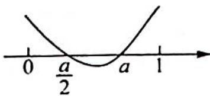
图1

若 $\frac{a^2}{4} + a - 1 > 0$ ，得 $2\sqrt{2} - 2 < a \leqslant 1$ ，则 $f(x)_{\max} = \frac{a^2}{4}$ ；若 $\frac{a^2}{4} - 1 + a \leqslant 0$ ，得 $0 < a \leqslant 2\sqrt{2} - 2$ ，则 $f(x)_{\max} = 1 - a$ 。

(2)如图2所示,当 $0<\frac{a}{2}\leqslant1<a$ 时,即 $1<a\leqslant2,f(x)$ 在 $\left(0,\frac{a}{2}\right)$ 上单调递增,在 $\left(\frac{a}{2},1\right)$ 上单调递减, $f(x)_{\max}=\dot{f}\left(\frac{a}{2}\right)=\frac{a^{2}}{4}$ .

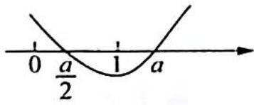
图2

(3)如图3所示,当 $\frac{a}{2}>1$ 时,即a>2,f(x)在[0,1]上单调递增, $f(x)_{\max}=f(1)=|1-a|=a-1.$

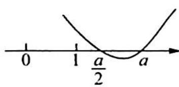

综上所述, $g(a)=\left\{\begin{aligned}&|1-a|,&0<a\leqslant2\sqrt{2}-2\text{或}a>2\\&\frac{a^{2}}{4},&2\sqrt{2}-2<a\leqslant2\end{aligned}\right.$ ，所以 $g(a)_{\min}=g(2\sqrt{2}-2)=$

图3

$$
\left| 1 - (2 \sqrt {2} - 2) \right| = 3 - 2 \sqrt {2}.
$$

4.【解析】令 x=1，得 $\left|a\right|\geqslant1$ ，所以 $a\geqslant1$ 或 $a\leqslant-1$ .

令 $g(x) = ax^3 -\ln x$ ，则 $g^{\prime}(x) = 3ax^{2} - \frac{1}{x} = \frac{3ax^{3} - 1}{x}.$

(1) 当 $a \leqslant -1$ 时, $g'(x) < 0, x \in (0,1], g(x)$ 在 $(0,1]$ 上单调递减, $g(x)_{\min} = g(1) = a \leqslant -1$ , 此时 $g(x)$ 的值域为 $[a, +\infty)$ , 则 $|g(x)|$ 最小值为 0, 不合题意.

(2)当 $a \geqslant 1$ 时，令 $g'(x) = 0$ ，得 $x = \sqrt[3]{\frac{1}{3a}}$ ，由导数正负性结合单调性知， $g(x)$ 在 $\left(0, \sqrt[3]{\frac{1}{3a}}\right)$ 上单调递减，在 $\left(\sqrt[3]{\frac{1}{3a}}, 1\right]$ 上单调递增，所以 $g(x)_{\min} = g\left(\sqrt[3]{\frac{1}{3a}}\right) > 0$ 只需满足 $g\left(\sqrt[3]{\frac{1}{3a}}\right) \geqslant 1$ ，解得 $a \geqslant \frac{\mathrm{e}^2}{3}$ .

综上所述，a 的取值范围是 $\left[\frac{e^{2}}{3}, +\infty\right)$ .

5.【解析】(1)由题意知,函数的定义域为 $(0,+\infty)$ .

当 $a \leqslant 0$ 时， $f(x) = x - a - \frac{a}{2} \ln x$ ，显然 $f(x)$ 单调递增。

当 $a > 0$ 时：

①若 $x \geqslant a$ ，则 $f(x) = x - a - \frac{a}{2} \ln x, f'(x) = 1 - \frac{a}{2x} > 0$ ;

②若 $x < a$ ，则 $f(x) = a - x - \frac{a}{2} \ln x, f'(x) = -1 - \frac{a}{2x} < 0.$

综上所述, 当 $a \leqslant 0$ 时, $f(x)$ 的单调递增区间为 $(0, +\infty)$ ; 当 $a > 0$ 时, $f(x)$ 的单调递减区间为 $(0, a)$ ,

单调递增区间为 $(a,+\infty)$ .

(2)由(1)知,当 $a \leqslant 0$ 时, $f(x)$ 单调递增,至多有一个零点,不合题意,所以必有 $a > 0$ , 由 $f(x)$ 在 $(0, a)$ 上单调递减,在 $(a, +\infty)$ 上单调递增,可知必须有 $f(a) < 0$ , 即 $-\frac{a}{2} \ln a < 0$ , 解得 $a > 1$ .

由 $f(1) = a - 1 - \frac{a}{2}\ln 1 = a - 1 > 0, f(a) = -\frac{a}{2}\ln a < 0$ 知 $x_{1} \in (1, a)$ , 而 $f(a^{2}) = a^{2} - a - a\ln a = a(a - 1 - \ln a)$ . 由经典不等式知, $a - 1 > \ln a$ , 则 $f(a^{2}) > 0$ , 所以 $x_{2} \in (a, a^{2})$ , 即证得 $1 < x_{1} < a < x_{2} < a^{2}$ .

## 训练 8

1.【解析】函数 $f(x)$ 定义域为 $(0, +\infty), f'(x) = 2e^{2x} - \frac{a}{x} = \frac{2xe^{2x} - a}{x}$ , 函数 $f'(x)$ 零点的个数等价于 $g(x) = 2xe^{2x} - a$ 零点的个数, 又 $g(x)$ 在 $(0, +\infty)$ 上单调递增.

(1) 当 $a \leqslant 0$ 时, $g(x)$ 恒大于零, $g(x)$ 无零点.

(2)当 $a > 0$ 时, $\mathrm{e}^{2x} > 2x + 1$ , 所以 $2x < \mathrm{e}^{2x} - 1$ , 所以 $2x\mathrm{e}^{2x} - a < (\mathrm{e}^{2x} - 1)\mathrm{e}^{2x} - a = (\mathrm{e}^{2x})^2 - \mathrm{e}^{2x} - a =$ $\left(\mathrm{e}^{2x} - \frac{1}{2}\right)^2 - a - \frac{1}{4} = 0$ , 即 $\mathrm{e}^{2x} - \frac{1}{2} = \sqrt{a + \frac{1}{4}}$ .

取 $x_0 = \frac{1}{2}\ln \left(\frac{1}{2} +\sqrt{a + \frac{1}{4}}\right)$ ，使得 $g(x_0) <   0,2x\mathrm{e}^{2x} - a > (2x)^2 -a = 0$ ，即 $2x = \sqrt{a}$ ，取 $x_{1} = \frac{\sqrt{a}}{2}$ ，使得 $g\left(\frac{\sqrt{a}}{2}\right)$ $>0.$ 由零点存在定理得， $\exists \xi \in \left(\frac{1}{2}\ln \left(\frac{1}{2} +\sqrt{a + \frac{1}{4}}\right),\frac{\sqrt{a}}{2}\right)$ ，使得 $g(\xi) = 0$ ，因此 $f^{\prime}(x)$ 零点的个数为1.

综上所述, 当 $a \leqslant 0$ 时, $f'(x)$ 没有零点; 当 $a > 0$ 时, $f'(x)$ 的零点个数为 1.

2.【解析】(1)因为 $g(x)=f'(x)=\mathrm{e}^{x}-x-\frac{m}{x}-(m+1)$ ，所以 $g'(x)=\mathrm{e}^{x}+\frac{m}{x^{2}}-1$ ，由题意， $g'(x)\geqslant0$ 在 $(0,+\infty)$ 上恒成立，即有 $e^{x}+\frac{m}{x^{2}}-1\geqslant0,x^{2}(e^{x}-1)+m\geqslant0$ .

令 $G(x) = x^{2}(\mathrm{e}^{x} - 1) + m, x > 0$ ，所以 $G'(x) = 2x(\mathrm{e}^{x} - 1) + x^{2}\mathrm{e}^{x}$ ，因为 $x > 0$ ，所以 $\mathrm{e}^{x} - 1 > 0, x^{2}\mathrm{e}^{x} > 0$ ，则 $G'(x) > 0$ ，因此 $G(x)$ 在 $(0, +\infty)$ 上单调递增， $G(x) > G(0) = m$ ，所以 $m \geqslant 0$ 。

(2) 当 $m = -\frac{1}{3}$ 时, $F(x) = \frac{1}{2} x^2 - \frac{1}{3} x - \frac{1}{3} \ln x + \frac{1}{3x} - \frac{2}{3}, F'(x) = \frac{(x-1)(3x^2+2x+1)}{3x^2}$ .

当 $0 < x < 1$ 时, $F'(x) < 0$ ; 当 $x > 1$ 时, $F'(x) > 0$ , 所以 $F(x)$ 在 $(0,1)$ 上单调递减, 在 $(1, +\infty)$ 上单调递增.

又 $F(1) = -\frac{1}{6} < 0, F\left(\frac{1}{\mathrm{e}^2}\right) = \frac{1}{3}\mathrm{e}^2 - \frac{1}{3\mathrm{e}^2} + \frac{1}{2\mathrm{e}^4} > 0, F(\mathrm{e}) = \frac{1}{2}\mathrm{e}^2 + \frac{1}{3\mathrm{e}} - 1 - \frac{1}{3}\mathrm{e} > 2 - 1 - \frac{\mathrm{e}}{3} > 0$ ，所以 $\exists x_1 \in \left(\frac{1}{\mathrm{e}^2}, 1\right), \exists x_2 \in (1, \mathrm{e})$ ，使 $F(x_1) = F(x_2) = 0$ ，故当 $m = -\frac{1}{3}$ 时， $F(x)$ 有且仅有两个零点。

3.【解析】(1)当 $a = 1$ 时, $f(x) = \ln x + \frac{1}{2} x^2 - 2x$ , 则 $f'(x) = \frac{1}{x} + x - 2 \geqslant 0$ , 当 $x \in (0,1)$ 时, $f'(x) > 0$ ; 当 $x = 1$ 时, $f'(x) = 0$ ; 当 $x \in (1, +\infty)$ 时, $f'(x) > 0$ .

所以在(0,1)和(1,+∞)上， $f(x)=\ln x+\frac{1}{2}x^{2}-2x$ 单调递增， $f(1)=0+\frac{1}{2}-2=-\frac{3}{2}$ ，当 $x\in(0,1)$ 时， $f(x)<f(1)<0$ ，所以 $f(x)$ 在(0,1)上没有零点.

$f(4)=\ln4+8-8=\ln4>0,f(1)f(4)<0$ ,所以 $f(x)$ 在 $(1,+\infty)$ 上有一个零点,故当a=1时,函数 $f(x)$ 有一个零点.

(2) 设 $g(x) = \ln x - (a + 1)x$ ，则 $g'(x) = \frac{1}{x} - (a + 1)$ ，令 $g'(x) = 0$ ，可得 $x = \frac{1}{a + 1}$ .

当 $0 < x < \frac{1}{a + 1}$ 时， $g'(x) > 0, g(x)$ 单调递增；当 $x > \frac{1}{a + 1}$ 时， $g'(x) < 0, g(x)$ 单调递减，所以 $g(x)_{\max} = g\left(\frac{1}{a + 1}\right) = \ln \frac{1}{a + 1} - 1$ ，要使得 $g(x)$ 有两个零点，须满足 $g(x)_{\max} > 0$ ，即 $\frac{1}{a + 1} > e, 0 < a + 1 < \frac{1}{e}$ ，所以 $-1 < a < \frac{1}{e} - 1$ 。

①当 $0 < x < \frac{1}{a + 1}$ 时， $g(1) = \ln 1 - (a + 1) < 0, g(1)g(\frac{1}{a + 1}) < 0$ ，所以 $g(x)$ 在 $\left(0, \frac{1}{a + 1}\right)$ 上存在一个零点.

②当 $x > \frac{1}{a + 1}$ 时，需要找一个点 $x_0$ 满足 $g(x_0) < 0, g(x) = \ln x - (a + 1)x < 2\sqrt{x} - (a + 1)x =$ $\sqrt{x}[2 - (a + 1)\sqrt{x}] < 0$ ，只需 $2 - (a + 1)\sqrt{x} < 0$ ，即 $x > \frac{4}{(a + 1)^2}$ ，取 $x_0 = \frac{5}{(a + 1)^2}$ ，则 $g(x_0) < 0$ ，所以 $g(x)$ 在 $\left(\frac{1}{a + 1}, + \infty\right)$ 上存在唯一零点.

所以方程 $g(x)$ 有两个零点，即方程 $f(x) = \frac{1}{2} ax^2$ 有两个不同实根.

综上所述，a 的取值范围是 $\left(-1, \frac{1}{e}-1\right)$ .

4.【解析】 $f'(x)=2ae^{2x}-2(ax+a+1)e^{x}+2x+2=2(ae^{x}-1)(e^{x}-x-1)$ ，令 $f'(x)=0$ ，解得 $x=\ln\frac{1}{a}$ ，或x=0。
当 $x\in\left(-\infty,\ln\frac{1}{a}\right)$ 时， $f'(x)<0,f(x)$ 单调递减；当 $x\in\left(\ln\frac{1}{a},+\infty\right)$ 时， $f'(x)>0,f(x)$ 单调递增，故 $f(x)_{\min}=f\left(\ln\frac{1}{a}\right)=ae^{2\ln\frac{1}{a}}-2\left(a\ln\frac{1}{a}+1\right)e^{\ln\frac{1}{a}}+\left(\ln\frac{1}{a}\right)^{2}+2\ln\frac{1}{a}=\left(\ln\frac{1}{a}\right)^{2}-\frac{1}{a}.$ 令 $t=\frac{1}{a}\in\left[\frac{1}{2},+\infty\right)$ ，记 $g(t)=\ln^{2}t-t, g'(t)=2\frac{1}{t}\ln t-1=\frac{2\ln t-t}{t}$ ，记 $h(t)=2\ln t-t, h'(t)=\frac{2}{t}-1.$ 当 $t \in \left[\frac{1}{2}, 2\right)$ 时， $h'(t) > 0, h(t)$ 单调递增；当 $t \in (2, +\infty)$ 时， $h'(t) < 0, h(t)$ 单调递减，所以 $h(t)_{\max}=$ $h(2)=2\ln2-2<0,g'(t)<0,g(t)$ 在 $\left[\frac{1}{2},+\infty\right)$ 单调递减，则 $g(t)\leqslant g\left(\frac{1}{2}\right)=$ $\left(\ln\frac{1}{2}\right)^{2}-\frac{1}{2}<0$ ，即 $f\left(\ln\frac{1}{a}\right)<0.$ 下面需要在 $\ln\frac{1}{a}$ 两侧各找一个 x 使得 $f(x)>0.$

(1) 当 $x < \ln \frac{1}{a}$ 时, $f(x) = ae^{2x} - 2(ax + 1)e^x + x^2 + 2x > 0$ , 只需 $-2(ax + 1)e^x + x^2 + 2x > 0$ ,$-2(ax + 1)\mathrm{e}^{x} > 0, x^{2} + 2x > 0$ ，即 $ax + 1 < 0, x^{2} + 2x > 0$ ，也就是 $x < -\frac{1}{a}, x < -2$ ，取 $x_{0} < \min \left\{-\frac{1}{a}, -2\right\}$ ，则 $f(x_{0}) > 0, f\left(\ln \frac{1}{a}\right)f(x_{0}) < 0, f(x)$ 在 $\left(-\infty, \ln \frac{1}{a}\right)$ 上存在唯一零点.

(2) 当 $x > \ln \frac{1}{a}$ 时, $f(x) = ae^{2x} - 2(ax + 1)e^x + x^2 + 2x > 0$ , 即 $e^x [ae^x - 2(ax + 1)] + x^2 + 2x > 0$ , 只需 $e^x [ae^x - 2(ax + 1)] > 0, x^2 + 2x > 0, ae^x - 2(ax + 1) > 0, x^2 + 2x > 0, aex - 2(ax + 1) > 0, x^2 + 2x > 0, (ae - 2a)x > 2, x^2 + 2x > 0$ , 也就是 $x > \frac{2}{ae - 2a}, x > 0$ .

取 $x_{1} > \max \left\{\frac{2}{ae - 2a},0\right\}$ ，则 $f(x_{1}) > 0,f\left(\ln \frac{1}{a}\right)f(x_{1}) <   0,f(x)$ 在 $\left(\ln \frac{1}{a}, + \infty\right)$ 上存在唯一零点.综上所述， $f(x)$ 必有两个零点.

5.【解析】 $f'(x)=(2e^{x}+1)(ae^{x}-1)$ ，当 $a\leqslant0$ 时， $f(x)$ 至多1个零点，不合题意.

当 $a > 0, f(x)_{\min} = f(-\ln a) = 1 - a^{-1} + \ln a$ ，则 $1 - a^{-1} + \ln a < 0$ .

令 $g(a)=1-a^{-1}+\ln a$ , $g(a)$ 是 $(0,+\infty)$ 上的增函数，且 $g(1)=0$ ，由 $g(a)<0$ ，得 0<a<1，此时 $f(-2)=ae^{-4}+(a-2)e^{-2}+2>0$ ，下面需在 $-\ln a$ 的右侧找点，使得 $f(x)>0$ 。

$f(x)=ae^{2x}+(a-2)e^{x}-x=e^{x}(ae^{x}+a-2)-x$ ，只需 $ae^{x}+a-2>1$ ，得 $x>\ln\left(\frac{3}{a}-1\right)$ ，取 $x_{0}=\ln\left(\frac{3}{a}\right)$ ， $f\left(\ln\frac{3}{a}\right)=a\cdot\left(\frac{3}{a}\right)^{2}+(a-2)\cdot\frac{3}{a}-\ln\frac{3}{a}=\frac{3}{a}-\ln\frac{3}{a}+3>0$ 。所以 $f(x)$ 在 $(-2,-\ln a)$ 和 $(- \ln a, \ln \frac{3}{a})$ 内恰各有一个零点。

综上所述，0<a<1，即a的取值范围是(0,1).

6.【分析】由 $g(x)$ 在区间 $(-1, +\infty)$ 内单调递增可知 $g'(x)$ 在 $(-1, +\infty)$ 上恒不小于 0，解得 $a \leqslant e^{-1}$ . $f'(x) = x^{-1} - a$ ，可知当 $a \leqslant 0$ 时，恒有 $f'(x) > 0$ ，且当 a > 0 时，有 $f(x)_{\max} = f(a^{-1})$ ; 再利用零点存在定理确定零点的个数，赋值前，可通过放缩，将 $\ln x$ 转为易于处理的幂函数形式.

$$
g (x)
$$

$$
g ^ {\prime} (x) = \mathrm{e} ^ {x} - a
$$

解得 $a \leqslant \mathrm{e}^{-1}$ , 下面分类讨论:

(1) 若 $a \leqslant 0$ , 此时恒有 $f'(x) > 0, f(x)$ 在 $(0, +\infty)$ 上单调递增.

因为 $f(1) = -a \geqslant 0$ ，所以只需找到一个 $x_0$ ，使得 $f(x_0) \leqslant 0$ ，即证此时 $f(x)$ 恰有一个零点。 $f(x_0) \leqslant 0 \Leftrightarrow \ln x_0 - ax_0 \leqslant 0 \Leftrightarrow \ln x_0 \leqslant ax_0$ ，可以用插值法，但此处用放缩法更为巧妙简便。

过程如下，熟知 $\ln x_0 \leqslant x_0 - 1$ ，所以只需令 $x_0 - 1 \leqslant ax_0$ ，解得 $x_0 \in \left(0, \frac{1}{1 - a}\right]$ .

取 $x_0 = \frac{1}{1 - a}$ , 此时 $f(x_0) = f\left(\frac{1}{1 - a}\right) = \ln \frac{1}{1 - a} - \frac{a}{1 - a} \leqslant \frac{1}{1 - a} - 1 - \frac{a}{1 - a} = 0$ , 所以 $f(x_0)f(1) \leqslant 0$ , 由零点存在性定理结合单调性, 可知此时 $f(x)$ 恰有一个零点.

(2) 若 $0 < a \leqslant e^{-1}$ , 求导可知此时 $f(x)$ 在 $(0, a^{-1})$ 上单调递增, 在 $(a^{-1}, +\infty)$ 上单调递减, 所以 $f(x)_{\max} = f(a^{-1}) = -\ln a - 1$ .

当 $a = \mathrm{e}^{-1}$ 时， $f(x)_{\max} = f(a^{-1}) = -\ln a - 1 = 0$ ，所以 $f(x)$ 恰有一个零点。

当 $0 < a < \mathrm{e}^{-1}$ 时， $f(a^{-1}) = -\ln a - 1 > 0$ ，又 $f(1) = -a < 0, f(1)f(a^{-1}) < 0.$

所以可知, $f(x)$ 在 $(0,a^{-1})$ 上恰有一个零点,接下来的关键在于证明 $f(x)$ 在 $(a^{-1},+\infty)$ 上也恰有一个零点,为此需要找到 $x_{1}\in(a^{-1},+\infty)$ ,使得 $f(x_{1})<0$ ,即 $\ln x_{1}-ax_{1}<0$ .

熟知 $\ln x_{1} < 2\sqrt{x_{1}}$ ，所以只需 $2\sqrt{x_1} - ax_1 = 0$ ，解得 $x_{1} = \frac{4}{a^{2}} >\frac{1}{a}$ ，此时 $f\left(\frac{4}{a^2}\right) <   0$ ，则 $f\left(\frac{1}{a}\right)f\left(\frac{4}{a^2}\right) <   0,$ 所以结合单调性，可知 $f(x)$ 在 $\left(\frac{1}{a},\frac{4}{a^2}\right)$ 上恰有一个零点.

综上所述,当 $a \leqslant 0$ 或 $a = \mathrm{e}^{-1}$ 时, $f(x)$ 恰有一个零点, 当 $0 < a < \mathrm{e}^{-1}$ 时, $f(x)$ 恰有两个零点.

【评注】本题值得品味之处,在于同样是赋值,使得 $\ln x - ax < 0$ ,为什么前一个放缩采用 $\ln x \leqslant x - 1$ ,而后一个放缩采用 $\ln x < 2\sqrt{x}$ 呢? 原因在 $a$ 范围的变化. 在第二种情况中,因为 $0 < a < e^{-1}$ ,所以如果还采用 $\ln x \leqslant x - 1$ ,则 $\ln x - ax \leqslant (1 - a)x - 1$ ,而此时 $x \in (a^{-1}, +\infty)$ ,又 $1 - a > 0$ ,所以 $(1 - a)x - 1 \geqslant (1 - a)a^{-1} - 1 = a^{-1} - 2 > e - 2 > 0$ ,不等号反了,究其原因,是把 $\ln x$ 放成 $x - 1$ 放得太大了,要更精确,即放得小一点,可以降低 $x$ 的幂次,运用 $\ln x \leqslant x - 1$ 的变换, $\ln x = \ln (x^{\frac{1}{a}})^{a} = a\ln x^{\frac{1}{a}} \leqslant a(x^{\frac{1}{a}} - 1) \leqslant a x^{\frac{1}{a}} - 1(a \geqslant 1)$ ,当 $a = 2$ 时, $\ln x < 2\sqrt{x} - 1 < 2\sqrt{x}$ ,所以想到 $\ln x < 2\sqrt{x}$ .

7.【解析】(1) $f'(x)=\mathrm{e}^{x}-a$ , $g'(x)=a-\frac{1}{x}=\frac{ax-1}{x}$ .

①当 $a \leqslant 0$ 时, $f'(x) > 0$ , 所以 $f(x)$ 在 $\mathbf{R}$ 上单调递增, 此时 $f(x)$ 无最小值;

②当 a>0 时，令 $f'(x)=0$ ，得 $x=\ln a, g'(x)=0$ ，得 $x=\frac{1}{a}$ .

$f(x)$ 在 $(-\infty, \ln a)$ 上单调递减，在 $(\ln a, +\infty)$ 上单调递增， $g(x)$ 在 $\left(0, \frac{1}{a}\right)$ 上单调递减，在 $\left(\frac{1}{a}, +\infty\right)$ 上单调递增.

$$
f (x) _ {\min} = f (\ln a) = \mathrm{e} ^ {\ln a} - a \ln a = a - a \ln a, g (x) _ {\min} = g \left(\frac {1}{a}\right) = 1 - \ln \frac {1}{a} = 1 + \ln a.
$$

依题意得 $a - a\ln a = 1 + \ln a$ ，即 $a - 1 = (a + 1)\ln a.$

构造函数 $F(a) = (a + 1)\ln a - a + 1,F(1) = 0,F^{\prime}(a) = \ln a + \frac{a + 1}{a} -1 = \ln a + \frac{1}{a},F^{\prime \prime}(a) = \frac{1}{a} -\frac{1}{a^{2}} =$ $\frac{a - 1}{a^2} = 0$ ，得 $a = 1$

$F'(a)$ 在 $(0,1)$ 上单调递减，在 $(1,+\infty)$ 上单调递增，且 $F'(1)=1>0$ ，因此 $F'(a)>0, F(a)$ 在 $(0,+\infty)$ 上单调递增，所以 $F(a)=0$ ，得 a=1。

(2)由(1)知 $a = 1, f(x) = \mathrm{e}^{x} - x, f'(x) = \mathrm{e}^{x} - 1$ , 所以 $f(x)$ 在 $(- \infty, 0)$ 上单调递减, 在 $(0, +\infty)$ 上单调递增.

$g(x)=x-\ln x, g'(x)=1-\frac{1}{x}=\frac{x-1}{x}, g(x)$ 在 $(0,1)$ 上单调递减， $(1,+\infty)$ 上单调递增.

依题意设直线 $y = b$ 与两条曲线 $y = f(x)$ 和 $y = g(x)$ 相交于 $A, B, C$ 三点且横坐标分别为 $x_{1}, x_{2}, x_{3}$ $(x_{1} < x_{2} < x_{3})$ ，则 $\mathrm{e}^{x_1} - x_1 = \mathrm{e}^{x_2} - x_2 = b$ ，且 $x_{2} - \ln x_{2} = x_{3} - \ln x_{3} = b$ ，即 $f(x_{1}) = f(x_{2}) = f(\ln x_{2}) = f(\ln x_{3})$ ，因此 $x_{1} = \ln x_{2}, x_{2} = \ln x_{3}$ ，也就是 $x_{2} = \mathrm{e}^{x_{1}}, x_{3} = \mathrm{e}^{x_{2}}, x_{1} + x_{3} = x_{1} + \mathrm{e}^{x_{2}} = \ln x_{2} + \mathrm{e}^{x_{2}} = (x_{2} - b) + (b + x_{2}) = 2x_{2}$ ，因此 $x_{1}, x_{2}, x_{3}$ 成等差数列。

8.【分析】由 $f(0)=0$ 可得 x=0 为 $f(x)$ 的零点，换元，令 $s=a^{3}, t=b^{3}$ ，又因为 $f(\log_{s}3)>0, f(\log_{t}3)>0$ ，根据零点存在定理可得 x=0 是 $f(x)$ 在 $(\log_{s}3, \log_{t}3)$ 上的唯一零点，且 $f'(0)=0$ 。

【解析】令 $s=a^{3}, t=b^{3}$ ，则 $f(x)=s^{x}+t^{x}-2, 0<s<1<t$ 。

注意到 $f(0) = 0$ ，由题意， $x = 0$ 即为 $f(x)$ 唯一的零点，则 $x = 0$ 也是 $f(x)$ 在 $(\log_3, \log_t 3)$ 上的唯一零点，又因为 $f(\log_3 3) = 1 + t^{\log_3 3} > 0$ ， $f(\log_t 3) = s^{\log_t 3} + 1 > 0$ ，所以由零点存在性定理，不存在 $x \in (\log_3, \log_t 3)$ ，使得 $f(x) < 0$ 。

又 $f(x) \geqslant 0$ 在 $(\log_3, \log_t 3)$ 上恒成立， $f(0) = 0$ ，所以 $f(x)$ 在 $x = 0$ 处取得最小值，即 $f'(0) = 0$ . $f'(x) = s^x \ln s + t^x \ln t$ ，代入 $f'(0) = 0$ ，得 $\ln s + \ln t = 0$ ，所以 $st = 1$ ，即 $a^3 b^3 = 1, ab = 1$ .

【评注】按照插值法的步骤,本题实际的解题思路如下.

(1)定性研究,发现 $f(+\infty)>0,f(-\infty)>0,f(0)=0$ ,结合 $f(x)$ 恰有一个零点及零点存在定理,这启示我们 $f(x)$ 在 $x=0$ 处取得最小值, $f'(0)=0$ ,但直接写不严谨,需要更严格,我们只需缩小区间,得到一个包含 0 在内的区间 $(m,n)$ ,使得 $f(m)>0,f(n)>0$ ,则上述 $f'(0)=0$ 的结论依然成立.由插值效应可知,当 $x_1$ 足够大时,必有 $x_1$ ,使得 $f(x_1)>0$ ,即 $s^{x_1}+t^{x_1}-2>0$ ,我们需要具体解得一个这样的 $x_1$ .

(2)不等式变形, $s^{x_1} + t^{x_1} - 2 > 0 \Leftrightarrow t^{x_1} > 2 - s^{x_1}$ , 注意到当 $x_1 \to +\infty$ 时, $t^{x_1} \to +\infty, 2 - s^{x_1} \to 2$ , 提示我们下一步插值的选择.

(3)插值,取常数 $C = 3$ ,解不等式组 $t^{x_1} > 3 > 2 - s^{x_1}$ ,得 $x_1 > \log_t 3$ ,当 $x_1 = \log_t 3$ 时,两不等式的不等号不同时成立,所以仍有 $t^{x_1} > 2 - s^{x_1}$ ,即 $f(\log_t 3) > 0$ ,同理可得在 $-\infty$ 这一侧的 $x_2$ 可取 $\log_s 3$ ,即 $f(\log_s 3) > 0$ .

9.【解析】由 $f(x)=0$ 得 $a=\frac{e^{x}}{x^{n}}, x>0$ ，则令 $g(x)=\frac{e^{x}}{x^{n}}, x>0$ ，则 $g'(x)=\frac{e^{x} \cdot x^{n}-e^{x} \cdot nx^{n-1}}{x^{2n}}=\frac{e^{x}(x-n)}{x^{n+1}}=0$ ，
x=n.

函数 $g(x)$ 在 $(0, n)$ 上单调递减，在 $(n, +\infty)$ 上单调递增， $g(x)_{\min} = \left(\frac{e}{n}\right)^n$ ，当 $a < \left(\frac{e}{n}\right)^n$ 时， $a = g(x)$ 没有零点；当 $a = \left(\frac{e}{n}\right)^n$ 时， $a = g(x)$ 有一个零点；当 $a > \left(\frac{e}{n}\right)^n$ 时， $a = g(x)$ 有两个零点。

$g(x_{1}) = \frac{\mathrm{e}^{x_{1}}}{x_{1}^{n}} >\frac{1}{x_{1}^{n - 1}} = a$ ，得 $x_{1} = \sqrt[n - 1]{\frac{1}{a}} <  n$ ，使得 $g\left(\sqrt[n - 1]{\frac{1}{a}}\right) > a.$

$g(x_{2}) = \frac{\mathrm{e}^{x_{2}}}{x_{2}^{n}} >\frac{\left(\frac{x_{2}}{n + 1} + 1\right)^{n + 1}}{x_{2}^{n}} >\frac{\left(\frac{x_{2}}{n + 1}\right)^{n + 1}}{x_{2}^{n}} = \frac{x_{2}}{(n + 1)^{n + 1}} = a$ ，则 $x_{2} = (n + 1)^{n + 1}\cdot a > (n + 1)^{n + 1}\cdot \left(\frac{\mathrm{e}}{n}\right)^{n}>$

n, 因此 $\exists \xi \in \left(\sqrt[n-1]{\frac{1}{a}}, n\right)$ ，使得 $g(\xi) = a$ ，以及 $\exists \eta \in (n, (n+1)^{n+1}a)$ ，使得 $g(\eta) = a$ ，故当 $a > \left(\frac{\mathrm{e}}{n}\right)^n$ 时， $g(x) = a$ 有两个零点.

综上所述， $f(x)$ 在 $(0, + \infty)$ 上只有一个零点时， $a = \left(\frac{\mathrm{e}}{n}\right)^n.$

10.【解析】(1) $f(x)=a+\sqrt{x}\ln x,f'(x)=\frac{\ln x}{2\sqrt{x}}+\frac{\sqrt{x}}{x}=\frac{\ln x+2}{2\sqrt{x}}(x>0)$ ，令 $f'(x)=0$ ，得 $x=e^{-2}$ .

当 $x \in (0, \mathrm{e}^{-2})$ 时， $f'(x) < 0, f(x)$ 单调递减；当 $x \in (\mathrm{e}^{-2}, +\infty)$ 时， $f'(x) > 0, f(x)$ 单调递增，所以 $f(x)$ 的单调递减区间是 $(0, \mathrm{e}^{-2})$ ，单调递增区间是 $(\mathrm{e}^{-2}, +\infty)$ .

(2)由(1)知 $f(x)_{\min} = f(\mathrm{e}^{-2}) = a + \mathrm{e}^{-1}\cdot (-2) = a - \frac{2}{\mathrm{e}}.$

①当 $a = \frac{2}{\mathrm{e}}$ 时， $f(x)$ 在 $x \in (0, \mathrm{e}^{-2})$ 单调递减，在 $x \in (\mathrm{e}^{-2}, +\infty)$ 单调递增。 $f(x) \geqslant f(\mathrm{e}^{-2}) = a - \frac{2}{\mathrm{e}} = 0$ ，此时 $f(x)$ 的零点个数为 1。

②当 $a > \frac{2}{\mathrm{e}}$ 时，由 $f(x) > f(x)_{\min} = f(\mathrm{e}^{-2}) = a - \frac{2}{\mathrm{e}} >0$ ，可知 $f(x)$ 的零点个数为0.

③当 $a \leqslant 0$ 时, 当 $x \in (0, \mathrm{e}^{-2})$ 时, $f(x) = a + \sqrt{x} \ln x < a \leqslant 0$ , 没有零点; 当 $x \in (\mathrm{e}^{-2}, +\infty)$ 时, $f(\mathrm{e}^{-2a}) = a(1 - 2\mathrm{e}^{-a}) > 0$ , 又因为 $f(\mathrm{e}^{-2}) = a - \frac{2}{\mathrm{e}} < 0$ , 所以 $f(x)$ 有 1 个零点.

④当 $0 < a < \frac{2}{\mathrm{e}}$ 时， $f(x)$ 在 $(\mathrm{e}^{-2}, +\infty)$ 单调递增，此时 $f(x)_{\min} = f(\mathrm{e}^{-2}) = a - \frac{2}{\mathrm{e}} < 0$ ，又因为 $f(1) = a > 0$ ，故 $f(x)$ 在 $(\mathrm{e}^{-2}, +\infty)$ 上有唯一零点.

又 $f(x)$ 在 $x \in (0, \mathrm{e}^{-2})$ 单调递减，且 $f(\mathrm{e}^{-2}) = a - \frac{2}{\mathrm{e}} < 0$ ，下面在 $(0, \mathrm{e}^{-2})$ 上找一个 $x$ ，满足 $f(x) = a + \sqrt{x} \ln x > 0$ ，只需 $f(x) = a + \sqrt{x} \left(-\frac{4}{\sqrt[4]{x}}\right) > 0, a - 4\sqrt[4]{x} > 0, \sqrt[4]{x} < \frac{a}{4}$ ，也就是 $x < \frac{a^4}{256}$ ，取 $x_0 = \frac{a^4}{257}$ ，则 $f(x_0) > 0$ ，所以 $f(x)$ 在 $(0, \mathrm{e}^{-2})$ 上存在唯一零点。

于是， $f(x)$ 有2个零点.

综上所述, 当 $a \leqslant 0$ 或当 $a = \frac{2}{\mathrm{e}}$ 时, $f(x)$ 有 1 个零点; 当 $a > \frac{2}{\mathrm{e}}$ 时, $f(x)$ 没有零点; 当 $0 < a < \frac{2}{\mathrm{e}}$ 时, $f(x)$ 有 2 个零点.

11.【解析】(1) $f'(x)=\cos x+\frac{1}{x^{2}}$ , $f''(x)=-\sin x-\frac{2}{x^{3}}<0$ , 故 $f'(x)$ 在 $(0,\pi)$ 上单调递减。又 $f'\left(\frac{\pi}{2}\right)=0+\frac{4}{\pi^{2}}>0$ , $f'\left(\frac{2\pi}{3}\right)=-\frac{1}{2}+\frac{9}{4\pi^{2}}=\frac{9-2\pi^{2}}{4\pi^{2}}<0$ , 故 $f'(x)$ 在 $(0,\pi)$ 上有唯一零点。

(2) 设 $f'(x)$ 在 $(0, \pi)$ 上的零点为 $x_0$ ，由第(1)问知 $\frac{1}{x_0^2} = -\cos x_0, x_0 \in \left(\frac{\pi}{2}, \frac{2\pi}{3}\right)$ ，且 $f(x)$ 在 $(0, x_0)$ 上单调递增，在 $(x_0, \pi)$ 上单调递减.

$f\left(\frac{\pi}{6}\right) = \frac{1}{2} -\frac{6}{\pi} < 0,f(\pi) = -\frac{1}{\pi} < 0$ ，因为 $x_0\in \left(\frac{\pi}{2},\frac{2\pi}{3}\right)$ ，所以 $\cos x_0\in \left(-\frac{1}{2},0\right),\sin^2 x_0 - \frac{1}{x_0^2} =$ $\sin^2 x_0 + \cos x_0 = -\cos^2 x_0 + \cos x_0 + 1 > -\left(-\frac{1}{2}\right)^2 -\frac{1}{2} +1 > 0$ ，由于 $\sin x_0 + \frac{1}{x_0} >0$ ，所以 $f(x_0) = \sin x_0 -$ $\frac{1}{x_0} >0$ ，故 $f(x)$ 在 $(0,x_0)$ 有且只有一个零点，在 $(x_0,\pi)$ 有且只有一个零点.

综上所述， $f(x)$ 有且仅有两个零点.

## 训练 9

1. 【解析】 $\frac{e^{x}}{x^{3}}-x-a\ln x-1=x^{-3}e^{x}-x-a\ln x-1=e^{(x-3\ln x)}-x-a\ln x-1\geqslant(x-3\ln x)+1-x-a\ln x-1=$ $-(a+3)\ln x\geqslant0$ ，当且仅当 $x-3\ln x=0$ 时，等号成立，因为 x>1，所以 $\ln x>0$ ，只需 $a+3\leqslant0$ ，即 $a\leqslant-3$ 。

故选 B.

【评注】(1)本题用差一的同构方式构造函数 $g(x) = \mathrm{e}^{x} - x - 1$ , 将 $x - 3 \ln x$ 看成一个整体 $x$ , 使用经典不等式 $\mathrm{e}^{x} \geqslant x + 1 (x \in \mathbb{R})$ 进行放缩.

(2)同构法常构造三大函数是 $g(x) = x\mathrm{e}^{x}, g(x) = x\mathrm{e}^{x} + x, g(x) = \mathrm{e}^{x} - x - 1$ (此时的函数值非负，在 $x = 0$ 处取等).

2.【分析】(1)本题函数形式并不复杂,没有分式与对数,可以先求出函数的导数,直接对参数a进行分类讨论;(2) $f(x)$ 恒不小于0,即 $f(x)_{\min}\geqslant0$ ,无法分离参数,那么可以借助第一问的结论,分类讨论各种情形.
【解析】(1)函数 $f(x)$ 的定义域为 R, 则 $f'(x)=(\mathrm{e}^{x}-a)(2\mathrm{e}^{x}+a), x \in \mathbb{R}$ .

①当 a=0 时， $f'(x)>0$ 恒成立， $f(x)$ 在 R 上单调递增.

②当 $a > 0$ 时, $2\mathrm{e}^{x} + a > 0$ , 令 $\mathrm{e}^{x} - a = 0$ , 解得 $x = \ln a$ , 故当 $x < \ln a$ 时, $f'(x) < 0$ , $f(x)$ 单调递减; 当 $x > \ln a$ 时, $f'(x) > 0$ , $f(x)$ 单调递增.

③当 $a < 0$ 时, $\mathrm{e}^x - a > 0$ , 令 $2\mathrm{e}^x + a = 0$ , 解得 $x = \ln \left(\frac{-a}{2}\right)$ , 故当 $x < \ln \left(\frac{-a}{2}\right)$ 时, $f'(x) < 0$ , $f(x)$ 单调递减; 当 $x > \ln \left(\frac{-a}{2}\right)$ 时, $f'(x) > 0$ , $f(x)$ 单调递增.

(2) 分类讨论：

①当 a=0 时， $f(x)=\mathrm{e}^{2x}\geqslant0$ 恒成立；

②当 $a > 0$ 时，由(1)可得 $f(x)_{\min} = f(\ln a) = -a^2\ln a$ ，所以 $f(x)_{\min}\geqslant 0\Leftrightarrow \ln a\leqslant 0$ ，解得 $0 < a\leqslant 1$

③当 a<0 时，由(1)可得 $f(x)_{\min}=f\left(\ln\frac{-a}{2}\right)=\frac{3a^{2}}{4}-a^{2}\ln\left(\frac{-a}{2}\right)$ ，令 $f(x)_{\min}\geqslant0$ ，解得 $-2e^{\frac{3}{4}}\leqslant a<0$ .
综上所述，a 的取值范围为 $\left[-2e^{\frac{3}{4}},1\right]$ .

【评注】本题的参数 $a$ 既有二次项, 又有一次项, 显然无法使用分离参数法. 注意本题的函数形式较为简洁,又有第一问的结论, 这启示我们直接分类讨论, 一步一步循序渐进, 这道题就自然解出了.

3.【分析】注意到 $f(1) = 0$ , 这表明 $f(x)$ 在 $x = 1$ 时取得极大值, 因此 $f'(1) = 0$ , 由此得出 $a$ 需满足的必要条件, 再证明其充分性.

【解析】 $f'(x)=\frac{2}{2x-1}-\frac{a}{x^{2}}-a$ ，因为 $f(x)\leqslant0$ 恒成立，又 $f(1)=0$ ，所以 $f(x)$ 在x=1时取得极大值，因此 $f'(1)=0$ ，解得a=1，此为a需满足的必要条件，下证其充分性.

即证当 $a = 1$ 时， $f(x) = \ln (2x - 1) + \frac{1}{x} - x \leqslant 0$ 恒成立，这里 $x \in \left(\frac{1}{2}, +\infty\right)$ .

$f'(x)=\frac{2}{2x-1}-\frac{1}{x^{2}}-1=\frac{-(x-1)(2x^{2}-x+1)}{(2x-1)x^{2}}$ ，所以当 $x\in\left(\frac{1}{2},1\right)$ 时， $f'(x)>0$ ；当 $x\in(1,+\infty)$

时， $f'(x)<0$ ，则 $f(x)$ 在 $\left(\frac{1}{2},1\right)$ 上单调递增，在 $(1,+\infty)$ 上单调递减，所以 $f(x)\leqslant f(1)=0$ 。

综上所述,满足条件的 a 的值为 1.

【评注】常规思路是对参数 $a$ 分类讨论, 讨论标准和原则为 $f(x)$ 的单调性, 即 $f'(x)$ 的正负, 这样做比较烦琐. 本题在观察到 $f(1)=0$ 后, 求出必要条件 $a=1$ , 既为下面的充分性证明指出了方向, 又避免了大量讨论, 且思路清晰自然.

4.【分析】思路一:题中 $\lambda$ 只出现一次,很容易改写成一侧只含有 $\lambda$ 的形式,因此可将 $\lambda$ 分离出来;思路二:将原不等式转化为 $e^{x} + x^{2} + 1 > \lambda x$ ,数形结合借助切线求解.

【解析】解法一(分离参数法): $xf(x) > -x^{2} + \lambda x - 1$ 恒成立 $\Leftrightarrow e^{x} + x^{2} + 1 > \lambda x$ 恒成立, 又 $x \in (0, +\infty)$ , 即 $\frac{e^{x} + x^{2} + 1}{x} > \lambda$ 恒成立.

令 $g(x) = \frac{\mathrm{e}^x + x^2 + 1}{x} = \frac{\mathrm{e}^x}{x} + x + \frac{1}{x}$ , 则 $g'(x) = \frac{x\mathrm{e}^x - \mathrm{e}^x}{x^2} + 1 - \frac{1}{x^2}$ , 注意到 $g'(1) = 0$ , 可因式分解为 $g'(x) = \frac{(x - 1)(\mathrm{e}^x + x + 1)}{x^2}$ .

当 $0 < x < 1$ 时， $g'(x) < 0$ ；当 $x > 1$ 时， $g'(x) > 0$ ，所以 $g(x)_{\min} = g(1) = e + 2$ .

故 $\lambda$ 的取值范围为 $(-∞, e+2)$ .

解法二(半分离参数法 数形结合): $xf(x) > -x^{2} + \lambda x - 1$ 恒成立 $\Leftrightarrow \mathrm{e}^{x} + x^{2} + 1 > \lambda x$ 恒成立. 设 $g(x) = \mathrm{e}^{x} + x^{2} + 1, h(x) = \lambda x, x \in (0, +\infty)$ , 即 $g(x) > h(x)$ 恒成立. 设 $y = kx$ 为 $g(x)$ 的切线, 切点坐标 $(x_{0}, \mathrm{e}^{x_{0}} + x_{0}^{2} + 1)$ , 则 $g'(x) = \mathrm{e}^{x} + 2x > 0, g''(x) = \mathrm{e}^{x} + 2 > 0$ , 函数 $g(x)$ 为凹函数.

研究切线 $k = \mathrm{e}^{x_0} + 2x_0, g(x)$ 在切点处的切线方程为 $y - (\mathrm{e}^{x_0} + x_0^2 + 1) = (\mathrm{e}^{x_0} + 2x_0)(x - x_0)$ , 即 $y = (\mathrm{e}^{x_0} + 2x_0)x + (\mathrm{e}^{x_0} + x_0^2 + 1) - (\mathrm{e}^{x_0} + 2x_0)x_0 = (\mathrm{e}^{x_0} + 2x_0)x + (1 - x_0)(\mathrm{e}^{x_0} + x_0 + 1), (1 - x_0)(\mathrm{e}^{x_0} + x_0 + 1) = 0$ , 所以 $x_0 = 1$ , 得 $k = \mathrm{e} + 2$ , 故 $\lambda$ 的取值范围是 $(- \infty, \mathrm{e} + 2)$ .

【评注】本题解法一为使用分离参数法的典例,一来参数易于分离,二来另一侧的函数方便研究.此外,在求出 $g'(x)$ 后,先观察其零点,从而将其因式分解,化简形式,解题就是水到渠成了.

完全分离参数法解题严谨,运算量、思维量更大,难度会更大;半分离参数法一般来说是把原不等式分离成我们熟知的便于求最值的函数,再数形结合进行处理,有时还要考虑函数的凹凸性.两种方法可以根据实际情况,酌情选用.

5.【解析】令 $F(x)=f(x)-ax=e^{x}-e^{-x}-ax(x\geqslant0)$ ， $F'(x)=e^{x}+e^{-x}-a$ .

当 $a \leqslant 2$ 时， $F'(x) \geqslant 0$ ，所以 $F(x)$ 在 $[0, +\infty)$ 上单调递增， $F(x) \geqslant F(0) = 0$ .

当 $a > 2$ 时，令 $F^{\prime}(x_0) = \mathrm{e}^{x_0} + \mathrm{e}^{-x_0} - a = 0$ ，解得 $x_0 = \ln \frac{a + \sqrt{a^2 - 4}}{2}$ 或 $x_0 = \ln \frac{a - \sqrt{a^2 - 4}}{2} < 0$ （舍去）.

易证 $F^{\prime}(x)$ 在 $[0, +\infty)$ 上单调递增，所以当 $0 < x < x_0$ 时， $F^{\prime}(x) < F^{\prime}(x_0) = 0$ ，则 $F(x)$ 单调递减， $F(x) < F(0) = 0$ ，不符合题意。

综上所述，a 的取值范围为 $(-∞,2]$ .

6.【解析】 $f(x)=\mathrm{e}^{x}-1-x-ax^{2}(x\geqslant0)$ ，则 $f'(x)=\mathrm{e}^{x}-1-2ax,f''(x)=\mathrm{e}^{x}-2a\geqslant1-2a$ ，启示我们以 $\frac{1}{2}$ 为界

讨论.

(1) 当 $a \leqslant \frac{1}{2}$ 时, $f''(x) \geqslant 0$ , $f'(x)$ 单调递增, 则 $f'(x) \geqslant f'(0) = 0$ , 则 $f(x)$ 单调递增, $f(x) \geqslant f(0) = 0$ ;

(2)当 $a > \frac{1}{2}$ 时，可知当 $0 < x < \ln 2a$ 时，有 $f''(x) < f''(\ln 2a) = 0$ ，则 $f'(x)$ 单调递减. $f'(x) < f'(0) = 0$ ，则 $f(x)$ 单调递减， $f(x) < f(0) = 0$ ，不满足题意.

综上所述,使不等式恒成立的 a 的取值范围是 $\left(-\infty, \frac{1}{2}\right]$ .

【评注】通过本题我们可进一步总结一些常用结论：

(1)已知 $g(x)\geqslant 0$ 在 $[a, + \infty)$ 上恒成立，若 $g(a) = 0,g^{\prime}(a) = 0$ ，则 $g''(a)\geqslant 0$

(2)已知 $g(x)\leqslant0$ 在 $[a,+\infty)$ 上恒成立，若 $g(a)=0,g'(a)=0$ ，则 $g''(a)\leqslant0$ .

注意开闭区间,结论相同.

## 7.【解析】解法一:分离参数

题中不等式即为在 $x \in (0,2]$ 时， $\frac{1}{2} ax^2 - (2a + 1)x + 2\ln x < 0$ 恒成立 $\Leftrightarrow a > \frac{x - 2\ln x}{\frac{1}{2}x^2 - 2x}$ . 令 $g(x) = \frac{x - 2\ln x}{\frac{1}{2}x^2 - 2x}$ ，则 $g'(x) = \frac{(x - 2)(2\ln x - \frac{1}{2}x - 2)}{\left(\frac{1}{2}x^2 - 2x\right)^2}$ . 求导易得 $2\ln x - \frac{1}{2}x - 2$ 在 $x \in (0,2]$ 上单调递增， $2\ln x - \frac{1}{2}x - 2 \leqslant 2\ln 2 - 3 < 0$ ，所以 $g'(x) > 0$ ，即 $g(x)$ 在 $x \in (0,2]$ 上单调递增， $g(x)_{\max} = g(2) = \ln 2 - 1$ . 故 $a > \ln 2 - 1$ . 另解：（从必要条件或充分条件入手+更换主元求解参数取值范围）

## 解法二:从必要条件入手

由已知得, 当 $x \in (0, 2]$ 时, $f(x) < 0$ , 所以 $f(2) < 0$ 为 $f(x) < 0$ 恒成立的必要条件, 即 $\frac{1}{2} a \cdot 2^2 - (2a + 1) \cdot 2 + 2\ln 2 < 0$ , 解得 $a > \ln 2 - 1$ .

反过来，当 $a > \ln 2 - 1$ 时，要证 $\frac{1}{2} ax^2 - (2a + 1) \cdot x + 2\ln x < 0$ ，更换主元，令 $h(a) = \left(\frac{1}{2} x^2 - 2x\right)a - x + 2\ln x, h'(a) = \frac{1}{2} x^2 - 2x < 0, h(a)$ 单调递减，所以 $h(a) < h(\ln 2 - 1)$ .

令 $g(x) = h(\ln 2 - 1) = \left(\frac{1}{2} x^2 - 2x\right)(\ln 2 - 1) - x + 2\ln x, x \in (0,2], g'(x) = (x - 2)(\ln 2 - 1) - 1 + \frac{2}{x} =$ $(x - 2)\left(\ln 2 - 1 - \frac{1}{x}\right) > 0, g(x)$ 单调递增，所以 $g(x) \leqslant g(2) = 0, h(a) < 0$ ，即 $f(x) < 0$ 成立.

故 a 的取值范围是 $(\ln2-1,+\infty)$ .

8.【分析】本题用常规方法计算困难,不等式由幂指对组合而成,隐含着对称性,可以尝试同构法.

【解析】 $x\mathrm{e}^{x}+ax\geqslant ax^{a}\ln x+a\ln x+(a-1)x\Leftrightarrow x\mathrm{e}^{x}\geqslant ax^{a}\ln x+a\ln x-x$ （同构同左） $\Leftrightarrow xe^{x} + x \geqslant x^{a} \ln x^{a} + \ln x^{a}$ $\Leftrightarrow x(e^{x}+1) \geqslant \ln x^{a}(x^{a}+1)$

$$
\Leftrightarrow x \left(\mathrm{e} ^ {x} + 1\right) \geqslant \ln x ^ {a} \left(\mathrm{e} ^ {\ln x ^ {a}} + 1\right).
$$

构造函数 $h(x) = x(\mathrm{e}^x + 1)$ , 则上式为 $h(x) \geqslant h(\ln x^a), h'(x) = (x + 1)\mathrm{e}^x + 1 > 0$ , 所以 $h(x)$ 在 $(1, +\infty)$ 上单调递增, $x \geqslant \ln x^a = a\ln x. x \in (1, +\infty), \ln x > 0$ , 分离参数得 $a \leqslant \frac{x}{\ln x}$ .

令 $\varphi(x) = \frac{x}{\ln x}, x \in (1, +\infty), \varphi'(x) = \frac{\ln x - 1}{(\ln x)^2}, \varphi'(x) = 0$ ，得 $x = e$ 。所以 $x \in (1, e), \varphi'(x) < 0, \varphi(x)$ 单调递减； $x \in (e, +\infty), \varphi'(x) > 0, \varphi(x)$ 单调递增， $\varphi(x)_{\min} = \varphi(e) = e$ ，得 $a \leqslant e$ 。故 $a$ 的取值范围是 $(- \infty, e]$ 。

## 训练 10

1. 【解析】(1) ${f}^{\prime }\left( x\right)  = {\mathrm{e}}^{ax}\left( {a\ln x + \frac{1}{x}}\right)$ ,令 $h\left( x\right)  = a\ln x + \frac{1}{x}$ ,则 ${h}^{\prime }\left( x\right)  = \frac{ax - 1}{{x}^{2}}$ .

令 $h^{\prime}(x) = 0$ ，得 $x = \frac{1}{a}$ 所以 $h(x)$ 在 $\left(0, \frac{1}{a}\right)$ 上单调递减，在 $\left(\frac{1}{a}, +\infty\right)$ 上单调递增，要使 $f(x)$ 在定义域内单调递增，则 $h\left(\frac{1}{a}\right) \geqslant 0$ ，即 $a\left(\ln \frac{1}{a} + 1\right) \geqslant 0$ ，解得 $a \in (0, e]$

(2)由 $g(x) = h(x)$ , 且 $\frac{1}{a}$ 是 $g(x)$ 的极小值点, 不妨设 $0 < x_{1} < \frac{1}{a} < x_{2}, \frac{2}{a} - x_{1} > \frac{1}{a}$ .

欲证 $x_{1} + x_{2} > \frac{2}{a}$ 即证 $x_{2} > \frac{2}{a} - x_{1}$ ，也即证 $g(x_{2}) > g\left(\frac{2}{a} -x_{1}\right)$ ，即 $g(x_{1}) > g\left(\frac{2}{a} -x_{1}\right)$

构造辅助函数 $F(x) = g(x) - g\left(\frac{2}{a} - x\right)\left(0 < x < \frac{1}{a}\right)$ , 则 $F'(x) = -\frac{4(ax - 1)^2}{x^2(2 - ax)^2} < 0$ , 所以 $F(x)$ 在 $\left(0, \frac{1}{a}\right)$ 上是单调递减的, 由此得 $F(x) > F\left(\frac{1}{a}\right) = 0$ , 即 $g(x) > g\left(\frac{2}{a} - x\right)\left(0 < x < \frac{1}{a}\right)$ .

又因为 $g(x_{2}) = g(x_{1}) > g\left(\frac{2}{a} -x_{1}\right)$ ，且 $g(x)$ 在区间 $\left(\frac{1}{a}, + \infty\right)$ 上单调递增，所以 $x_{2} > \frac{2}{a} -x_{1}$ ，即 $x_{1}+$ $x_{2} > \frac{2}{a}$

2.【解析】(1)由题意得 $f'(x)=\frac{a(1-x)}{\mathrm{e}^{x}}$ ，因为函数在 x=0 处的切线方程为 y=x，所以 $f'(0)=\frac{a}{1}=1$ ，得 a=1。

(2)由(1)知, $f(x)=\frac{x}{e^{x}}<\frac{1}{k+2x-x^{2}}$ 对任意 $x\in(0,2)$ 都成立,所以 $k+2x-x^{2}>0$ ,即 $k>x^{2}-2x$ 对任意 $x\in(0,2)$ 都成立,从而 $k\geqslant0$ .

又不等式整理可得 $k < \frac{\mathrm{e}^x}{x} + x^2 - 2x$ ，令 $g(x) = \frac{\mathrm{e}^x}{x} + x^2 - 2x$ ，令 $g'(x) = \frac{\mathrm{e}^x(x - 1)}{x^2} + 2(x - 1) = (x - 1)\left(\frac{\mathrm{e}^x}{x^2} + 2\right) = 0$ ，得 $x = 1$ ，当 $x \in (1,2)$ 时， $g'(x) > 0$ ，函数 $g(x)$ 在 $(1,2)$ 上单调递增。

同理, 函数 $g(x)$ 在 $(0,1)$ 上单调递减, 所以 $k < g(x)_{\min} = g(1) = e - 1$ .

综上所述,实数 k 的取值范围是 $[0, e-1)$ .

(3)结论是 $g'\left(\frac{x_{1}+x_{2}}{2}\right)<0.$

证明:由题意知函数 $g(x)=\ln x-x-b$ ，所以 $g'(x)=\frac{1}{x}-1=\frac{1-x}{x}$ ，易得函数 $g(x)$ 在 $(0,1)$ 单调递增，
在 $(1,+\infty)$ 上单调递减，所以只需证明 $\frac{x_{1}+x_{2}}{2}>1$ 即可.

因为 $x_{1}, x_{2}$ 是函数 $g(x)$ 的两个零点，所以 $\left\{ \begin{array}{l} x_{1} + b = \ln x_{1} \\ x_{2} + b = \ln x_{2} \end{array} \right.$ ，相减得 $x_{2} - x_{1} = \ln \frac{x_{2}}{x_{1}}$ 。

不妨令 $\frac{x_2}{x_1} = t > 1$ ，则 $x_2 = tx_1, tx_1 - x_1 = \ln t$ ，所以 $x_1 = \frac{1}{t-1} \ln t, x_2 = \frac{t}{t-1} \ln t$ ，即证 $\frac{t+1}{t-1} \ln t > 2$ ，也就是 $\varphi(t) = \ln t - 2 \frac{t-1}{t+1} > 0$ ，因为 $\varphi'(t) = \frac{1}{t} - \frac{4}{(t+1)^2} = \frac{(t-1)^2}{t(t+1)^2} > 0$ ，所以 $\varphi(t)$ 在 $(1, +\infty)$ 上单调递增， $\varphi(t) > \varphi(1) = 0$ 。

综上所述，函数 $g(x)$ 总满足 $g^{\prime}\left(\frac{x_{1} + x_{2}}{2}\right) < 0$ 成立.

3.【解析】(1)因为 $f(x)=\mathrm{e}^{ax+b}$ ，所以 $f'(x)=ae^{ax+b}$ ，又 $f'(1)=\mathrm{e}$ ，所以 a=1, b=0。

(2)由(1)得 $f(x)=\mathrm{e}^{x}$ ，则 $y=me^{x}$ ，设 A, B 关于 y 轴的对称点分别为 $A', B'$ ，则点 $A'$ 的坐标为 $(-x_{1}, me^{x_{1}})$ ，点 $B'$ 的坐标为 $(-x_{2}, me^{x_{2}})$ ，且 $A', B' \in l$ ，故有 $me^{x_{1}} = 1 - x_{1}$ ①， $me^{x_{2}} = 1 - x_{2}$ ②。

① + ② 得 $m(\mathrm{e}^{x_1} + \mathrm{e}^{x_2}) = 2 - (x_1 + x_2)$ ③，① - ② 得 $m(\mathrm{e}^{x_1} - \mathrm{e}^{x_2}) = x_2 - x_1$ ④，

③得 $\frac{\mathrm{e}^{x_1} + \mathrm{e}^{x_2}}{\mathrm{e}^{x_1} - \mathrm{e}^{x_2}} = \frac{2 - (x_1 + x_2)}{-(x_1 - x_2)}$ ⑤，⑤得 $(x_{1} + x_{2}) - 2 = \frac{\mathrm{e}^{x_{1}} + \mathrm{e}^{x_{2}}}{\mathrm{e}^{x_{1}} - \mathrm{e}^{x_{2}}} (x_{1} - x_{2}) = (x_{1} - x_{2})\cdot \frac{\mathrm{e}^{x_{1} - x_{2}} + 1}{\mathrm{e}^{x_{1} - x_{2}} - 1}$ ⑥.

设 $t = x_{1} - x_{2}(t < 0)$ , 要证 $x_{1} + x_{2} > 4$ , 即 $(x_{1} + x_{2}) - 2 > 2$ , 只要证 $t\left(\frac{\mathrm{e}^{t} + 1}{\mathrm{e}^{t} - 1}\right) > 2$ , 即 $t(\mathrm{e}^{t} + 1) < 2(\mathrm{e}^{t} - 1), (t - 2)\mathrm{e}^{t} + (t + 2) < 0$ .

设 $h(t) = (t - 2)\mathrm{e}^t +(t + 2)(t <   0)$ ，则 $h^\prime (t) = (t - 1)\mathrm{e}^t +1,h''(t) = te^{t} <   0,h^{\prime}(t)$ 在 $(-\infty ,0)$ 内单调递减，故 $h^\prime (t) > h^\prime (0) = 0.$ 所以 $h(t)$ 在 $(-\infty ,0)$ 内单调递增， $h(t) <   h(0) = 0$

于是由此证得 $(x_{1} + x_{2}) - 2 > 2$ ，即 $x_{1} + x_{2} > 4$

4.【解析】(1) $y'=\mathrm{e}^{x}$ ，设切点 $(x_{0},y_{0})$ ，则 $\left\{\begin{aligned}y_{0}&=\mathrm{e}^{x_{0}}\\ \mathrm{e}^{x_{0}}&=\frac{y_{0}}{x_{0}+1}\end{aligned}\right.$ ，解得 $x_{0}=0$ 。因此 $y'\mid_{x=0}=1,l$ 的方程是 $y=x+1$ 。

(2)依题意有 $\left\{ \begin{array}{l} \frac{a}{\mathrm{e}^{x_1}} = x_1 + 1 \\ \frac{a}{\mathrm{e}^{x_2}} = x_2 + 1 \end{array} \right.$ ，所以 $(x_1 + 1)\mathrm{e}^{x_1} = (x_2 + 1)\mathrm{e}^{x_2}$ . 设 $f(x) = (x + 1)\mathrm{e}^x$ ，则 $f(x_1) = f(x_2)$ .

$f'(x)=(x+2)e^{x}$ ，当 x<-2 时， $f'(x)<0$ ；当 x>-2 时， $f'(x)>0$ ，所以 $f(x)$ 在 $(-∞,-2)$ 单调递减，在 $(-2,+∞)$ 单调递增。

因为 $x_{1} \neq x_{2}$ , 不妨设 $x_{1} < -2, x_{2} > -2$ . 要证 $x_{1} + x_{2} < -4$ , 即证 $x_{1} < -4 - x_{2}, f(x_{1}) > f(-4 - x_{2})$ , 即证 $f(x_{2}) > f(-4 - x_{2})$ , 所以设 $g(x) = f(x) - f(-4 - x), (x > -2)$ , 则 $g'(x) = f'(x) +$ $f'(-4-x)=(x+2)e^{x}(1-e^{-2(2+x)})$ ，当x>-2时， $g'(x)>0$ ， $g(x)$ 在 $(-2,+\infty)$ 单调递增，所以 $g(x)>g(-2)=0$ 。故当x>-2时， $f(x)>f(-4-x)$ 。

因为 $x_{2} > -2$ ，所以 $f(x_{2}) > f(-4 - x_{2})$ ，从而 $f(x_{1}) > f(-4 - x_{2})$ ，又 $-4 - x_{2} < -2, f(x)$ 在 $(- \infty, -2)$ 单调递减，所以 $x_{1} < -4 - x_{2}$ ，即 $x_{1} + x_{2} < -4$

## 训练 11

1.【分析】先取特值代入,可得 $\frac{\ln b-\ln a}{b-a}<\frac{a+b}{2ab}$ ,再证明结论成立.对 $\frac{\ln b-\ln a}{b-a}<\frac{a+b}{2ab}$ 进行变形,引入参数,化二元不等式为一元不等式来证明.

【解析】取 b=2, a=1，则 $\frac{\ln b-\ln a}{b-a}=\frac{\ln2-\ln1}{2-1}=\ln2\approx0.69<\frac{a+b}{2ab}=\frac{1+2}{2\times1\times2}=0.75.$

下面证明： $\frac{\ln b - \ln a}{b - a} <  \frac{a + b}{2ab}$

原不等式等价于 $\ln b - \ln a < \frac{(a + b)(b - a)}{2ab} \Leftrightarrow \ln \frac{b}{a} < \frac{\left(\frac{b}{a}\right)^2 - 1}{2\frac{b}{a}}.$

由于 $0 < a < b$ ，所以令 $\frac{b}{a} = t > 1$ ，不等式等价于 $\ln t < \frac{t^2 - 1}{2t}$ .

构造函数 $f(t) = \ln t - \frac{t^2 - 1}{2t}, f'(t) = \frac{1}{t} - \frac{1}{2} - \frac{1}{2t^2} = \frac{-(t - 1)^2}{2t^2} < 0$ ，所以 $f(t)$ 在 $(1, +\infty)$ 上单调递减。故 $f(t) < f(1) = 0$ ，即原命题成立。

2.【解析】原不等式变形为 $e^{\frac{b}{a}-1} < \frac{b}{a}$ ，令 $\frac{b}{a} = t > 1$ ，则原不等式等价于 $e^{\frac{t-1}{t+1}} < t \Leftrightarrow \frac{t-1}{t+1} < \ln t$ .

构造函数 $f(t) = \ln t - \frac{t - 1}{t + 1}$ ，则 $f'(t) = \frac{1}{t} - \frac{2}{(t + 1)^2} = \frac{t^2 + 1}{t(t + 1)^2} > 0$ ，即 $f(t)$ 在 $(1, +\infty)$ 上单调递增，所以必有 $f(t) > f(1) = 0$ ，则原命题成立.

3.【分析】我们将要证明的式子具体显示出来: $\frac{e^{a} + e^{b}}{2}$ 和 $\frac{e^{b} - e^{a}}{b - a}$ , 看着这样两个式子, 其实很难一下看出头绪. 那么我们来做一个代数变形处理, 而处理的数学思想就是广义的齐次式思想. 这样一来, 我们就将指数级变化的变量和线性级变化的变量分别放在一起, 有 $\frac{e^{b} - e^{a}}{e^{a} + e^{b}}$ 和 $\frac{b - a}{2}$ . 到这一步, 我们依旧无法处理, 于是还需要继续观察, 注意到 $b - a$ 已经无法继续处理了, 所以将火力集中在 $\frac{e^{b} - e^{a}}{e^{a} + e^{b}}$ 上. 既然 $b - a$ 无法再简化, 就可以猜想最后得将 $b - a$ 看成一个整体 (从而达到减少变元的效果), 那么分子分母同时除以 $e^{a}$ 可得 $\frac{e^{b} - e^{a}}{e^{a} + e^{b}} = \frac{e^{b - a} - 1}{e^{b - a} + 1}$ . 这么一来, 达到减元的目的. 至此, 多变元化单变元的任务完成, 后面就是我们常见的单变元函数不等式问题了.

【解析】 $\frac{\mathrm{e}^a + \mathrm{e}^b}{2} >\frac{\mathrm{e}^b - \mathrm{e}^a}{b - a}\Leftrightarrow \frac{b - a}{2} >\frac{\mathrm{e}^b - \mathrm{e}^a}{\mathrm{e}^a + \mathrm{e}^b}\Leftrightarrow \frac{b - a}{2} >\frac{\mathrm{e}^{b - a} - 1}{\mathrm{e}^{b - a} + 1}.$

令 $b - a = t > 0$ ，则原命题等价于 $\frac{t}{2} > \frac{\mathrm{e}^t - 1}{\mathrm{e}^t + 1}$ . 构造函数 $f(t) = \frac{t}{2} - \frac{\mathrm{e}^t - 1}{\mathrm{e}^t + 1} (t > 0)$ ，则 $f'(t) = \frac{1}{2} - \frac{\mathrm{e}^t (\mathrm{e}^t + 1) - \mathrm{e}^t (\mathrm{e}^t - 1)}{(\mathrm{e}^t + 1)^2} = \frac{(\mathrm{e}^t - 1)^2}{2(\mathrm{e}^t + 1)^2} > 0.$

所以函数 $f(t)$ 在 $(0, +\infty)$ 上单调递增，故 $f(t) > f(0) = 0$ ，即原命题成立.

【评注】本题利用齐次式的思想,将式子进行合理变形,从而解决问题,除了本题提供的方法,还可以选择主元法、换元法,对于本题中的 $e^{a} = x$ , $e^{b} = y \Rightarrow a = \ln x$ , $b = \ln y$ ,原不等式转化成 $\frac{x + y}{2} > \frac{x - y}{\ln x - \ln y}$ ,也就是经典的对数平均不等式.

4.【解析】原不等式变形为 $b - a < \frac{\mathrm{e}^b - \mathrm{e}^a}{\mathrm{e}^{\frac{a + b}{2}}} \Leftrightarrow b - a < \mathrm{e}^{\frac{b - a}{2}} - \mathrm{e}^{\frac{a - b}{2}}$ .

令 $\frac{b - a}{2} = t > 0$ ，原不等式等价于 $2t < e^t - e^{-t}$ . 构造函数 $f(t) = e^t - e^{-t} - 2t (t > 0)$ ，则 $f'(t) = e^t + e^{-t} - 2 \geqslant 2\sqrt{e^t \cdot e^{-t}} - 2 = 0$ ，所以 $f(t)$ 在 $(0, +\infty)$ 上单调递增，故 $f(t) > f(0) = 0$ ，即原不等式成立.

5.【解析】(1) $f(x)$ 的定义域为 $(0,+\infty)$ , $f'(x)=\frac{a+1}{x}+2ax=\frac{2ax^{2}+a+1}{x}$ .

①当 $a \geqslant 0$ 时, $f'(x) > 0$ , 函数 $f(x)$ 在 $(0, +\infty)$ 上单调递增.

②当 $a < 0$ 时，令 $f'(x) = 0$ 得 $2ax^2 + a + 1 = 0$ ，即 $x^2 = -\frac{a + 1}{2a} > 0$ 得 $-1 < a < 0$ ，因此 $x = \sqrt{-\frac{a + 1}{2a}}$ ，函数 $f(x)$ 在 $\left(0, \sqrt{-\frac{a + 1}{2a}}\right)$ 上单调递增，在 $\left(\sqrt{-\frac{a + 1}{2a}}, +\infty\right)$ 上单调递减.

当 $a \leqslant -1$ 时， $f'(x) < 0, f(x)$ 在 $(0, +\infty)$ 上单调递减.

(2) 当 $a \leqslant -2$ 时, $f(x)$ 在 $(0, +\infty)$ 上单调递减, 设 $x_1 < x_2$ , 则不等式 $|f(x_2) - f(x_1)| \geqslant 4|x_2 - x_1| \Leftrightarrow f(x_1) + 4x_1 \geqslant f(x_2) + 4x_2$ ①.

构造函数 $g(x) = f(x) + 4x, x > 0$ ，则式①等价于 $g(x)$ 在 $(0, +\infty)$ 上单调递减，故以下证明 $g(x)$ 在 $(0, +\infty)$ 上单调递减即可.

$g(x)=f(x)+4x,x>0$ ，则 $g'(x)=\frac{a+1}{x}+2ax+4$ ，即证 $\frac{a+1}{x}+2ax+4\leqslant0$

而 $\frac{a + 1}{x} + 2ax + 4 \leqslant 0 \Leftrightarrow a \leqslant \frac{-4x - 1}{2x^2 + 1} = \frac{(2x - 1)^2 - 4x^2 - 2}{2x^2 + 1} = \frac{(2x - 1)^2}{2x^2 + 1} - 2$ ，由于 $\frac{(2x - 1)^2}{2x^2 + 1} - 2 \geqslant -2$ ，且 $a \leqslant -2$ ，所以 $a \leqslant \frac{(2x - 1)^2}{2x^2 + 1} - 2$ 成立，从而原不等式成立。

6.【解析】(1) $a = 1, f(1) = -\frac{1}{2}$ , 函数 $f(x) = \frac{1}{2} x^2 - x + \ln x$ , 可得 $f'(x) = x - 1 + \frac{1}{x}$ , 所以 $f'(1) = 1$ . 于是切线方程为 $y + \frac{1}{2} = x - 1$ , 化简得 $2x - 2y - 3 = 0$ .

(2) $f'(x)=x-1+\frac{a}{x}$ ，依题意有 $f'(x)\geqslant0$ 或 $f'(x)\leqslant0$ 在 $(0,+\infty)$ 上恒成立，即 $a\leqslant-x^{2}+x$ 或 $a\geqslant-x^{2}+x$ 在 $(0,+\infty)$ 上恒成立，显然 $a\leqslant-x^{2}+x$ 不可能恒成立，所以 $a\geqslant-x^{2}+x$ ，解得 $a\geqslant\frac{1}{4}$ .

(3)由 $f^{\prime}(x) = x - 1 + \frac{a}{x}$ , 令 $f^{\prime}(x) = 0$ , 得 $x^{2} - x + a = 0$ , 即 $x_{1}, x_{2}$ 是 $f^{\prime}(x) = 0$ 的两根, 所以 $x_{1} + x_{2} = 1, x_{1}x_{2} = a$ .

$f(x_{1}) + f(x_{2}) = \frac{1}{2} x_{1}^{2} - x_{1} + a\ln x_{1} + \frac{1}{2} x_{2}^{2} - x_{2} + a\ln x_{2} = \frac{1}{2} (x_{1} + x_{2})^{2} - (x_{1} + x_{2}) - x_{1}x_{2} + a\ln x_{1}x_{2} =$ $\frac{1}{2} -1 - a + a\ln a = -\frac{1}{2} -a + a\ln a.$

由(2)可知 $a < \frac{1}{4}$ , 令 $g(x) = x \ln x - x - \frac{1}{2} \left(0 < x < \frac{1}{4}\right)$ , 则 $g'(x) = \ln x < 0$ , 所以 $g(x)$ 在 $\left(0, \frac{1}{4}\right)$ 上单调递减, $g(x) > g\left(\frac{1}{4}\right) = -\frac{3 + 2 \ln 2}{4}$ , 故 $f(x_1) + f(x_2) > -\frac{3 + 2 \ln 2}{4}$ .

7.【解析】(1) $f'(x)=\frac{1}{x}+m=\frac{1+mx}{x},x>0.$

①当 $m < 0$ 时，由 $1 + mx > 0$ ，解得 $x < -\frac{1}{m}$ ，即当 $0 < x < -\frac{1}{m}$ 时， $f'(x) > 0, f(x)$ 单调递增；由 $1 + mx < 0$ 解得 $x > -\frac{1}{m}$ ，即当 $x > -\frac{1}{m}$ 时， $f'(x) < 0, f(x)$ 单调递减.

②当 $m = 0$ 时, $f'(x) = \frac{1}{x} > 0$ , 即 $f(x)$ 在 $(0, +\infty)$ 上单调递增.

③当 $m > 0$ 时, $1 + mx > 0$ , 故 $f'(x) > 0$ , 即 $f(x)$ 在 $(0, +\infty)$ 上单调递增.

所以当 $m < 0$ 时， $f(x)$ 的单调递增区间为 $\left(0, -\frac{1}{m}\right)$ ，单调递减区间为 $\left(-\frac{1}{m}, +\infty\right)$ ；

当 $m \geqslant 0$ 时, $f(x)$ 的单调递增区间为 $(0, +\infty)$ , 无单调递减区间.

(2)由 $g(x) = \ln x + mx + \frac{1}{2} x^2$ 得 $g'(x) = \frac{1}{x} + m + x = \frac{x^2 + mx + 1}{x}$ , 已知 $x^2 + mx + 1 = 0$ 有两个互异实根 $x_1, x_2$ , 由根与系数的关系得 $x_1 + x_2 = -m, x_1x_2 = 1$ , 因为 $x_1, x_2 (x_1 < x_2)$ 是 $h(x)$ 的两个零点, 故 $h(x_1) = 2\ln x_1 - x_1^2 - ax_1 = 0$ ①, $h(x_2) = 2\ln x_2 - x_2^2 - ax_2 = 0$ ②.

②-①得 $2\ln \frac{x_2}{x_1} -(x_2^2 - x_1^2) - a(x_2 - x_1) = 0$ ，解得 $a = \frac{2\ln \frac{x_2}{x_1}}{x_2 - x_1} -(x_1 + x_2)$ .

因为 $h'(x)=\frac{2}{x}-2x-a$ ，得 $h'\left(\frac{x_{1}+x_{2}}{2}\right)=\frac{4}{x_{1}+x_{2}}-2\cdot\frac{x_{1}+x_{2}}{2}-a$ ，将 $a=\frac{2\ln\frac{x_{2}}{x_{1}}}{x_{2}-x_{1}}-(x_{1}+x_{2})$ 代入得 $h'\left(\frac{x_{1}+x_{2}}{2}\right)=\frac{4}{x_{1}+x_{2}}-2\cdot\frac{x_{1}+x_{2}}{2}-\left[\frac{2\ln\frac{x_{2}}{x_{1}}}{x_{2}-x_{1}}-(x_{1}+x_{2})\right]=-\frac{2\ln\frac{x_{2}}{x_{1}}}{x_{2}-x_{1}}+\frac{4}{x_{1}+x_{2}}=-\frac{2}{x_{2}-x_{1}}$ $\left[\ln\frac{x_{2}}{x_{1}}-\frac{2(x_{2}-x_{1})}{x_{1}+x_{2}}\right]=-\frac{2}{x_{2}-x_{1}}\left[\ln\frac{x_{2}}{x_{1}}-2\frac{\left(\frac{x_{2}}{x_{1}}-1\right)}{\frac{x_{2}}{x_{1}}+1}\right]$ ，所以 $y=(x_{1}-x_{2})h'\left(\frac{x_{1}+x_{2}}{2}\right)=$ $2\left[\ln\frac{x_{2}}{x_{1}}-2\cdot\frac{\frac{x_{2}}{x_{1}}-1}{\frac{x_{2}}{x_{1}}+1}\right]$ .

设 $t = \frac{x_2}{x_1} > 1$ ，因为 $(x_1 + x_2)^2 = x_1^2 + x_2^2 + 2x_1x_2 = m^2 \geqslant \frac{9}{2}$ ，所以 $x_1^2 + x_2^2 \geqslant \frac{5}{2}$ ，则 $\frac{x_1^2 + x_2^2}{x_1x_2} = \frac{x_1}{x_2} + \frac{x_2}{x_1} \geqslant \frac{5}{2}$ ， $t + \frac{1}{t} \geqslant \frac{5}{2}, t \geqslant 2.$

构造函数 $F(t) = \ln t - 2\frac{t - 1}{t + 1} (t\geqslant 2)$ ，得 $F^{\prime}(t) = \frac{1}{t} -\frac{4}{(t + 1)^{2}} = \frac{(t - 1)^{2}}{t(t + 1)^{2}} >0$ ，则 $F(t) = \ln t - 2\frac{t - 1}{t + 1}$ 在 $[2, + \infty)$ 上是增函数，所以 $F(x)_{\min} = F(2) = \ln 2 - \frac{2}{3}$ 即 $y = (x_{1} - x_{2})h^{\prime}\left(\frac{x_1 + x_2}{2}\right)$ 的最小值为 $2\ln 2 - \frac{4}{3}$

8.【解析】(1)函数 $f(x)$ 的定义域为 $(-∞,1)$ ，求导： $f'(x)=2x-\frac{a}{1-x}=\frac{-2x^{2}+2x-a}{1-x},x<1.$

令 $g(x) = -2x^{2} + 2x - a$ ，则 $\Delta = 4 - 4(-2)(-a) = 4 - 8a$ ，当 $4 - 8a \leqslant 0$ ，即 $a \geqslant \frac{1}{2}$ 时，则 $-2x^{2} + 2x - a \leqslant 0$ 恒成立，则 $f(x)$ 在 $(- \infty, 1)$ 上单调递减；当 $4 - 8a > 0$ ，即 $a < \frac{1}{2}$ 时，则 $-2x^{2} + 2x - a = 0$ 的两个根为 $x_{1} = \frac{1 - \sqrt{1 - 2a}}{2}, x_{2} = \frac{1 + \sqrt{1 - 2a}}{2}$ .

当 $x \in (-\infty, x_1)$ 时， $f'(x) < 0$ ，函数 $f(x)$ 单调递减；当 $x \in \left(x_1, \frac{1}{2}\right)$ 时， $f'(x) > 0$ ，函数 $f(x)$ 单调递增，不符合题意。

综上可知, 函数 $f(x)$ 为定义域上的单调函数, 实数 a 的取值范围 $\left[\frac{1}{2}, +\infty\right)$ .

(2)由函数 $f(x)$ 有两个极值点, 则 $f'(x)=0$ , 在 $x<1$ 上有两个不等的实根, 即 $g(x)=-2x^{2}+2x-a=0$ , 在 $x<1$ 有两个不等的实根 $x_{1}, x_{2}$ , 则 $g(1)<0$ , 得 $a>0$ .

又由(1)知 $a < \frac{1}{2}$ , 故 $0 < a < \frac{1}{2}$ , 所以 $\left\{ \begin{array}{l} x_{1} + x_{2} = 1 \\ x_{1}x_{2} = \frac{a}{2} \end{array} \right.$ , 且 $x_{1} \in \left(0, \frac{1}{2}\right), x_{2} \in \left(\frac{1}{2}, 1\right)$ , 则

$$
\frac {f \left(x _ {1}\right)}{x _ {2}} = \frac {x _ {1} ^ {2} - 1 + a \ln \left(1 - x _ {1}\right)}{x _ {2}} = \frac {\left(x _ {1} - 1\right) \left(x _ {1} + 1\right) + 2 x _ {1} x _ {2} \ln \left(1 - x _ {1}\right)}{x _ {2}} = - (1 + x _ {1}) + 2 x _ {1} \ln \left(1 - x _ {1}\right).
$$

同理可得 $\frac{f(x_2)}{x_1} = -(1 + x_2) + 2x_2\ln (1 - x_2)$ ，则

$$
\frac {f \left(x _ {1}\right)}{x _ {2}} - \frac {f \left(x _ {2}\right)}{x _ {1}} = \left(x _ {2} - x _ {1}\right) + 2 x _ {1} \ln \left(1 - x _ {1}\right) - 2 x _ {2} \ln \left(1 - x _ {2}\right) = 2 x _ {2} - 1 + 2 \left(1 - x _ {2}\right) \ln x _ {2} - 2 x _ {2} \ln \left(1 - x _ {2}\right).
$$

令 $g(x)=2x-1+2(1-x)\ln x-2x\ln(1-x)$ , $x\in\left(\frac{1}{2},1\right)$ ，求导得 $g'(x)=-2\ln\left[x(1-x)\right]+\frac{2}{x}+\frac{2x}{1-x}$ , $x\in\left(\frac{1}{2},1\right)$ .

由 $x \in \left(\frac{1}{2}, 1\right)$ , 则 $\frac{2}{x} + \frac{2x}{1 - x} > 0, g'(x) > 0$ , 所以 $g(x)$ 在 $x \in \left(\frac{1}{2}, 1\right)$ 上单调递增, $g(x) > g\left(\frac{1}{2}\right) = 0$ , $\frac{f(x_1)}{x_2} - \frac{f(x_2)}{x_1} > 0$ . 故 $\frac{f(x_1)}{x_2} > \frac{f(x_2)}{x_1}$ 成立.

9.【解析】 $F(x)=f(x)-g(x)=ae^{-x}-\frac{1}{2}x^{2}+b$ ，则 $F'(x)=-ae^{-x}-x$ 。由条件可知 $x_{1},x_{2}$ 是 $F(x)$ 的两个极

值点, 则 $x_{1}, x_{2}$ 是方程 $a \mathrm{e}^{-x} + x = 0$ 的两个根, 易判断 $a > 0, x_{1} < 0, x_{2} < 0$ .

设 $x_{1} = -t_{1}$ ，得到 $t_1,t_2$ 是方程 $t - \ln t = \ln \frac{1}{a}$ 的两个根，则 $\left\{ \begin{array}{ll}t_{1} - \ln t_{1} = \ln \frac{1}{a} & ①\\ t_{2} - \ln t_{2} = \ln \frac{1}{a} & ② \end{array} \right.$ ，②一①得 $t_2 - t_1 - \ln \frac{t_2}{t_1} = 0.$

设 $t_2 = \alpha t_1$ ，可得 $\left\{ \begin{array}{l}t_{1} = \frac{\ln\alpha}{\alpha - 1}\\ t_{2} = \frac{\alpha\ln\alpha}{\alpha - 1} \end{array} \right.$ ，由已知 $3x_{1}\geqslant x_{2}$ 得 $\alpha \geqslant 3$

令 $g(x) = \frac{\ln x}{x - 1}, x \geqslant 3, g'(x) = \frac{\frac{x - 1}{x} - \ln x}{(x - 1)^2} = \frac{1 - \frac{1}{x} - \ln x}{(x - 1)^2} < 0$ ，所以 $g(x)$ 在 $[3, +\infty)$ 上单调递减，则 $g(x) \leqslant g(3) = \frac{\ln 3}{2}$ ，故 $0 < t_1 \leqslant \frac{\ln 3}{2}$ .

又因为 $\ln \frac{1}{a} = t_1 - \ln t_1$ ，所以 $a = \frac{t_1}{\mathrm{e}^{t_1}}, 0 < t_1 \leqslant \frac{\ln 3}{2}$ .

令 $h(x) = \frac{x}{\mathrm{e}^x}, 0 < x \leqslant \frac{\ln 3}{2}, h'(x) = \frac{1 - x}{\mathrm{e}^x}$ , 当 $0 < x \leqslant \frac{\ln 3}{2}$ 时, $h'(x) > 0, h(x)$ 单调递增.

所以 $h(x) \leqslant h\left(\frac{\ln 3}{2}\right) = \frac{\sqrt{3} \ln 3}{6}$ , 故 $a$ 的取值范围是 $\left(0, \frac{\sqrt{3} \ln 3}{6}\right]$ .

10.【解析】(1) $f'(x)=\mathrm{e}^{x-1}-a$ ，又 $\frac{1}{\mathrm{e}}<\mathrm{e}^{x-1}<\mathrm{e}$ ，当 $a\leqslant\frac{1}{\mathrm{e}}$ 或 $a\geqslant\mathrm{e}$ 时，此时 $f'(x)>0$ 或 $f'(x)<0$ ，函数 $f(x)$ 在(0,2)上单调递增或单调递减，则 $f(x)$ 不可能满足在区间(0,2)上有两个不同的零点.

当 $\frac{1}{\mathrm{e}} < a < \mathrm{e}$ 时，令 $f'(x) = 0$ 得 $x = \ln a + 1 \in (0,2)$ ，且当 $0 < x < \ln a + 1$ 时， $f'(x) < 0, f(x)$ 在 $(0, \ln a + 1)$ 上单调递减。

当 $\ln a + 1 < x < 2$ 时， $f'(x) > 0, f(x)$ 在 $(\ln a + 1, 2)$ 上单调递增，又 $f(0) = \mathrm{e}^{-1}, f(2) = \mathrm{e} - 2a, f(\ln a + 1) = \mathrm{e}^{\ln a} - a(\ln a + 1) = -a\ln a.$

若 $f(x)$ 在区间 $(0,2)$ 上有两个不同的零点，则 $\left\{ \begin{array}{l} \mathrm{e} - 2a > 0 \\ -a\ln a < 0 \end{array} \right.$ ，得 $1 < a < \frac{\mathrm{e}}{2}$ ，所以 $a$ 的取值范围是 $\left(1, \frac{\mathrm{e}}{2}\right)$ .

(2)由(1)知, $f(x)$ 在 $(0,1+\ln a)$ 上单调递减,在 $(1+\ln a,2)$ 上单调递增.

因为 $x_{1}, x_{2}$ 为 $f(x)$ 的两个零点，不妨设 $x_{1} < x_{2}$ ，则 $0 < x_{1} < 1 + \ln a < x_{2} < 2$ .

且 $\left\{ \begin{array}{l} \mathrm{e}^{x_1 - 1} = ax_1 \\ \mathrm{e}^{x_2 - 1} = ax_2 \end{array} \right.$ , 取对数 $\left\{ \begin{array}{l} x_1 - 1 = \ln a + \ln x_1 \\ x_2 - 1 = \ln a + \ln x_2 \end{array} \right.$ , 原不等式等价于 $\ln x_1 + \ln x_2 > -\ln a$ , 又 $x_1 + x_2 = 2\ln a + \ln x_1 + \ln x_2 + 2 > \ln a + 2$ , 则原不等式等价于 $x_1 + x_2 > \ln a + 2$ .

即证 $x_{1} > \ln a + 2 - x_{2} = \ln a + 2 - (\ln a + \ln x_{2} + 1) = 1 - \ln x_{2}$ , 因为 $1 + \ln a < x_{2} < 2$ , 所以 $\ln (1 + \ln a) < \ln x_{2} < \ln 2, 1 - \ln 2 < 1 - \ln x_{2} < 1 - \ln (1 + \ln a) < 1 < 1 + \ln a$ ,

$f(x)$ 在 $(0,1 + \ln a)$ 上单调递减，也就是证明 $0 = f(x_{1}) <   f(1 - \ln x_{2})$

又 $f(1 - \ln x_2) = \mathrm{e}^{1 - \ln x_2 - 1} - a(1 - \ln x_2) = \frac{1}{x_2} -\frac{\mathrm{e}^{x_2 - 1}}{x_2}(1 - \ln x_2) = \frac{1 - \mathrm{e}^{x_2 - 1}(1 - \ln x_2)}{x_2}$ ，要证明 $f(1 - \ln x_2) > 0$ ，即证 $1 - \mathrm{e}^{x_2 - 1}(1 - \ln x_2) > 0\Leftrightarrow \mathrm{e}^{x_2 - 1}(1 - \ln x_2) <   1$ ，即证明 $1 - \ln x_{2} <   \mathrm{e}^{1 - x_{2}}$

设 $m(x) = \mathrm{e}^{1 - x} + \ln x, x \in (\ln a + 1,2), m'(x) = -\mathrm{e}^{1 - x} + \frac{1}{x} = \frac{1 - x\mathrm{e}^{1 - x}}{x}$ , 又 $\mathrm{e}^{x - 1} > x (x > 1)$ , 故 $m'(x) > 0, m(x)$ 在 $(1, +\infty)$ 上单调递增, 故 $m(x) > m(1) = 1, \mathrm{e}^{1 - x_2} + \ln x_2 > 1, \ln x_1 + \ln x_2 > -\ln a$ , 所以 $x_1x_2 > \frac{1}{a}$ .

11.【解析】(1) $f'(x)=a\left(\frac{1}{x}-\frac{2}{x^{2}}\right)-\frac{\mathrm{e}^{x-1}\cdot x^{2}-\mathrm{e}^{x-1}\cdot 2x}{x^{4}}=\frac{a(x-2)}{x^{2}}-\frac{\mathrm{e}^{x-1}(x-2)}{x^{3}}=\frac{x-2}{x^{2}}\left(a-\frac{\mathrm{e}^{x-1}}{x}\right).$

若 $f(x)$ 在定义域 $(0,2)$ 内有 2 个极值点，等价于 $a = \frac{\mathrm{e}^{x - 1}}{x}$ 在 $(0,2)$ 上有两个变号零点.

令 $g(x)=\mathrm{e}^{x-1}-ax$ ，问题转化为函数 $g(x)$ 在区间 $(0,2)$ 上有两个不同的零点 $x_{1}, x_{2}$ ，求实数 a 的取值范围，以下解析同第 10 题的(1)问。故 a 的取值范围是 $\left(1, \frac{\mathrm{e}}{2}\right)$ 。

(2)由条件知 $\left\{ \begin{array}{l} \mathrm{e}^{x_1 - 1} = ax_1① \\ \mathrm{e}^{x_2 - 1} = ax_2② \end{array} \right.$ ，两式相除 $\frac{\mathrm{e}^{x_1 - 1}}{\mathrm{e}^{x_2 - 1}} = \frac{x_1}{x_2}$ ，即 $\mathrm{e}^{x_1 - x_2} = \frac{x_1}{x_2}$ ，取对数得 $x_1 - x_2 = \ln x_1 - \ln x_2$ ，故 $\frac{x_1 - x_2}{\ln x_1 - \ln x_2} = 1$ ，由对数平均值不等式有 $\sqrt{x_1x_2} < \frac{x_1 - x_2}{\ln x_1 - \ln x_2} < \frac{x_1 + x_2}{2}$ ，所以 $\sqrt{x_1x_2} < 1 < \frac{x_1 + x_2}{2}$ ，得 $x_1 + x_2 > 2,0 < x_1x_2 < 1$ ，且 $\left\{ \begin{array}{l} x_1 - 1 = \ln a + \ln x_1 \\ x_2 - 1 = \ln a + \ln x_2 \end{array} \right.$ ，即 $\ln x_1 + \ln x_2 + 2\ln a = x_1 + x_2 - 2 > 0$ ，则 $\ln x_1 + \ln x_2 > -2\ln a$ ，且 $\ln x_1 + \ln x_2 < 0$ ，故 $-2\ln a < \ln x_1 + \ln x_2 < 0$ 。

## 训练 12

1.【解析】(1) $f(x)$ 的定义域为 $(0,+\infty)$ , $f'(x)=\frac{1}{x}-a$ .

若 $a \leqslant 0$ ，则 $f'(x) > 0, f(x)$ 在 $(0, +\infty)$ 上单调递增；

若 $a > 0$ ，则当 $x\in \left(0,\frac{1}{a}\right)$ 时， $f^{\prime}(x) > 0$ ；当 $\left(\frac{1}{a}, + \infty\right)$ 时， $f^{\prime}(x) <   0.$

所以 $f(x)$ 在 $\left(0, \frac{1}{a}\right)$ 上单调递增，在 $\left(\frac{1}{a}, +\infty\right)$ 上单调递减.

(2)由(1)知,当 $a \leqslant 0$ 时, $f(x)$ 在 $(0, +\infty)$ 上无最大值; 当 $a > 0$ 时, $f(x)$ 在 $x = \frac{1}{a}$ 处取得最大值, 最大值为 $f\left(\frac{1}{a}\right) = \ln \left(\frac{1}{a}\right) + a\left(1 - \frac{1}{a}\right) = -\ln a + a - 1$ , 因此 $f\left(\frac{1}{a}\right) > 2a - 2$ 等价于 $\ln a + a - 1 < 0$ .

令 $g(a)=\ln a+a-1$ ，则 $g(a)$ 在 $(0,+\infty)$ 上单调递增，又 $g(1)=0$ ，于是，当 0<a<1 时， $g(a)<0$ ；当 a>1 时， $g(a)>0$ 。

因此，a 的取值范围是(0,1).

【评注】猜测本题的命制过程如下:由泰勒展开式先得到 $\ln x \leqslant x - 1$ ，左右两边同时加 2 得到不等式 $\ln x + 2 \leqslant x + 1$ ，然后在右边添加参数 a 改为含参不等式 $\ln x + 2 \leqslant a(x + 1)$ ，即 $\ln x + a(1 - x) \leqslant 2a - 2$ 。

2.【解析】(1)设 $g(x)=f'(x)$ ，则 $g(x)=\cos x+x\sin x-1, g'(x)=x\cos x$ 。当 $x\in(0,\frac{\pi}{2})$ 时， $g'(x)>0$ ；当 $x\in$ $\left(\frac{\pi}{2},\pi\right)$ 时， $g'(x)<0$ ，所以 $g(x)$ 在 $\left(0,\frac{\pi}{2}\right)$ 上单调递增，在 $\left(\frac{\pi}{2},\pi\right)$ 上单调递减。

又 $g(0) = 0, g\left(\frac{\pi}{2}\right) > 0, g(\pi) = -2$ ，故 $g(x)$ 在 $(0, \pi)$ 上存在唯一零点。所以 $f'(x)$ 在 $(0, \pi)$ 上存在唯一零点。

(2)由题设知 $f(\pi)\geqslant a\pi ,f(\pi) = 0$ ，可得 $a\leqslant 0$

由(1)知， $f'(x)$ 在 $(0,\pi)$ 只有一个零点，设为 $x_{0}$ ，且当 $x\in(0,x_{0})$ 时， $f'(x)>0$ ；当 $x\in(x_{0},\pi)$ 时， $f'(x)<0$ ，所以 $f(x)$ 在 $(0,x_{0})$ 上单调递增，在 $(x_{0},\pi)$ 上单调递减。又 $f(0)=0,f(\pi)=0$ ，所以当 $x\in[0,\pi]$ 时， $f(x)\geqslant0$ 。

当 $a \leqslant 0, x \in [0, \pi]$ 时， $ax \leqslant 0$ ，故 $f(x) \geqslant ax$ . 因此， $a$ 的取值范围是 $(- \infty, 0]$ .

【评注】猜测本题的命制过程如下,由泰勒公式得

$$
2 \sin x = 2 x - \frac {2 x ^ {3}}{3 !} + \frac {2 x ^ {5}}{5 !} + \dots + (- 1) ^ {n - 1} \frac {2 x ^ {2 n - 1}}{(2 n - 1) !} + \dots ,
$$

$$
x \cos x = x - \frac {x ^ {3}}{2 !} + \frac {x ^ {5}}{4 !} + \dots + (- 1) ^ {n} \frac {x ^ {2 n + 1}}{(2 n) !} + \dots .
$$

两式相减得 $2\sin x - x\cos x = x - \left(\frac{2}{3!} - \frac{1}{2!}\right)x^{3} + \left(\frac{2}{5!} - \frac{1}{4!}\right)x^{5} - \left(\frac{2}{7!} - \frac{1}{6!}\right)x^{7} + \cdots + (-1)^{n-1} \left[\frac{2}{(2n-1)!} - \frac{1}{(2n-2)!}\right]x^{2n-1} + \cdots$ ，所以当 $x \in [0, \pi]$ 时，有 $2\sin x - x\cos x \geqslant x$ ，然后隐掉 x 前面的系数即可.

3.【解析】(1)设 $f(x)=\sin x-x+\frac{1}{6}x^{3}$ ，则 $f'(x)=\cos x-1+\frac{1}{2}x^{2}$ ， $f''(x)=x-\sin x$ ，因为 $f'''(x)=1-\cos x\geqslant0$ ，所以 $f''(x)$ 在 $[0,+\infty)$ 上单调递增，因此 $f''(x)\geqslant f''(0)=0$ ，从而 $f'(x)$ 在 $[0,+\infty)$ 上单调递增，因此 $f'(x)\geqslant f'(0)=0$ ，所以 $f(x)$ 在 $[0,+\infty)$ 上单调递增，即 $f(x)\geqslant f(0)=0$ ，故 $\sin x\geqslant x-\frac{1}{6}x^{3}$ .

(2) 当 $0 < x < \frac{\pi}{2}$ 时, $\frac{2\sin x + \sin 2x}{x} > 4\cos x$ 等价于 $\tan x + \sin x > 2x$ .

设 $g(x) = \tan x + \sin x - 2x\left(0 <   x <   \frac{\pi}{2}\right).$

因为当 $0 < x < \frac{\pi}{2}$ 时， $\cos x > \cos^2 x$ ，所以 $g'(x) = \frac{1}{\cos^2 x} + \cos x - 2 > \frac{1}{\cos^2 x} + \cos^2 x - 2 > 2 - 2 = 0.$

因此 $g(x)$ 在 $\left(0, \frac{\pi}{2}\right)$ 上单调递增， $g(x) > g(0) = 0$ ，即当 $0 < x < \frac{\pi}{2}$ 时， $\tan x + \sin x > 2x$ ，原不等式得证。

【评注】由泰勒公式有 $\sin x = x - \frac{x^{3}}{3!} + \frac{x^{5}}{5!} + \cdots + (-1)^{n-1} \frac{x^{2n-1}}{(2n-1)!} + \cdots, \tan x = x + \frac{x^{3}}{3} + \frac{2x^{5}}{15} + \cdots$ ，于是得到 $\sin x \geqslant x - \frac{1}{6} x^{3} (x \geqslant 0)$ .

当 $0 < x < \frac{\pi}{2}$ 时，两式相加，得 $\sin x + \tan x = 2x + \frac{1}{6}x^{3} + \frac{17}{120}x^{5} + \cdots$ ，可知 $\sin x + \tan x > 2x\left(0 < x < \frac{\pi}{2}\right)$ 。这就是本题的命制思路。

4.【解析】(1)由题意知 $f'(x)=\cos x+\frac{x^{2}}{2}-m$ , $f''(x)=x-\sin x$ , $f'''(x)=1-\cos x$ .

因为 $f'''(x)=1-\cos x \geqslant 0$ ，所以 $f''(x)$ 在 $[0,+\infty)$ 上单调递增，即有 $f''(x) \geqslant f''(0) = 0$ .

从而 $f^{\prime}(x)$ 在 $[0, +\infty)$ 上单调递增，所以 $f^{\prime}(x) = \cos x + \frac{x^{2}}{2} - m \geqslant f^{\prime}(0) = 1 - m.$

要使 $f(x)$ 在 $[0, +\infty)$ 上单调递增，只需 $f'(x) \geqslant 0$ ，则 $1 - m \geqslant 0$ ，即 $m \leqslant 1$ .

(2)由(1)可知,当 $x \in [0, +\infty)$ 时, $\sin x \leqslant x$ , 且 $\cos x + \frac{x^2}{2} - m \geqslant 1 - m$ , 即 $\cos x \geqslant 1 - \frac{x^2}{2}$ , 所以 $\sin x - \cos x \leqslant x - \left(1 - \frac{x^2}{2}\right)$ .

因此，要使 $\forall x\in [0, + \infty)$ ，不等式 $\sin x - \cos x\leqslant e^{ax} - 2$ 恒成立，只需 $\forall x\in [0, + \infty)$ ，不等式 $x-$ $\left(1 - \frac{x^2}{2}\right)\leqslant e^{ax} - 2$ 恒成立，即 $\forall x\in [0, + \infty)$ ，不等式 $e^{ax}\geqslant 1 + x + \frac{x^2}{2}$ 恒成立.

令 $g(x) = \mathrm{e}^{x} - \frac{x^{2}}{2} - x - 1$ ，则 $g'(x) = \mathrm{e}^{x} - x - 1, g''(x) = \mathrm{e}^{x} - 1$ .

当 $x \in [0, +\infty)$ 时， $g''(x) \geqslant 0$ ，所以 $g'(x)$ 在 $[0, +\infty)$ 上单调递增，故 $g'(x) \geqslant g'(0) = 0$ ，从而 $g(x)$ 在 $[0, +\infty)$ 上单调递增，因此 $g(x) \geqslant g(0) = 0$ ，即 $e^x \geqslant 1 + x + \frac{x^2}{2}$ .

所以当 $a \geqslant 1$ 时， $\mathrm{e}^{ax} \geqslant \mathrm{e}^x \geqslant 1 + x + \frac{x^2}{2}$ .

故当 $a \geqslant 1$ 时， $\forall x \in [0, +\infty)$ ，不等式 $\sin x - \cos x \leqslant e^{ax} - 2$ 恒成立.

【评注】第(1)问， $f(x)$ 在 $[0, +\infty)$ 上单调递增，即 $f'(x) = \cos x + \frac{x^2}{2} - m \geqslant 0$ 在 $[0, +\infty)$ 上恒成立，也即 $\cos x \geqslant m - \frac{x^2}{2}$ 在 $[0, +\infty)$ 上恒成立.

由泰勒公式有 $\cos x \geqslant 1 - \frac{x^2}{2}$ , 故要使 $\cos x \geqslant m - \frac{x^2}{2}$ 在 $[0, +\infty)$ 上恒成立, 则 $m \leqslant 1$ .

第(2)问, 由泰勒公式知, 当 $x \in [0, +\infty)$ 时, 有 $\sin x \leqslant x, \cos x \geqslant 1 - \frac{x^2}{2}$ , 所以 $\sin x - \cos x \leqslant x - \left(1 - \frac{x^2}{2}\right)$ .

要证 $\sin x - \cos x \leqslant e^{ax} - 2$ 恒成立, 只需证 $x - \left(1 - \frac{x^2}{2}\right) \leqslant e^{ax} - 2$ 恒成立, 即证 $e^{ax} \geqslant 1 + x + \frac{x^2}{2}$ 恒成立. 而 $a \geqslant 1$ , 所以 $e^{ax} \geqslant e^x$ , 故只需证 $\forall x \in [0, +\infty), e^x \geqslant 1 + x + \frac{x^2}{2}$ 恒成立, 该不等式由 $e^x$ 的泰勒展开式即可得到.

## 训练 13

1.【解析】由于 $\ln\frac{1}{t}\leqslant\frac{1}{t}-1$ ，所以 $\ln t\geqslant1-\frac{1}{t}$ ，从而只需证 $1-\frac{1}{x+\frac{1}{4y}}+\frac{1}{4x}+y\geqslant1$ ，即 $\left(x+\frac{1}{4y}\right)\left(\frac{1}{4x}+y\right)\geqslant1$ ，
由均值不等式 $\left(x+\frac{1}{4y}\right)\left(\frac{1}{4x}+y\right)\geqslant2\sqrt{\frac{x}{4y}}\cdot2\sqrt{\frac{y}{4x}}=1$ ，当且仅当4xy=1时，等号成立。得证。

2.【解析】由于 $1 + \frac{x}{2} \geqslant \sqrt{x + 1}$ , 从而本题只要证 $\frac{\mathrm{e}^x}{x + 2} > 1 + \frac{x}{2} + \frac{x^2 - 6}{2x + 4}$ , 化简即 $\mathrm{e}^x > x^2 + 2x - 1$ .

令 $F(x) = \mathrm{e}^{x} - x^{2} - 2x + 1$ ，则 $F^{\prime}(x) = \mathrm{e}^{x} - 2x - 2,F^{\prime \prime}(x) = \mathrm{e}^{x} - 2.$

当 $x \in [0, \ln 2)$ 时， $F''(x) < 0$ ， $F'(x)$ 单调递减；当 $x \in (\ln 2, +\infty)$ 时， $F''(x) > 0$ ， $F'(x)$ 单调递增，因为 $F'(0) = -1 < 0$ ，所以在 $[0, \ln 2)$ 上 $F'(x)$ 无零点。

又 $F^{\prime}(1) = \mathrm{e} - 4 <   0$ ，而 $F^{\prime}(\sqrt{3}) = \mathrm{e}^{\sqrt{3}} - 2\sqrt{3} -2 > 0$ ，所以存在 $x_0\in (1,\sqrt{3})$ ，有 $F^{\prime}(x_0) = 0$ ，即 $\mathbf{e}^{x_0} -$ $2x_{0} - 2 = 0,\mathrm{e}^{x_{0}} = 2x_{0} + 2.$

故 $F(x)$ 在 $(0, x_0)$ 上单调递减，在 $(x_0, +\infty)$ 上单调递增， $F(x)_{\min} = F(x_0) = 2x_0 + 2 - x_0^2 - 2x_0 + 1 = 3 - x_0^2$ 。

因为 $x_0 \in (1, \sqrt{3})$ ，所以 $F(x_0) > 0$ ，则 $F(x) > 0$ 。原命题得证。

3. 【解析】(1)根据 $\forall x>1,\ln x<\frac{1}{2}\left(x-\frac{1}{x}\right)$ ，得 $\ln3=2\ln\sqrt{3}<2\times\frac{1}{2}\times\left(\sqrt{3}-\frac{1}{\sqrt{3}}\right)=\frac{2\sqrt{3}}{3}$ .

$$
\begin{array}{r l} & {(2) \ln 3 = \ln \left(\frac {3}{2} \times \frac {4}{3} \times \frac {5}{4} \times \frac {6}{5}\right) = \ln \frac {3}{2} + \ln \frac {4}{3} + \ln \frac {5}{4} + \ln \frac {6}{5}} \\ & {\qquad <   \frac {1}{2} \times \left(\frac {3}{2} - \frac {2}{3}\right) + \frac {1}{2} \times \left(\frac {4}{3} - \frac {3}{4}\right) + \frac {1}{2} \times \left(\frac {5}{4} - \frac {4}{5}\right) + \frac {1}{2} \times \left(\frac {6}{5} - \frac {5}{6}\right)} \\ & {\qquad = \frac {6 7}{6 0} <   1. 1 2.} \end{array}
$$

【评注】使用 $2 \cdot \frac{x-1}{x+1} < \ln x < \frac{1}{2}\left(x - \frac{1}{x}\right)$ 估算时，x 越接近 1，误差越小，所以把 3 拆成 $3 = \frac{3}{2} \times \frac{4}{3} \times \frac{5}{4} \times \frac{6}{5}$ .

4.【解析】采用数学归纳法,当 n=1 时,命题成立.

假设当 $n = k$ 时，有 $\frac{2}{k + 2} < a_k \leqslant \frac{3}{k + 2}$ ，则当 $n = k + 1$ 时，根据 $\forall 0 < x \leqslant 1, \frac{2x}{2 + x} < \ln (1 + x) < \frac{3x}{3 + x}$ ，得 $a_{k+1} = \ln (a_k + 1) > \frac{2a_k}{2 + a_k} > \frac{2 \cdot \frac{2}{k + 2}}{2 + \frac{2}{k + 2}} = \frac{2}{k + 3}, a_{k+1} = \ln (a_k + 1) < \frac{3a_k}{3 + a_k} < \frac{3 \cdot \frac{3}{k + 2}}{3 + \frac{3}{k + 2}} = \frac{3}{k + 3}$ ，所以 $\frac{2}{k + 3} < a_{k+1} < \frac{3}{k + 3}$ ，即当 $n = k + 1$ 时也成立.

综上所述， $\frac{2}{n + 2} < a_{n}\leqslant \frac{3}{n + 2}$ 即原不等式成立.

5.【解析】方程 $\ln x - ax + 1 = 0$ 有两个零点，即 $\ln x = ax - 1$ 有交点，显然 a < 1.
变形方程 $\ln x - ax + 1 = 0$ 得 $ax - \ln ax = 1 - \ln a$ .

设 $t_1 = ax_1, t_2 = ax_2, t_1, t_2$ 是方程 $t - \ln t = \ln \frac{\mathrm{e}}{a}$ 的两个根，则 $\left\{ \begin{array}{l} t_1 - \ln t_1 = \ln \frac{\mathrm{e}}{a} \\ t_2 - \ln t_2 = \ln \frac{\mathrm{e}}{a} \end{array} \right.$ ，两式相减得 $t_2 - t_1 - \ln \frac{t_2}{t_1} = 0$ .

设 $t_2 = \alpha t_1$ ，于是可得 $\left\{ \begin{array}{l} t_1 = \frac{\ln\alpha}{\alpha - 1} \\ t_2 = \frac{\alpha \ln\alpha}{\alpha - 1} \end{array} \right.$ ，由已知 $x_2 > 2x_1$ ，得 $\alpha > 2$ ，即 $\left\{ \begin{array}{l} ax_1 = \frac{\ln\alpha}{\alpha - 1} \\ ax_2 = \frac{\alpha \ln\alpha}{\alpha - 1} \end{array} \right.$ ， $\alpha > 2$ ，于是 $\sqrt{x_1^2 + x_2^2} = \frac{1}{a}\cdot$ $\frac{\sqrt{\alpha^2 + 1}}{\alpha - 1}\cdot \ln \alpha >\frac{\sqrt{\alpha^2 + 1}}{\alpha - 1}\cdot \ln \alpha >\sqrt{5}\ln 2 > 1.5 > \frac{4}{e}.$

故 $\sqrt{x_1^2 + x_2^2} >\frac{4}{\mathrm{e}}$ ，得证.
