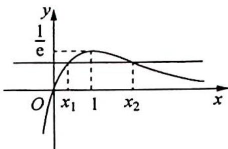
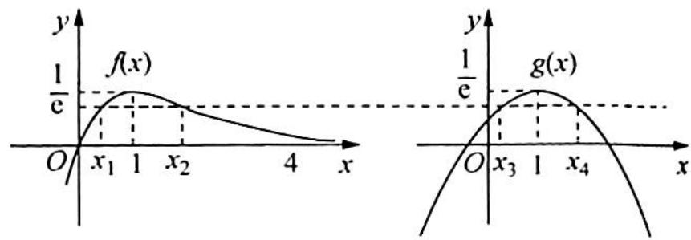

> [!faq]- 《高考数学培优40讲》例题解析
>
> > [!success]- **【答案】** 详见解析
>
> > [!note]- **【分析】**
> > 分析 思路一:通过题目条件知 $x_{1}, x_{2}$ 无法直接求出,也就无法直接将 $x_{1} + x_{2}$ 与 2 作比较,需要进行转化: $x_{1} + x_{2} > 2 \Leftrightarrow x_{2} > 2 - x_{1}$ (或 $x_{1} > 2 - x_{2}$ ), 因为 $x_{2}$ 和 $2 - x_{1}$ 在同一个单调区间内,可以利用函数的单调性来证明. 又因为 $f(x_{1}) = f(x_{2})$ , 等价于比较 $f(x_{1})$ 和 $f(2 - x_{1})$ 的大小关系,因此构造辅助函数 $g(x) = f(x) - f(2 - x)$ , 结合 $g(x)$ 的零点和单调性即可证明.
> >
> > 思路二:待证不等式为一个二元不等式, $x_{1},x_{2}$ 无法直接求出,也就无法直接将 $x_{1}+x_{2}$ 与2作比较,引入参数t,令 $t=\frac{x_{2}}{x_{1}}$ ,将 $x_{1},x_{2}$ 都表示为关于t的形式, $x_{1}+x_{2}>2$ 转化为关于t的不等式,再构造关于一元变量的函数,求导证明.
> >
> > 思路三:根据对数均值不等式 $\frac{a+b}{2}>\frac{a-b}{\ln a-\ln b}$ ，只要证明 $\frac{x_{1}-x_{2}}{\ln x_{1}-\ln x_{2}}=1$ 即可。
> >
> > 设 $f(x_{1}) = f(x_{2}) = \frac{1}{m} (m > 0)$ ，列出两个方程，通过取对数作差，即可得到 $x_{1} - x_{2} = \ln x_{1} - \ln x_{2}$
> >
> > 思路四：对于这类问题 $x_{1} + x_{2}$ 是无法直接求得的，但是对于二次函数来说就很容易求出.
> >
> > 根据 $x_{1} + x_{2} > 2$ 可得 1 是 $f(x)$ 的极值点. 所以考虑构造一个二次函数, 设函数 $g(x) = f(1) + \frac{f''(1)}{2}(x - 1)^{2} = \frac{1}{\mathrm{e}} - \frac{1}{2\mathrm{e}} (x - 1)^{2}$ , 这是一个对称轴为 $x = 1$ 的二次函数, 所以 $g(x)$ 的极值点不偏移. 令 $h(x) = f(x) - g(x)$ , 利用 $h(x)$ 的零点和单调性证明不等式成立.
>
> > [!note]- **【解析】**
> > 解析 ▶ 解法一(构造函数法): $f'(x) = \frac{1 - x}{\mathrm{e}^x}$ , 令 $f'(x) = 0 \Rightarrow x = 1$ .
> > <table><tr><td>x</td><td>(-∞,1)</td><td>1</td><td>(1,+∞)</td></tr><tr><td>f&#x27;(x)</td><td>+</td><td>0</td><td>-</td></tr><tr><td>f(x)</td><td>增</td><td>极大</td><td>减</td></tr></table>
> > 不妨设 $x_{1} < 1 < x_{2}$ , 很明显 $x_{1}$ 和 $x_{2}$ 位于不同的两个单调区间, 所以我们需要统一区间.
> > 欲证 $x_{1} + x_{2} > 2$ ，即证 $x_{2} > 2 - x_{1}(x_{2} > 1,2 - x_{1} > 1),f(x_{2}) <   f(2 - x_{1}).$
> > 
> > 因为 $f(x_{1})=f(x_{2})$ ，即证 $f(x_{1})<f(2-x_{1})$ （自变量统一为 $x_{1}$ ）.
> > 构造函数 $g(x)=f(x)-f(2-x)(x<1)$ ，即 $g(x)=\frac{x}{\mathrm{e}^{x}}-\frac{2-x}{\mathrm{e}^{2-x}}(x<1)$ ， $g'(x)=\frac{1-x}{\mathrm{e}^{x}}-\frac{1-x}{\mathrm{e}^{2-x}}=$ $(1-x)\left(\frac{1}{\mathrm{e}^{x}}-\frac{1}{\mathrm{e}^{2-x}}\right)$ ,
> > 因为 $x < 1$ , 所以 $1 - x > 0$ , $\mathrm{e}^x < \mathrm{e}^{2 - x} \Rightarrow \frac{1}{\mathrm{e}^x} - \frac{1}{\mathrm{e}^{2 - x}} > 0$ , 即 $g'(x) > 0$ , 因此 $g(x)$ 在 $(- \infty, 1)$ 上单调递增.
> > 所以 $g(x) < g(1) = 0$ ，即 x < 1 时， $f(x) < f(2 - x)$ .
> > 由于 $x_{1} < 1$ ，则 $f(x_{1}) < f(2 - x_{1})$
> > 解法二(参数法,比值换元引入参数):
> > 可设 $0 < x_{1} < 1 < x_{2}, f(x_{1}) = f(x_{2})$ ，即 $x_{1} \mathrm{e}^{-x_{1}} = x_{2} \mathrm{e}^{-x_{2}}$ ，取自然对数得 $\ln x_{1} - x_{1} = \ln x_{2} - x_{2}$ 。令 $t = \frac{x_{2}}{x_{1}} > 1$ ，则 $x_{2} = tx_{1}$ ，代入上式得 $\ln x_{1} - x_{1} = \ln t + \ln x_{1} - tx_{1}$ ，解得 $x_{1} = \frac{\ln t}{t - 1}, x_{2} = \frac{t\ln t}{t - 1}$ ，所以 $x_{1} + x_{2} = \frac{(t + 1)\ln t}{t - 1} > 2 \Leftrightarrow \ln t - \frac{2(t - 1)}{t + 1} > 0.$
> > 构造函数 $g(x)=\ln x-\frac{2(x-1)}{x+1}(x>1)$ ，求导可得 $g'(x)=\frac{1}{x}-\frac{4}{(x+1)^{2}}=\frac{(x-1)^{2}}{x(x+1)^{2}}$ .
> > 因为 $x > 1$ ，所以 $g^{\prime}(x) > 0$ ，则 $g(x)$ 在 $(1, + \infty)$ 上单调递增， $g(x) > g(1) = 0$ ，即 $\ln t - \frac{2(t - 1)}{t + 1} > 0$ ，不等式得证.
> > 解法三(对数均值不等式): 易知 $x_{1}, x_{2}$ 都大于 0, 设 $f(x_{1}) = f(x_{2}) = \frac{1}{m} (m > 0), x_{1} < x_{2}$ , 即 $\frac{x_{1}}{\mathrm{e}^{x_{1}}} = \frac{x_{2}}{\mathrm{e}^{x_{2}}} = \frac{1}{m} (m > 0), \left\{ \begin{array}{l} \mathrm{e}^{x_{1}} = mx_{1} \\ \mathrm{e}^{x_{2}} = mx_{2} \end{array} \right. \Rightarrow \left\{ \begin{array}{l} x_{1} = \ln m + \ln x_{1} ① \\ x_{2} = \ln m + \ln x_{2} ② \end{array} \right.$ .
> > - **①**：-②得 $x_{1} - x_{2} = \ln x_{1} - \ln x_{2}$ , 由对数平均值不等式得 $x_{2} > x_{1} > 0$ , $\sqrt{x_1x_2} < \frac{x_1 - x_2}{\ln x_1 - \ln x_2} < \frac{x_1 + x_2}{2}$ , 其中 $\frac{x_1 - x_2}{\ln x_1 - \ln x_2} = 1$ , 则 $\sqrt{x_1x_2} < 1 < \frac{x_1 + x_2}{2}$ .
> > 所以 $x_{1}+x_{2}>2$ ，且 $x_{1}\cdot x_{2}<1$ 。
> > 
> > ## 解法四(将极值点偏移转化为极值点不偏移的情形):
> > 令 $g(x) = \frac{1}{\mathrm{e}} -\frac{1}{2\mathrm{e}} (x - 1)^2$ ，不妨设 $x_{1},x_{3}$ 小于 $1,x_{2},x_{4}$ 大于1.
> > $f(x_{1}) = f(x_{2}) = g(x_{3}) = g(x_{4})$ ，则易知 $x_{3} + x_{4} = 2$
> > $$
> > h (x) = f (x) - g (x) = \frac {x}{\mathrm{e} ^ {x}} + \frac {1}{2 \mathrm{e}} (x - 1) ^ {2} - \frac {1}{\mathrm{e}},
> > $$
> > $$
> > h ^ {\prime} (x) = \frac {1 - x}{\mathrm{e} ^ {r}} + \frac {x - 1}{\mathrm{e}} = (1 - x) \left(\frac {1}{\mathrm{e} ^ {x}} - \frac {1}{\mathrm{e}}\right).
> > $$
> > 
> > - **①**：当 $x > 1$ 时， $1 - x < 0$ ，且 $\frac{1}{\mathrm{e}^x} - \frac{1}{\mathrm{e}} < 0$ ，所以 $h'(x) > 0$ ，则 $h(x)$ 在 $x > 1$ 上单调递增， $h(x) > h(1) = 0$ ，即当 $x > 1$ 时， $f(x) > g(x)$ ，由于 $x_4 > 1$ ，则 $f(x_4) > g(x_4), f(x_4) > f(x_2)$ .
> > 因为 $f(x)$ 在 $(1, +\infty)$ 上单调递减，所以 $x_{4} < x_{2}$ .
> > - **②**：当 $x < 1$ 时, $1 - x > 0$ , 且 $\frac{1}{\mathrm{e}^x} - \frac{1}{\mathrm{e}} > 0$ . 所以 $h'(x) > 0$ , 则 $h(x)$ 在 $x < 1$ 上单调递增.
> > 所以 $h(x) < h(1) = 0$ ，即当 $x < 1$ 时， $f(x) < g(x)$ ，由于 $x_3 < 1$ ，则 $f(x_3) < g(x_3), f(x_3) < f(x_1)$ .
> > 因为 $f(x)$ 在 $(-∞,1)$ 上单调递增，所以 $x_{3}<x_{1}$ .
> > 综合①②可知， $x_{1}+x_{2}>x_{3}+x_{4}=2.$
> > ## 探究总结
> > ## 极值点偏移问题规律技巧小结
> > (1)乘法的证明多转化为加法,比如证 $x_{1}x_{2} > \mathrm{e}^{2}$ , 即等价于证明 $\ln x_{1} + \ln x_{2} > 2$ , 可用换元构造对称或者去凑对称手段.
> > (2)遇到 $x_{1}x_{2} < x_{1} + x_{2}$ 有两个想法：
> > - **①**：除过去换元,即 $\frac{1}{x_{1}}+\frac{1}{x_{2}}>1\Rightarrow t_{1}+t_{2}>1;$
> > - **②**：凑“1”换元，即 $x_{1} + x_{2} - x_{1}x_{2} - 1 > - 1 \Rightarrow (x_{1} - 1)(x_{2} - 1) < 1 \Rightarrow t_{1} \cdot t_{2} < 1.$
> > 凑因式分解是一个比较重要的能力.
> > 另外,偏移问题多变,但是掌握几种常用的方法即可,其中变化还需从刷题中去体会,并没有万能之法.
