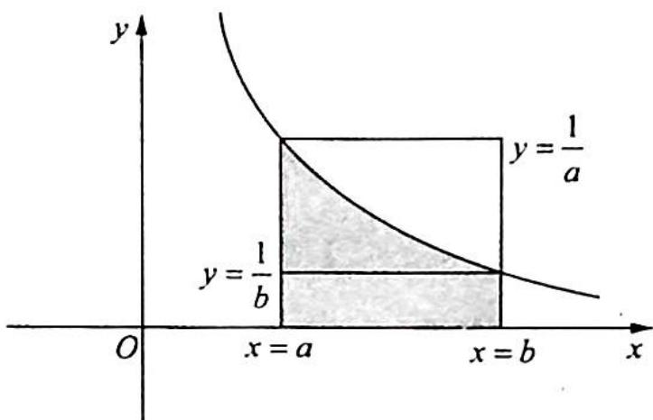
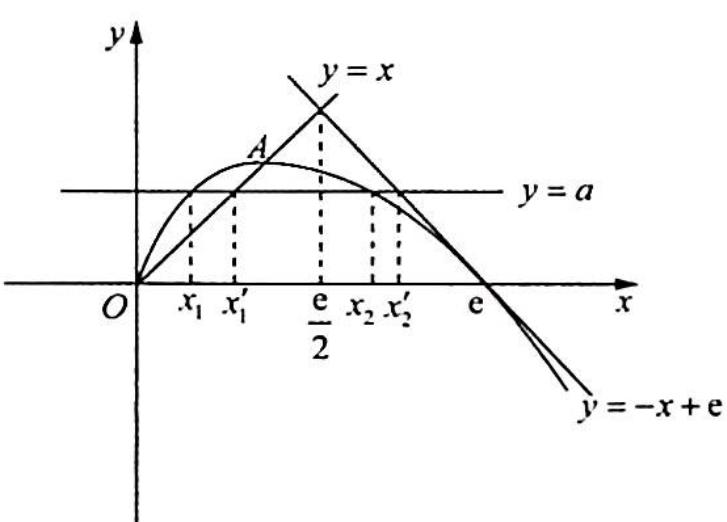

> [!faq]- 《高考数学培优40讲》例题解析
>
> > [!success]- **【答案】** 详见解析
>
> > [!note]- **【分析】**
> > 本题未单列分析。
>
> > [!note]- **【解析】**
> > 解析 (1) 函数 $f(x)$ 的定义域为 $(0, +\infty)$ .
> > $f'(x)=1-\ln x+x\left(-\frac{1}{x}\right)=-\ln x.$ 令 $f'(x)=0$ 得 x=1，当 0<x<1 时， $f'(x)>0$ ， $f(x)$ 在 $(0,1)$ 上单调递增；当 x>1 时， $f'(x)<0$ ， $f(x)$ 在 $(1,+\infty)$ 上单调递减。
> > (2) 因为 $b \ln a - a \ln b = a - b$ ，所以 $b(\ln a + 1) = a (\ln b + 1)$ ，即 $\frac{\ln a + 1}{a} = \frac{\ln b + 1}{b}$ ，亦即 $\frac{1}{a} \left( 1 - \ln \frac{1}{a} \right) = \frac{1}{b} \left( 1 - \ln \frac{1}{b} \right)$ .
> > 设 $f(x) = x(1 - \ln x),\frac{1}{a} = x_1,\frac{1}{b} = x_2$ ，故 $f\left(\frac{1}{a}\right) = f\left(\frac{1}{b}\right)$ ，即 $f(x_{1}) = f(x_{2})$ ，其中不妨设 $a>$ $b > 0$ ，则 $0 <   x_{1} <   x_{2}$
> > $f(x)$ 在 $(0,1)$ 上单调递增， $(1,+\infty)$ 上单调递减。
> > 先证 $x_{1} + x_{2} > 2$ ，若 $x_{2} > 2, x_{1} + x_{2} > 2$ 必成立.
> > 若 $x_{2} < 2$ ，要证 $x_{1} + x_{2} > 2$ ，即证 $x_{1} > 2 - x_{2}$ ，而 $0 < 2 - x_{2} < 1$ ，故即证 $f(x_{1}) > f(2 - x_{2})$ ， $f(x_{2}) > f(2 - x_{2})$ ，其中 $1 < x_{2} < 2$
> > 设 $g(x) = f(x) - f(2 - x) = x(1 - \ln x) - (2 - x)[1 - \ln (2 - x)] = 2x - 2 - x\ln x + (2 - x)$ $\ln (2 - x),1 <   x <   2.$
> > $$
> > g ^ {\prime} (x) = 2 - (1 + \ln x) - \ln (2 - x) + (2 - x) \cdot \frac {- 1}{2 - x} = - \ln x - \ln (2 - x) = - \ln (- x ^ {2} + 2 x) =
> > $$
> > $$
> > - \ln [ x (2 - x) ], 1 <   x <   2.
> > $$
> > 所以 $g'(x)>0$ ，故 $g(x)$ 在 $(1,2)$ 为增函数，所以 $g(x)>g(1)=0$ ， $f(x)>f(2-x)$ ，即 $f(x_{2})>f(2-x_{2})$ 成立，得证.
> > 再证 $x_{1} + x_{2} <   \mathrm{e}$
> > 解法一（构造函数）：要使得 $f(x_{1}) = f(x_{2})$ ，则 $0 < x_{2} < \mathrm{e}$
> > 若 $x_{2} < \mathrm{e} - 1$ ，则 $x_{1} + x_{2} < \mathrm{e}$ 必成立.
> > 若 $\mathrm{e} - 1 \leqslant x_{2} < \mathrm{e}$ , 要证 $x_{1} + x_{2} < \mathrm{e}$ , 即证 $x_{1} < \mathrm{e} - x_{2}$ , 而 $0 < \mathrm{e} - x_{2} \leqslant 1$ , 故即证 $f(x_{1}) < f(\mathrm{e} - x_{2}), f(x_{2}) < f(\mathrm{e} - x_{2})$ .
> > $$
> > \begin{array}{r l} {\text {设} h (x) = f (x) - f (\mathrm{e} - x) = x (1 - \ln x) - (\mathrm{e} - x) [ 1 - \ln (\mathrm{e} - x) ]} \\ & {\qquad = x - x \ln x - (\mathrm{e} - x) + (\mathrm{e} - x) \ln (\mathrm{e} - x)} \\ & {\qquad = 2 x - x \ln x + (\mathrm{e} - x) \ln (\mathrm{e} - x) - \mathrm{e}, \mathrm{e} - 1 \leqslant x <   \mathrm{e}.} \end{array}
> > $$
> > 因为 $e-1 \leqslant x < e$ ，所以 $(e-x)\ln(e-x) \leqslant 0$ ，从而 $h(x) \leqslant 2x - x\ln x - e$ ，又 $y = 2x - x\ln x - e$ 在 $[e-1, e)$ 上单调递增，且 $y\bigg|_{x=e} = 0$ ，因此 $2x - x\ln x - e \leqslant 0$ ，所以 $h(x) < 0$ ，即 $f(x) < f(e-x)$ ， $e-1 \leqslant x < e$ . 代入 $x_2$ ，得 $f(x_2) < f(e-x_2)$ ，又 $f(x_1) = f(x_2)$ ，则 $f(x_1) < f(e-x_2)$ ，而 $x_1, e-x_2 \in (0,1]$ ，且 $f(x)$ 在 $(0,1]$ 上单调递增，故 $x_1 < e - x_2$ ，即 $x_1 + x_2 < e$ .
> > 解法二(参数法): 设 $x_{2}=tx_{1}$ ，则 t>1，结合 $\frac{\ln a+1}{a}=\frac{\ln b+1}{b},\frac{1}{a}=x_{1},\frac{1}{b}=x_{2}$ ，可得 $x_{1}(1-\ln x_{1})=x_{2}(1-\ln x_{2})$ ，即 $1-\ln x_{1}=\frac{x_{2}}{x_{1}}(1-\ln x_{2})=t(1-\ln x_{2})=t[1-\ln(tx_{1})]=t(1-\ln t-\ln x_{1})$ 。故 $1-\ln x_{1}=t(1-\ln t)-t\ln x_{1}$ ，得 $(t-1)\ln x_{1}=t(1-\ln t)-1,\ln x_{1}=\frac{t(1-\ln t)-1}{t-1}$ 。
> > 要证 $x_{1} + x_{2} < \mathrm{e}$ , 即证 $(t + 1)x_{1} < \mathrm{e}$ , 即 $\ln (t + 1) + \ln x_{1} < 1, \ln (t + 1) + \frac{t(1 - \ln t) - 1}{t - 1} < 1$ , $(t - 1)\ln (t + 1) + t(1 - \ln t) - 1 < t - 1$ , 即 $(t - 1)\ln (t + 1) - t\ln t < 0$ .
> > 令 $S(t) = (t - 1)\ln (1 + t) - t\ln t, t > 1$ ，则 $S'(t) = \ln (1 + t) + \frac{t - 1}{t + 1} - \ln t - 1 = \ln \left(1 + \frac{1}{t}\right) - \frac{2}{t + 1}$ ，先证明一个不等式： $\ln (1 + x) \leqslant x$ 。
> > 设 $u(x)=\ln(1+x)-x$ ，则 $u'(x)=\frac{1}{x+1}-1=\frac{-x}{x+1}$ .
> > 当 $-1 < x < 0$ 时, $u'(x) > 0$ ; 当 $x > 0$ 时, $u'(x) < 0$ , 所以 $u(x)$ 在 $(-1, 0)$ 上为增函数, 在 $(0, +\infty)$ 上为减函数, $u(x)_{\max} = u(0) = 0$ , 故 $\ln (1 + x) \leqslant x$ 成立.
> > 由上述不等式可知当 $t > 1$ 时， $\ln \left(1 + \frac{1}{t}\right) < \frac{1}{t} < \frac{2}{t + 1}$ ，所以 $S'(t) < 0$ 恒成立。故 $S(t)$ 在 $(1, +\infty)$ 上为减函数， $S(t) < S(1) = 0, (t - 1)\ln (t + 1) - t\ln t < 0$ 成立，即 $x_1 + x_2 < e$ 。综上所述， $2 < \frac{1}{a} + \frac{1}{b} < e$ 。
> > 解法三(利用纳皮尔不等式放缩): 以上不等式左边的证明运用到极值点偏移的构造函数, 将变量转化到同一单调区间上去比较: 不等式右端的证明是消元的思想, 将二元不等式转化为一元函数不等式证明.
> > 对于不等式的右端还可以运用不等式放缩来证明.
> > 先看一个重要的不等式 $\frac{b - a}{b} < \ln \frac{b}{a} < \frac{b - a}{a} (0 < a < b)$ , 其几何直观如图 1 所示.
> > $\frac{b - a}{b} < \int_{a}^{b}\frac{1}{x}\mathrm{d}x < \frac{b - a}{a}$ , 即 $\frac{b - a}{b} < \ln \frac{b}{a} < \frac{b - a}{a}$ (纳皮尔不等式).
> > 
> > 利用纳皮尔不等式: 若 0 < a < b, 则 $\frac{b - a}{b} < \ln \frac{b}{a} < \frac{b - a}{a}$ .
> > 图 1
> > 因为 $x_{1} \in (0,1), \ln \frac{\mathrm{e}}{x_{1}} > 1$ ，所以 $x_{1} < x_{1} \ln \frac{\mathrm{e}}{x_{1}} = x_{2} \ln \frac{\mathrm{e}}{x_{2}} < x_{2} \left(\frac{\mathrm{e} - x_{2}}{x_{2}}\right) = \mathrm{e} - x_{2}$ ，则 $x_{1} + x_{2} < \mathrm{e}$ .
> > 综上所述， $2<x_{1}+x_{2}<e.$
> > 解法四(切割线放缩):如图2所示, $f(x)$ 在点(e,0)处的切线方程为y=e-x,且经过 $O(0,0)$ 和 $A(1,1)$ 的直线方程为y=x,又 $x_{1}<x_{1}^{\prime},x_{2}<x_{2}^{\prime}$ ,且 $x_{1}^{\prime}+x_{2}^{\prime}=e$ ,则 $x_{1}+x_{2}<x_{1}^{\prime}+x_{2}^{\prime}=e$ .
> > 
> > 图2
