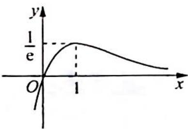

> [!faq]- 《高考数学培优40讲》例题解析
>
> > [!success]- **【答案】** 详见解析
>
> > [!note]- **【分析】**
> > 分析 ▶ 令 $f'(x) = 0$ ，可得函数 $f(x) = \frac{x}{\mathrm{e}^x}$ 的极值点为 1，若 $f(x_1) = f(x_2)$ ，易证 $x_1 + x_2 > 2$ 。而要证明的结论是 $x_1 + x_2 > 2.5$ ，则需要根据条件 $f(x_1) = f(x_2) = \mathrm{e}^{-\frac{3}{2}}$ 去分析，得出比 $x_1 + x_2 > 2$ 更精确的结论 $x_1 + x_2 > 2.5$ 。令 $f(x_1) = f(x_2) = \frac{1}{m}$ ，已知条件是方程而结论是不等式，使用对数平均不等式可以将方程放缩成不等式，最后将 $m = \mathrm{e}^{\frac{3}{2}}$ 代入即可得证。
>
> > [!note]- **【解析】**
> > 解析 若 $f(x_{1}) = f(x_{2}) = \frac{1}{m}$ , 由 $f(x)$ 的图像可知 $0 < \frac{1}{m} < \frac{1}{\mathrm{e}} \Rightarrow m > \mathrm{e}$ . 因为 $\frac{x_{1}}{\mathrm{e}^{x_{1}}} = \frac{x_{2}}{\mathrm{e}^{x_{2}}} = \frac{1}{m}$ , 不妨设 $x_{1} < 1 < x_{2}$ , 所以 $\left\{ \begin{array}{l} \mathrm{e}^{r_{1}} = mx_{1} \\ \mathrm{e}^{r_{2}} = mx_{2} \end{array} \right. \Rightarrow \left\{ \begin{array}{l} x_{1} = \ln m + \ln x_{1} \\ x_{2} = \ln m + \ln x_{2} \end{array} \right.$ .
> > 
> > 根据对数均值不等式可得, 当 $x > 1$ 时, $\ln x > \frac{2(x - 1)}{x + 1}$ ; 当 $0 < x < 1$ 时, $\ln x < \frac{2(x - 1)}{x + 1}$ , 则 $\left\{ \begin{array}{l} x_{1} = \ln m + \ln x_{1} < \ln m + \frac{2(x_{1} - 1)}{x_{1} + 1} \\ x_{2} = \ln m + \ln x_{2} > \ln m + \frac{2(x_{2} - 1)}{x_{2} + 1} \end{array} \right.$ , 整理得 $\left\{ \begin{array}{l} x_{1}^{2} - (1 + \ln m)x_{1} + 2 - \ln m < 0① \\ x_{2}^{2} - (1 + \ln m)x_{2} + 2 - \ln m > 0② \end{array} \right.$ .
> > - **②**：-①得 $(x_{2}+x_{1})(x_{2}-x_{1})-(1+\ln m)(x_{2}-x_{1})>0$ ，则 $(x_{2}+x_{1})(x_{2}-x_{1})>(1+\ln m)(x_{2}-x_{1})$ .
> > 因为 $x_{2} > x_{1} \Rightarrow x_{2} - x_{1} > 0$ ，所以 $x_{1} + x_{2} > 1 + \ln m$ 。而 $m > e$ ，故 $x_{1} + x_{2} > 1 + \ln m > 2$ ，而取 $m = e^{\frac{3}{2}} \Rightarrow x_{1} + x_{2} > 2.5$ ，即本例题得证。
> > ## 评注
> > 首先,我们只要取大于 e 的实数做 m 就可以加强出不同的问题,也就是说这是一个出题的题根.其次,平时我们应该养成把问题加强和推广的能力,不要总是“就题论题”.
> > ## 探究推广
> > ## 极值点偏移问题的推广
> > 推广方向1:极值点不偏移,而极值偏移.
> > 如：已知函数 $f(x) = \frac{x}{\mathrm{e}^x}, x_1 < x_2, x_1 + x_2 = 2$ ，求证： $f(x_1) < f(x_2)$ .
> > 推广方向 2: 拐点不偏移, 而拐值偏移.
> > 如：已知函数 $f(x) = 2\ln x + x^2 + x$ ，若 $x_1, x_2 \in \mathbb{R}^+$ ， $x_1 + x_2 = 2$ ，求证： $f(x_1) + f(x_2) \leqslant 4$ .
> > 推广方向3:一般极值点偏移问题都是 $x_{1}+x_{2}$ 和 $x_{1}\cdot x_{2}$ ，那么如果是 $|x_{1}-x_{2}|$ 或 $\frac{x_{2}}{x_{1}}$ 呢？
> > 如:(1)已知函数 $f(x)=(1-x^{2})\mathrm{e}^{-x}$ ，若方程 $f(x)=m(m>0)$ 有两个实数根 $x_{1}, x_{2}$ ，求证 $\left|x_{1}-x_{2}\right|<2-m\left(1+\frac{1}{2\mathrm{e}}\right)$ .
> > (2)已知函数 $h(x) = (x - 1)(\ln x - 1)$ , 若方程 $h(x) = m (0 \leqslant m < 1)$ 有两个实数根 $x_{1} < x_{2}$ . 求证 $\frac{x_{2}}{x_{1}} \leqslant \frac{\mathrm{e}}{1 - m} \left(1 + \frac{m}{\mathrm{e} - 1}\right)$ .
