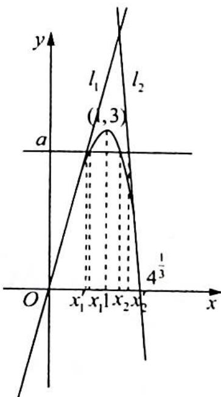

> [!faq]- 《高考数学培优40讲》例题解析
>
> > [!success]- **【答案】** 详见解析
>
> > [!note]- **【分析】**
> > 分析 ▶ 对函数求导可得函数在定义域上任意一点 $x_{0}$ 处切线的斜率, 根据 $y - f(x_{0}) = f'(x_{0})(x - x_{0})$ 可得切线的方程, 根据图像可得切线与直线 $f(x) = a$ 的交点和函数与直线 $f(x) = a$ 的
> >
> > 交点的位置关系,而切线与直线 $f(x)=a$ 的交点可以用含 a 的式子表示出来,再证明不等式成立.
>
> > [!note]- **【解析】**
> > 解析 $f^{\prime}(x) = 4 - 4x^{3}$ ，令 $f^{\prime}(x) = 0$ 得 $x = 1$
> > 当 0 < x < 1 时， $f'(x) > 0$ ，函数 $f(x)$ 在 $(0,1)$ 上单调递增；当 x > 1 时， $f'(x) < 0$ ，函数 $f(x)$ 在 $(1,+\infty)$ 上单调递减，又函数 $y = f(x)$ 在 $(0,0)$ 处的切线方程为 y = 4x，函数 $y = f(x)$ 在 $(4^{\frac{1}{3}},0)$ 处的切线方程为 $y = f'(4^{\frac{1}{3}})(x - 4^{\frac{1}{3}}) = [4 - 4 \times (4^{\frac{1}{3}})^{3}] (x - 4^{\frac{1}{3}}) = -12(x - 4^{\frac{1}{3}})$ .
> > 
> > 令 $4x_{1}^{\prime} = a$ ，得 $x_{1}^{\prime} = \frac{a}{4}$ ，令 $-12(x_{2}^{\prime} - 4^{\frac{1}{3}}) = a$ ，得 $x_{2}^{\prime} = -\frac{a}{12} +4^{\frac{1}{3}}$ ，则 $x_{2}^{\prime} - x_{1}^{\prime} = -\frac{a}{12} +4^{\frac{1}{3}} - \frac{a}{4} =$ $-\frac{a}{3} +4^{\frac{1}{3}}$ ，又 $x_{2} <   x_{2}^{\prime},x_{1} > x_{1}^{\prime}$ ，得 $x_{2} - x_{1} <   x_{2}^{\prime} - x_{1}^{\prime} = -\frac{a}{3} +4^{\frac{1}{3}}.$
