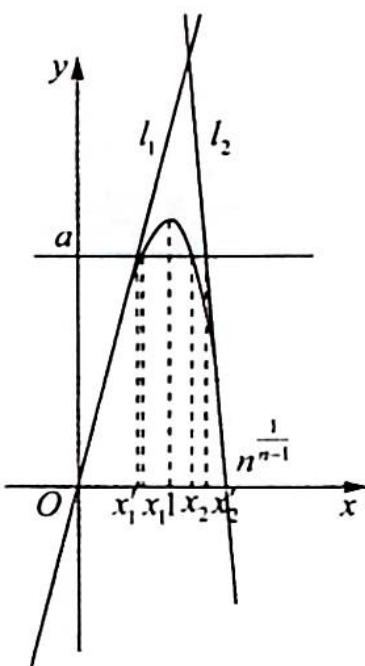

> [!faq]- 《高考数学培优40讲》例题解析
>
> > [!success]- **【答案】** 详见解析
>
> > [!note]- **【分析】**
> > 本题未单列分析。
>
> > [!note]- **【解析】**
> > 解析 $f^{\prime}(x) = n - nx^{n - 1} = n(1 - x^{n - 1})$ ，令 $f^{\prime}(x) = 0$ 得 $x = 1$
> > 当 $0 < x < 1$ 时, $f'(x) > 0$ , $f(x)$ 在 $(0,1)$ 上单调递增; 当 $x > 1$ 时, $f'(x) < 0$ , $f(x)$ 在 $(1, +\infty)$ 上单调递减.
> > 函数 $f(x)=nx-x^{n}$ 在 $(0,0)$ 处的切线方程为 $l_{1}:y=nx$ ，如图所示，在 $(n^{\frac{1}{n-1}},0)$ 处的切线方程为 $y=n\left[1-(n^{\frac{1}{n-1}})^{n-1}\right](x-n^{\frac{1}{n-1}})=n(1-n)(x-n^{\frac{1}{n-1}})$ .
> > 不妨设 $x_{1} < x_{2}$ , 令 $nx_{1}^{\prime} = a$ , 得 $x_{1}^{\prime} = \frac{a}{n}$ ; 令 $n(1 - n)(x_{2}^{\prime} - n^{\frac{1}{n - 1}}) = a$ , 得 $x_{2}^{\prime} = \frac{a}{n(1 - n)} + n^{\frac{1}{n - 1}}$ , 则 $x_{2}^{\prime} - x_{1}^{\prime} = \frac{a}{n(1 - n)} + n^{\frac{1}{n - 1}} - \frac{a}{n} = -\frac{a}{(n - 1)n} + n^{\frac{1}{n - 1}} - \frac{a}{n} = -a\left(\frac{1}{n - 1} - \frac{1}{n}\right) + n^{\frac{1}{n - 1}} - \frac{a}{n} = \frac{a}{1 - n} + n^{\frac{1}{n - 1}}.$
> > 
> > 又 $n \leqslant 2^{n-1} (n \geqslant 2, n \in \mathbb{N}^*)$ , 则 $n^{n-1} \leqslant 2$ , 所以 $x_2' - x_1' \leqslant \frac{a}{1-n} + 2$ , 因此 $x_2 - x_1 < x_2' - x_1' \leqslant \frac{a}{1-n} + 2$ , 故 $|x_2 - x_1| < \frac{a}{1-n} + 2$ .
