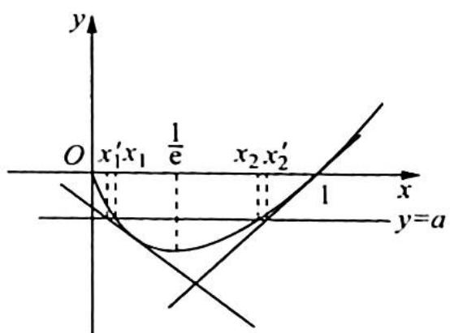
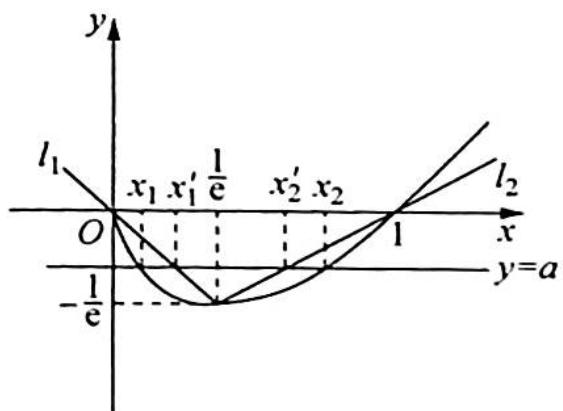

> [!faq]- 《高考数学培优40讲》例题解析
>
> > [!success]- **【答案】** 详见解析
>
> > [!note]- **【分析】**
> > 本题未单列分析。
>
> > [!note]- **【解析】**
> > 解析 $f^{\prime}(x) = 1 + \ln x, f(x)$ 在 $\left(0, \frac{1}{\mathrm{e}}\right)$ 上单调递减， $f(x)$ 在 $\left(\frac{1}{\mathrm{e}}, +\infty\right)$ 上单调递增.
> > 如图1所示， $f(x)$ 在(1,0)处的切线方程为 $y=f'(1)(x-1)$ ，即 y=x-1。 $f(x)$ 在 $x=\frac{1}{e^{2}}$ 处的切线方程为 $y+\frac{2}{e^{2}}=-\left(x-\frac{1}{e^{2}}\right)$ ，得 $y=-x-\frac{1}{e^{2}}$ 。令 $-x_{1}^{\prime}-\frac{1}{e^{2}}=a$ ，得 $x_{1}^{\prime}=-a-\frac{1}{e^{2}};x_{2}^{\prime}-1=a$ ，得 $x_{2}^{\prime}=1+a$ ，所以 $x_{2}-x_{1}<x_{2}^{\prime}-x_{1}^{\prime}=1+2a+\frac{1}{e^{2}}$ 。
> > 如图2所示， $l_{1}:y = -x,l_{2}:y = \frac{\frac{1}{\mathrm{e}}}{1 - \frac{1}{\mathrm{e}}} (x - 1) = \frac{1}{\mathrm{e} - 1}(x - 1).$
> > 
> > 图1
> > 
> > 图 2
> > 令 $-x_{1}^{\prime} = a$ ，得 $x_{1}^{\prime} = -a, \frac{1}{\mathrm{e} - 1} (x_{2}^{\prime} - 1) = a$ ，得 $x_{2}^{\prime} - 1 = a(\mathrm{e} - 1)$ ，即 $x_{2}^{\prime} = 1 + a(\mathrm{e} - 1)$
> > 由图2知 $x_{2} > x_{2}^{\prime}, x_{1}^{\prime} > x_{1}$ , 则 $x_{2} - x_{1} > x_{2}^{\prime} - x_{1}^{\prime} = 1 + a(\mathrm{e} - 1) + a = 1 + ae$ .
> > 综上所述， $1 + \mathrm{e}a <   x_{2} - x_{1} <   1 + 2a + \frac{1}{\mathrm{e}^{2}}.$
