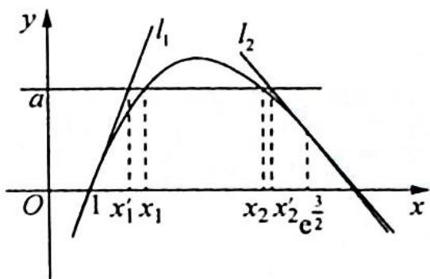

> [!faq]- 《高考数学培优40讲》例题解析
>
> > [!success]- **【答案】** 详见解析
>
> > [!note]- **【分析】**
> > 本题未单列分析。
>
> > [!note]- **【解析】**
> > 解析 如图所示, 设 $y = \frac{\ln x}{x}$ , 则 $y' = \frac{\frac{1}{x}x - \ln x}{x^2} = \frac{1 - \ln x}{x^2}$ .
> > <!-- source-part:2 pages:201-302 -->
> > 
> > 函数 $y=\frac{\ln x}{x}$ 在 $(0,e)$ 上单调递增，在 $(e,+\infty)$ 上单调递减， $a=\frac{\ln x}{x},\frac{3}{2\mathrm{e}^{\frac{3}{2}}}<a<\frac{1}{\mathrm{e}}.$
> > 曲线 $y=\frac{\ln x}{x}$ 在点 $(1,0)$ 处的切线方程为 $l_{1}:y=x-1$ .
> > 曲线 $y=\frac{\ln x}{x}$ 在 $x=e^{\frac{3}{2}}$ 处的切线方程为 $l_{2}:y-\frac{3}{2e^{\frac{3}{2}}}=-\frac{1}{2e^{3}}(x-e^{\frac{3}{2}})$ ，即 $y=-\frac{1}{2e^{3}}x+\frac{3}{2e^{\frac{3}{2}}}+\frac{1}{2e^{\frac{3}{2}}}=-\frac{1}{2e^{3}}x+\frac{2}{e^{\frac{3}{2}}}$ .
> > 令 $a = x_1' - 1$ ，得 $x_1' = a + 1$ ，令 $a = -\frac{1}{2\mathrm{e}^3} x_2' + 2\mathrm{e}^{-\frac{3}{2}}$ ，得 $\frac{x_2'}{2\mathrm{e}^3} = 2\mathrm{e}^{-\frac{3}{2}} - a$ ，即 $x_2' = 4\mathrm{e}^{\frac{3}{2}} - 2a\mathrm{e}^3.$
> > 因此 $\left|x_{2}-x_{1}\right|<\left|x_{2}^{\prime}-x_{1}^{\prime}\right|=4e^{\frac{3}{2}}-2ae^{3}-a-1=4e^{\frac{3}{2}}-1-(2e^{3}+1)a.$
