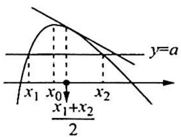
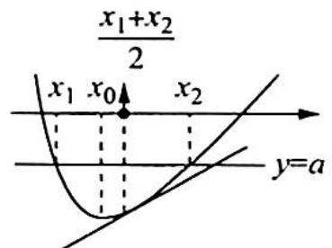
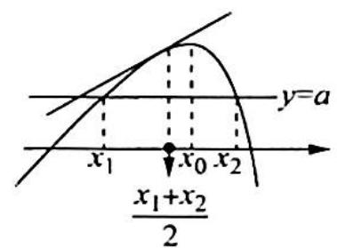
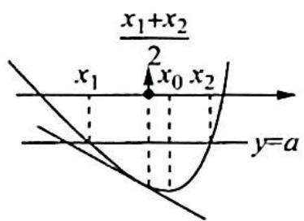

# 第 10 讲

# 极值点偏移问题的深度研究

随着高考试题中导数问题的难度增大,出现了很多双零点问题,其中以极值点(拐点)偏移问题最为常见.尤其是在模拟考试中,此类问题层出不穷.对于这类问题本讲从不同角度给出认知,学生可以由此掌握很多这类问题的解题技巧.

所谓极值点偏移问题,是指对于单极值函数,由于函数极值点左右的增减速度不同,导致函数图像没有对称性.

极值点的左偏

极值点的右偏

极值点左偏与右偏的判断

如上图所示, 可导函数 $f(x)$ 在区间 $D$ 上只有一个极大 (小) 值点 $x_0, x_1$ 与 $x_2$ 分别为 $f(x) = a$ 的零点.

(1) 若 $f'\left(\frac{x_{1}+x_{2}}{2}\right)>0$ ，则 $\frac{x_{1}+x_{2}}{2}<(>)x_{0}$ ，即函数 $y=f(x)$ 在区间 $(x_{1}, x_{2})$ 上极大（小）值点 $x_{0}$ 右（左）偏；

(2) 若 $f'\left(\frac{x_{1}+x_{2}}{2}\right)<0$ ，则 $\frac{x_{1}+x_{2}}{2}>(<)x_{0}$ ，即函数 $y=f(x)$ 在区间 $(x_{1}, x_{2})$ 上极大（小）值点 $x_{0}$ 左（右）偏。

本讲结合例题与变式讲解极值点偏移问题的常见解法,如构造对称性函数法,比值(差值)换元法及对数平均值不等式等方法,使读者在面对这类问题时,有章可循,有路可走.

![[高中/总复习/专题/高考数学培优40讲/高考数学培优40讲-01-函数与导数/第10讲_极值点偏移问题的深度研究/10_1_极值点偏移与拐点偏移/10_1_极值点偏移与拐点偏移.md]]
![[高中/总复习/专题/高考数学培优40讲/高考数学培优40讲-01-函数与导数/第10讲_极值点偏移问题的深度研究/10_2_非常规类型极值点偏移问题/10_2_非常规类型极值点偏移问题.md]]
![[高中/总复习/专题/高考数学培优40讲/高考数学培优40讲-01-函数与导数/第10讲_极值点偏移问题的深度研究/10_3_极值点偏移问题的加强/10_3_极值点偏移问题的加强.md]]
![[高中/总复习/专题/高考数学培优40讲/高考数学培优40讲-01-函数与导数/第10讲_极值点偏移问题的深度研究/10_4_切割线的放缩与应用/10_4_切割线的放缩与应用.md]]
![[高中/总复习/专题/高考数学培优40讲/高考数学培优40讲-01-函数与导数/第10讲_极值点偏移问题的深度研究/训练10/训练10.md]]
