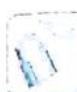

> [!faq]- 《高考数学培优40讲》例题解析
>
> > [!success]- **【答案】** 详见解析
>
> > [!note]- **【分析】**
> > 本题未单列分析。
>
> > [!note]- **【解析】**
> > 解析 先比较 $\frac{1 - \ln y}{y}$ 与 $\frac{1 - \ln x}{x}$ 的大小.
> > 构造函数 $f(x) = \frac{1 - \ln x}{x}, x \in (0, e^2)$ ，则 $f'(x) = \frac{\ln x - 2}{x^2}$ ，当 $0 < x < e^2$ 时， $f'(x) < 0, f(x)$ 在
> > $(0, e^{2})$ 上单调递减, 从而当 $0 < x < y < e^{2}$ 时, $\frac{1 - \ln y}{y} < \frac{1 - \ln x}{x}$ .
> > 当 $0 < x < e$ 时， $1 - \ln x > 0$ ，则 $\frac{1 - \ln y}{1 - \ln x} < \frac{y}{x}$ ；
> > 当 $e<x<y<e^{2}$ 时， $1-\ln x<0$ ，则 $\frac{1-\ln y}{1-\ln x}>\frac{y}{x}$ .
> > 
