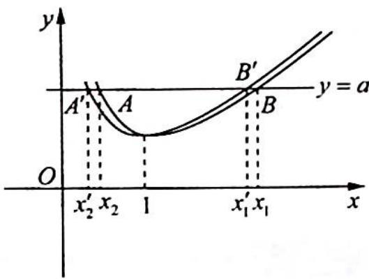
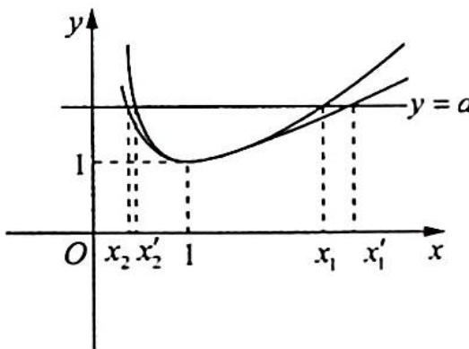
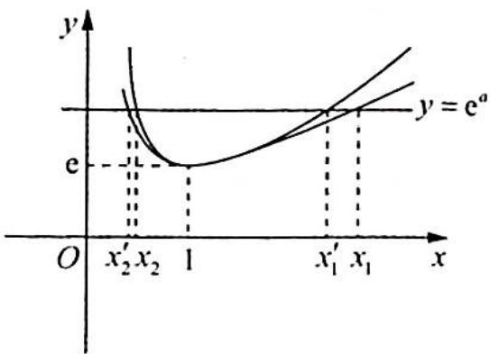
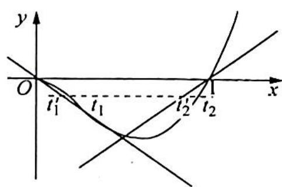

> [!faq]- 《高考数学培优40讲》例题解析
>
> > [!success]- **【答案】** 详见解析
>
> > [!note]- **【分析】**
> > 分析 ▶ 总的思想就是化二元为一元, 引入参数, 将 $x_{1}, x_{2}$ 均用该参数表示, 将二元不等式转化为一元不等式来证明; 也可变形使不等式两边形成相同的结构, 从而构造函数, 借助单调性来证明.
> >
> > (1)不妨设 $0 < x_{1} < x_{2}$ , 由 $x_{1} - \ln x_{1} = x_{2} - \ln x_{2} = a$ , 得 $\ln x_{2} - \ln x_{1} = x_{2} - x_{1}$ , 即 $\ln \frac{x_{2}}{x_{1}} = x_{2} - x_{1}$ .
> >
> > 设 $t = \frac{x_2}{x_1} > 1$ ，则 $\ln t = tx_{1} - x_{1} = (t - 1)x_{1}$ ，得 $x_{1} = \frac{\ln t}{t - 1}, x_{2} = \frac{t\ln t}{t - 1}$ .
> >
> > 要证明 $x_{1}x_{2} < 1$ ，等价于证明 $\frac{t\ln^2t}{(t - 1)^2} < 1, t > 1, \Leftrightarrow \frac{\sqrt{t}\ln t}{t - 1} < 1, t > 1 \Leftrightarrow \ln t < \frac{t - 1}{\sqrt{t}} = \sqrt{t} - \frac{1}{\sqrt{t}}$ ， $t > 1 \Leftrightarrow 2\ln \sqrt{t} < \sqrt{t} - \frac{1}{\sqrt{t}}, \sqrt{t} > 1.$
> >
> > 构造函数 $F(x) = 2\ln x - \left(x - \frac{1}{x}\right), x > 1$ ，则
> >
> > $$
> > F ^ {\prime} (x) = \frac {2}{x} - \left(1 + \frac {1}{x ^ {2}}\right) = \frac {2}{x} - \frac {x ^ {2} + 1}{x ^ {2}} = \frac {2 x - x ^ {2} - 1}{x ^ {2}} = \frac {- (x ^ {2} - 2 x + 1)}{x ^ {2}} = \frac {- (x - 1) ^ {2}}{x ^ {2}} <   0,
> > $$
> >
> > 函数 $F(x)$ 在 $(1, +\infty)$ 上单调递减， $F(x) < F(1) = 0$ ，即 $2\ln x < x - \frac{1}{x}, x > 1$ ，则原不等式得证。
> >
> > 引入参数 $t = \frac{x_2}{x_1} > 1$ ，将 $x_1, x_2$ 均用参数 $t$ 表示，即 $\left\{ \begin{array}{l} x_1 = f(t) \\ x_2 = g(t) \end{array} \right.$ .
> >
> > (2)不妨设 $0 < x_{1} < x_{2}$ , 由 $x_{1} - \ln x_{1} = x_{2} - \ln x_{2} = a$ , 得 $x_{2} - x_{1} = \ln x_{2} - \ln x_{1} = \ln \frac{x_{2}}{x_{1}}$ .
> >
> > 令 $t = \frac{x_2}{x_1} > 1$ ，得 $(t - 1)x_1 = \ln t$ ，即 $x_1 = \frac{\ln t}{t - 1}(t > 1), x_2 = \frac{t\ln t}{t - 1}$ ，要证明 $x_1 + x_2 > 2 \Leftrightarrow \frac{(t + 1)\ln t}{t - 1} > 2, t > 1 \Leftrightarrow \ln t > \frac{2(t - 1)}{t + 1}, t > 1$ 。设 $G(t) = \ln t - \frac{2(t - 1)}{t + 1}, t > 1$ ，则
> >
> > $$
> > G ^ {\prime} (x) = \frac {1}{t} - 2 \cdot \frac {(t + 1) - (t - 1)}{(t + 1) ^ {2}} = \frac {1}{t} - \frac {4}{(t + 1) ^ {2}} = \frac {(t + 1) ^ {2} - 4 t}{t (t + 1) ^ {2}} = \frac {(t - 1) ^ {2}}{t (t + 1) ^ {2}} > 0,
> > $$
> >
> > $G(t)$ 在 $(1, +\infty)$ 上单调递增，则 $G(t) > G(1) = 0$ ，所以 $\ln t > \frac{2(t - 1)}{t + 1}, t > 1$ ，因此 $x_1 + x_2 > 2$ .
> >
> > 本题也可以运用对数平均值不等式证明：
> >
> > 由 $x_{1} - \ln x_{1} = x_{2} - \ln x_{2}$ 得 $x_{1} - x_{2} = \ln x_{1} - \ln x_{2}, 1 = \frac{x_{1} - x_{2}}{\ln x_{1} - \ln x_{2}} < \frac{x_{1} + x_{2}}{2}$ , 即 $x_{1} + x_{2} > 2$ .
> >
> > (3)要证 $2x_{1} + x_{2} > \mathrm{e}$ , 即 $\frac{2\ln t}{t - 1} + \frac{t\ln t}{t - 1} > \mathrm{e}(t > 1)$ , 即只要证 $\forall t > 1, \frac{(2 + t)\ln t}{t - 1} > \mathrm{e}$ .
> >
> > 设 $g(t) = \frac{(2 + t)\ln t}{t - 1} (t > 1)$ ，则 $g'(t) = \frac{\left(t + 1 - \frac{2}{t}\right) - 3\ln t}{(t - 1)^2}$ .
> >
> > 设 $h(t) = \left(t + 1 - \frac{2}{t}\right) - 3\ln t$ ，则 $h'(t) = 1 + \frac{2}{t^2} - \frac{3}{t} = \frac{t^2 - 3t + 2}{t^2} = \frac{(t - 1)(t - 2)}{t^2}$ .
> >
> > 所以 $h(t)$ 在 $(1,2)$ 上单调递减，在 $(2,+\infty)$ 上单调递增， $h(1)=0$ ，所以 $h(t)$ 在 $(1,2)$ 上小于 0，在 $(2,+\infty)$ 上有唯一零点 $\alpha_{0}$ ，且由于 $\left(\mathrm{e}+1-\frac{2}{\mathrm{e}}\right)-3\ln\mathrm{e}<0=\left(\alpha_{0}+1-\frac{2}{\alpha_{0}}\right)-3\ln\alpha_{0}$ ，故 $e<\alpha_{0}$ ，
> > 所以 $g(t)_{\min}=\frac{(2+\alpha_{0})\ln\alpha_{0}}{\alpha_{0}-1}=\frac{2+\alpha_{0}}{\alpha_{0}-1}\cdot\frac{\alpha_{0}+1-\frac{2}{\alpha_{0}}}{3}=\frac{\alpha_{0}+\frac{4}{\alpha_{0}}+4}{3}>\frac{\mathrm{e}+\frac{4}{\mathrm{e}}+4}{3}>\mathrm{e}.$
> >
> > (4)解法一(构造辅助函数):先证不等式左边 $x_{1}+x_{2}>a+1$ , 即证 $x_{2}>a+1-x_{1}$ . 又 $x_{1}-\ln x_{1}=a$ , 则上式等价于 $x_{2}>x_{1}-\ln x_{1}+1-x_{1}=1-\ln x_{1}$ .
> >
> > 令 $f(x) = x - \ln x (x > 0)$ ，易得 $f(x)$ 在(0,1)上单调递减，在(1, +∞)上单调递增，由于 $x_1$ ， $x_2$ 是 $x - \ln x = a$ 的两根，不妨设 $x_1 < x_2$ ，则易得 $0 < x_1 < 1 < x_2, 1 - \ln x_1 > 1$ .
> >
> > 要证明 $x_{2} > 1 - \ln x_{1}$ ，即证 $f(x_{2}) > f(1 - \ln x_{1})$ ，又 $f(x_{2}) = f(x_{1})$ ，得 $f(x_{1}) > f(1 - \ln x_{1})$ ， $0 < x_{1} < 1.$
> >
> > 构造函数 $F(x) = f(x) - f(1 - \ln x) = (x - \ln x) - [(1 - \ln x) - \ln (1 - \ln x)]$ $= x - 1 + \ln (1 - \ln x),0 <   x <   1,$
> >
> > 又 $F(1) = 0$ ，则
> >
> > $$
> > F ^ {\prime} (x) = 1 + \frac {1}{1 - \ln x} \left(- \frac {1}{x}\right) = 1 - \frac {1}{x (1 - \ln x)} = \frac {x (1 - \ln x) - 1}{x (1 - \ln x)}, 0 <   x <   1.
> > $$
> >
> > 令 $y = x - 1 - x \ln x, y \bigg|_{x=1} = 0, y' = 1 - 1 - \ln x = -\ln x > 0$ ，函数 $y = x - 1 - x \ln x$ 在(0,1)上单调递增，则 $x - 1 - x \ln x < 0$ ，因此 $F'(x) < 0, F(x)$ 在(0,1)上单调递减，所以 $F(x) > F(1) = 0$ ，即 $f(x) > f(1 - \ln x)$ ，
> >
> > 令 $x = x_{1}$ ，即 $f(x_{1}) > f(1 - \ln x_{1})$
> >
> > 再证 $x_{1} + x_{2} < 2a$ ，由 $\left\{ \begin{array}{l}x_{1} - \ln x_{1} = a\\ x_{2} - \ln x_{2} = a \end{array} \right.$ 得 $x_{1} + x_{2} = \ln x_{1} + \ln x_{2} + 2a = \ln (x_{1}x_{2}) + 2a$ ，由 $x_{1}x_{2} < 1$ 得 $x_{1} + x_{2} < 2a.$
> >
> > ## 解法二(数形结合,构造方程借助韦达定理):
> >
> > 首先研究 $g(x)=(x+1)\ln x-2(x-1)(x>0)$ ，有 $g'(x)=\ln x+\frac{x+1}{x}-2=\ln x+\frac{1}{x}-1=\frac{x\ln x-x+1}{x}$ .
> >
> > 令 $h(x) = x\ln x - x + 1$ ，则 $h'(x) = \ln x + 1 - 1 = \ln x$ ，易得 $h(x)_{\min} = h(1) = 0$ ，所以 $h(x) > 0$ ，即 $g'(x) > 0, g(x)$ 在 $(0, +\infty)$ 上单调递增。
> >
> > 当 $x > 1$ 时， $g(x) > g(1) = 0$ ，有 $\ln x > \frac{2(x - 1)}{x + 1}$ ；当 $0 < x < 1$ 时， $g(x) < g(1) = 0$ ，有
> >
> > $\ln x<\frac{2(x-1)}{x+1}$ ，则 $x-\ln x<x-\frac{2(x-1)}{x+1}=\frac{x^{2}-x+2}{x+1}$ ，x>1； $x-\ln x>\frac{x^{2}-x+2}{x+1}$ ，0<x<1。
> >
> > 如图1所示, 直线 $y = a$ 与 $y = x - \ln x$ 的图像交于 $A, B$ 两点, 与 $y = \frac{x^2 - x + 2}{x + 1}$ 的图像交于 $A'$ , $B'$ 两点, 则 $x_1 > x_1', x_2 > x_2'$ , 所以 $x_1 + x_2 > x_1' + x_2'$ .
> >
> > 又 $\frac{x^2 - x + 2}{x + 1} = a$ ，得 $x^2 - x + 2 = ax + a$ ，即 $x^2 - (a + 1)x + 2 - a = 0$ ，得 $x_1' + x_2' = a + 1$ ，因此 $x_1 + x_2 > x_1' + x_2' = a + 1$ . 再证不等式的右边.
> >
> > 
> >
> > 构造函数 $f(x)=\ln x-\frac{1}{2}\left(x-\frac{1}{x}\right)(x>0)$ ，则 $f'(x)=\frac{1}{x}-\frac{1}{2}\left(1+\frac{1}{x^{2}}\right)\leqslant\frac{1}{x}-\frac{1}{2}\cdot\frac{2}{x}=0$ ，所以 $f(x)$ 在 $(0,+\infty)$ 上单调递减。
> >
> > 图1
> >
> > 又 $f(1) = 0$ ，所以当 $0 < x < 1$ 时， $f(x) > 0, \ln x > \frac{1}{2}\left(x - \frac{1}{x}\right)$ ；当 $x > 1$ 时， $f(x) < 0, \ln x < \frac{1}{2}\left(x - \frac{1}{x}\right)$ .
> >
> > 因此，当 $0 < x < 1$ 时， $x - \ln x < x - \frac{1}{2}\left(x - \frac{1}{x}\right) = \frac{1}{2}\left(x + \frac{1}{x}\right)$ ；当 $x > 1$ 时， $x - \ln x > \frac{1}{2}\left(x + \frac{1}{x}\right)$ .
> >
> > 如图2所示, $x_{1} < x_{1}^{\prime}, x_{2} < x_{2}^{\prime}$ , 则 $x_{1} + x_{2} < x_{1}^{\prime} + x_{2}^{\prime}$ , 又 $x_{1}^{\prime}$ 和 $x_{2}^{\prime}$ 是方程 $\frac{1}{2}\left(x + \frac{1}{x}\right) = a$ 的两个根, 即 $x^{2} - 2ax + 1 = 0, x_{1}^{\prime} + x_{2}^{\prime} = 2a$ , 因此 $x_{1} + x_{2} < x_{1}^{\prime} + x_{2}^{\prime} = 2a$ .
> >
> > 
> > 图2
> >
> > 综上所述， $a + 1 <   x_{1} + x_{2} <   2a.$
> >
> > ## 评注
> >
> > 解法二的运用以曲化曲,体现了数形结合的精髓.2021年全国卷也考查了以曲代曲和切割线放缩,这种方法要格外重视,是高考命题新的增长点和亮点.
> >
> > (5)解法一(等价变形,利用已知结论): $x_{1} x_{2} > \mathrm{e}^{1 - a} \Leftrightarrow \ln x_{1} + \ln x_{2} > 1 - a$ , 又 $x_{1} - \ln x_{1} = a = x_{2} - \ln x_{2}$ , 所以 $\ln x_{1} = x_{1} - a, \ln x_{2} = x_{2} - a$ , 则 $\ln x_{1} + \ln x_{2} = x_{1} + x_{2} - 2a > 1 - a$ , 即 $x_{1} + x_{2} > 1 + a$ , 与上问中的不等式左边一致, 是成立的.
> >
> > 解法二(数形结合,构造方程借助韦达定理):由 $x_{1}, x_{2}$ 是方程 $x - \ln x = a$ 的两个根,也是方程 $\frac{e^{x}}{x} = e^{a}$ 的两个根,构造函数 $f(x) = (3 - x)e^{x - 1} - x - 1 (x > 0)$ ,则
> >
> > $$
> > f ^ {\prime} (x) = (2 - x) \mathrm{e} ^ {x - 1} - 1, f ^ {\prime \prime} (x) = (1 - x) \mathrm{e} ^ {x - 1}.
> > $$
> >
> > 所以易得 $f^{\prime}(x)_{\max} = f^{\prime}(1) = 0$ ，则 $f^{\prime}(x)\leqslant 0,f(x)$ 在 $(0, + \infty)$ 上单调递减，且 $f(1) = 0$
> >
> > 注意到当 $x < 3$ 时，若 $1 < x < 3, f(x) < 0$ ，则 $\mathrm{e}^x < \frac{\mathrm{e}(x + 1)}{3 - x}$ ，即 $\frac{\mathrm{e}^x}{x} < \frac{\mathrm{e}(x + 1)}{x(3 - x)}$ ；若 $0 < x < 1, f(x) > 0$ ，则 $\mathrm{e}^x > \frac{\mathrm{e}(x + 1)}{3 - x}$ ，即 $\frac{\mathrm{e}^x}{x} > \frac{\mathrm{e}(x + 1)}{x(3 - x)}$ 。
> >
> > 
> >
> > 并且令 $\frac{\mathrm{e}(x + 1)}{x(3 - x)} = \mathrm{e}^a$ ，即 $\mathrm{e}^a \cdot x^2 + (\mathrm{e} - 3\mathrm{e}^a)x + \mathrm{e} = 0$ ，设 $x_1', x_2'$ 为此方程的两根，故 $x_1' x_2' = \mathrm{e}^{1 - a}$ ，如图所示， $x_1 > x_1', x_2 > x_2', x_1 x_2 > x_1' x_2'$ ，则 $x_1 x_2 > \mathrm{e}^{1 - a}$ .
> >
> > 本题应设计对不等式当 $1 < x < 3$ 时, $\mathrm{e}^{x} < \frac{\mathrm{e}(x + 1)}{3 - x}$ 和 $0 < x < 1$ 时, $\mathrm{e}^{x} > \frac{\mathrm{e}(x + 1)}{3 - x}$ 的证明, 其命题背景源于帕德逼近, 高考中常以帕德逼近作为放缩或命题背景.
> >
> > (6)要证 $x_{1} + x_{2} < \frac{4a + 2}{3}$ , 即 $x_{2} < \frac{4a + 2}{3} - x_{1}$ , 且 $a = x_{1} - \ln x_{1}$ , 因此 $x_{2} < \frac{4(x_{1} - \ln x_{1}) + 2}{3} - x_{1} = \frac{x_{1} - 4\ln x_{1} + 2}{3}$ .
> >
> > 构造函数 $g(x)=\frac{x-4\ln x+2}{3}(0<x<1)$ , $g(1)=1$ , $g'(x)=\frac{1}{3}\left(1-\frac{4}{x}\right)=\frac{1}{3}\cdot\frac{x-4}{x}<0$ , $g(x)$ 在 $(0,1)$ 上单调递减，所以 $g(x)>g(1)=1$ ，故 $\frac{x_{1}-4\ln x_{1}+2}{3}>1$ .
> >
> > 又 $f(x) = x - \ln x$ 在 $(1, +\infty)$ 上单调递增，要证明 $x_{2} < \frac{x_{1} - 4\ln x_{1} + 2}{3} \Leftrightarrow f(x_{2}) < f\left(\frac{x_{1} - 4\ln x_{1} + 2}{3}\right)$ ，又 $f(x_{1}) = f(x_{2})$ ，即证明 $f(x_{1}) < f\left(\frac{x_{1} - 4\ln x_{1} + 2}{3}\right)$ ，构造函数 $h(x) = f(x) - f\left(\frac{x - 4\ln x + 2}{3}\right)(0 < x < 1)$ ，且 $f(x) = x - \ln x$ ，则 $h(x) = x - \ln x - \frac{x - 4\ln x + 2}{3} + \ln \frac{x - 4\ln x + 2}{3}, 0 < x < 1, h(1) = 0$ ，则
> >
> > $$
> > \begin{array}{r l} & h ^ {\prime} (x) = 1 - \frac {1}{x} - \left(\frac {1}{3} - \frac {4}{3 x}\right) + \frac {3}{x - 4 \ln x + 2} \cdot \frac {1}{3} \left(1 - \frac {4}{x}\right) = \frac {2}{3} + \frac {1}{3 x} + \frac {1}{x - 4 \ln x + 2} - \frac {4}{x (x - 4 \ln x + 2)} \\ & = \frac {2 x + 1}{3 x} + \frac {1}{x - 4 \ln x + 2} \cdot \frac {x - 4}{x}. \end{array}
> > $$
> >
> > 下面证明 $h'(x)>0$ .
> >
> > $$
> > \frac {2 x + 1}{3 x} + \frac {x - 4}{x (x - 4 \ln x + 2)} > 0 \Leftrightarrow \frac {2 x + 1}{3} + \frac {x - 4}{x - 4 \ln x + 2} > 0, \quad \frac {x - 4}{x - 4 \ln x + 2} > - \frac {2 x + 1}{3},
> > $$
> >
> > 得 $4\ln x < x + 2 + \frac{3(x - 4)}{2x + 1} = \frac{2(x + 5)(x - 1)}{2x + 1}$ , 即 $2\ln x < \frac{(x + 5)(x - 1)}{2x + 1}, 0 < x < 1$ .
> >
> > 令 $p(x) = 2\ln x - \frac{(x + 5)(x - 1)}{2x + 1},0 <   x <   1,p(1) = 0$ ，则
> >
> > $$
> > \begin{array}{r l} p ^ {\prime} (x) & = \frac {2}{x} - \frac {(2 x + 4) (2 x + 1) - 2 (x ^ {2} + 4 x - 5)}{(2 x + 1) ^ {2}} = \frac {2}{x} - \frac {4 x ^ {2} + 1 0 x + 4 - 2 x ^ {2} - 8 x + 1 0}{(2 x + 1) ^ {2}} \\ & = \frac {2}{x} - \frac {2 x ^ {2} + 2 x + 1 4}{(2 x + 1) ^ {2}} = 2 \left[ \frac {1}{x} - \frac {x ^ {2} + x + 7}{(2 x + 1) ^ {2}} \right] = 2 \cdot \frac {(2 x + 1) ^ {2} - x ^ {3} - x ^ {2} - 7 x}{x (2 x + 1) ^ {2}} \\ & = 2 \cdot \frac {4 x ^ {2} + 4 x + 1 - x ^ {3} - x ^ {2} - 7 x}{x (2 x + 1) ^ {2}} = 2 \cdot \frac {- x ^ {3} + 3 x ^ {2} - 3 x + 1}{x (2 x + 1) ^ {2}} \\ & = 2 \cdot \frac {(1 - x) ^ {3}}{x (2 x + 1) ^ {2}} > 0. \end{array}
> > $$
> >
> > 所以 $p(x)$ 在 $(0,1)$ 上单调递增，则 $p(x)<p(1)=0$ ，故 $2\ln x<\frac{(x+5)(x-1)}{2x+1},0<x<1$ .
> >
> > $h'(x)>0,h(x)$ 在 $(0,1)$ 上单调递增，所以 $h(x)<h(1)=0$ ，令 $x=x_{1}$ ，得 $f(x_{1})<f\left(\frac{x_{1}-4\ln x_{1}+2}{3}\right)$ ，又 $f(x_{1})=f(x_{2})$ ，则 $f(x_{2})<f\left(\frac{x_{1}-4\ln x_{1}+2}{3}\right)$ ，且 $x_{2},\frac{x_{1}-4\ln x_{1}+2}{3}\in(1,+\infty)$ ， $f(x)=x-\ln x$ 在 $(1,+\infty)$ 上单调递增，则 $x_{2}<\frac{x_{1}-4\ln x_{1}+2}{3}=\frac{4a+2}{3}-x_{1}$ ，即 $x_{1}+x_{2}<\frac{4a+2}{3}$ .
> >
> > (7)要证 $2\mathrm{e}^{a - 1} < \frac{1}{x_1} + \frac{1}{x_2}$ , 只需证 $2 < \frac{1}{\mathrm{e}^{a - 1}x_1} + \frac{1}{\mathrm{e}^{a - 1}x_2}$ , 设 $\left\{ \begin{array}{l} \frac{1}{\mathrm{e}^{a - 1}x_1} = t_1 \\ \frac{1}{\mathrm{e}^{a - 1}x_2} = t_2 \end{array} \right.$ , 则 $\left\{ \begin{array}{l} x_1 = \frac{1}{\mathrm{e}^{a - 1}t_1} \\ x_2 = \frac{1}{\mathrm{e}^{a - 1}t_2} \end{array} \right.$ . 又 $x_1$ , $x_2$ 是方程 $x - \ln x = a$ 的两根, 则有 $\frac{1}{\mathrm{e}^{a - 1}t_1} - \ln \frac{1}{\mathrm{e}^{a - 1}t_1} = \frac{1}{\mathrm{e}^{a - 1}t_2} - \ln \frac{1}{\mathrm{e}^{a - 1}t_2} = a$ . 即 $\frac{1}{\mathrm{e}^{a - 1}t_1} + a - 1 + \ln t_1 = \frac{1}{\mathrm{e}^{a - 1}t_2} + a - 1 + \ln t_2 = a$ , 亦即 $\frac{1}{\mathrm{e}^{a - 1}t_1} = 1 - \ln t_1, \frac{1}{\mathrm{e}^{a - 1}t_2} = 1 - \ln t_2$ , 所以 $t_1, t_2$ 是方程 $t - t\ln t = e^{1 - a}$ 的两根.
> >
> > 要证明 $t_1 + t_2 > 2$ ，设 $f(t) = t - t \ln t, f'(t) = 1 - (1 + \ln t) = -\ln t$ ，函数 $f(t)$ 在 $(0,1)$ 上单调递增， $(1, +\infty)$ 上单调递减，若 $t_2 > 2$ ，则 $t_1 + t_2 > 2$ ；若 $1 < t_2 < 2$ ，要证明 $t_1 + t_2 > 2$ ，只需证明 $t_1 > 2 - t_2$ ，即证明 $f(t_1) > f(2 - t_2)$ ，又 $f(t_1) = f(t_2)$ ，即证 $f(t_2) > f(2 - t_2), 1 < t_2 < 2$ 。
> >
> > 构造函数 $F(t) = f(t) - f(2 - t), 1 < t < 2$ , 因为 $F(1) = 0$ , 要证明 $F(t) > 0$ , 只需证明 $F(t)$ 在 $(1,2)$ 上单调递增, $F'(t) = -\ln t + [-\ln (2 - t)] = -\ln [t(2 - t)] > 0$ , 即证.
> >
> > 再证明 $\frac{1}{x_1} +\frac{1}{x_2} <  \mathrm{e}^a\Leftrightarrow \frac{1}{\mathrm{e}^{a - 1}x_1} +\frac{1}{\mathrm{e}^{a - 1}x_2} <   \mathrm{e},$ 即 $t_1 + t_2 <   \mathrm{e}$
> >
> > 又 $t_1, t_2$ 是方程 $t - t \ln t = e^{1 - a}$ 的两根，则 $t_1 \ln \frac{e}{t_1} = t_2 \ln \frac{e}{t_2}$ ，不妨设 $0 < t_1 < 1 < t_2 < e$ .
> >
> > 由取值范围的放缩和经典不等式放缩得 $t_1 < t_1 \ln \frac{\mathrm{e}}{t_1} = t_2 \ln \frac{\mathrm{e}}{t_2} < t_2 \left(\frac{\mathrm{e}}{t_2} - 1\right)$ , 即 $t_1 < \mathrm{e} - t_2$ , 故 $t_1 + t_2 < \mathrm{e}$ .
> >
> > (8)要证 $\frac{1}{\sqrt{x_1}} +\frac{1}{\sqrt{x_2}} <  2\mathrm{e}^{\frac{a - 1}{2}}$ ，只需证 $\frac{1}{\sqrt{\mathrm{e}^{a - 1}x_1}} +\frac{1}{\sqrt{\mathrm{e}^{a - 1}x_2}} <  2.$
> >
> > 设 $\left\{ \begin{array}{l} \frac{1}{\sqrt{\mathrm{e}^{a - 1}x_1}} = t_1 \\ \frac{1}{\sqrt{\mathrm{e}^{a - 1}x_2}} = t_2 \end{array} \right.$ ，则 $t_1^2 \ln t_1^2 - t_1^2 = t_2^2 \ln t_2^2 - t_2^2 = -\mathrm{e}^{1 - a}, t_1, t_2$ 是方程 $t^2(2 \ln t - 1) = -\mathrm{e}^{1 - a}$ 的两
> >
> > $$
> > t _ {1} + t _ {2} <   2
> > $$
> >
> > 设 $f(t) = t^2 (2\ln t - 1)$ ，则 $f'(t) = 2t(2\ln t - 1) + t^2 \cdot \frac{2}{t} = 4t\ln t.$
> >
> > 当 $0 < t < 1$ 时, $f'(t) < 0$ , $f(t)$ 在 $(0,1)$ 上单调递减; 当 $t > 1$ 时, $f'(t) > 0$ , $f(t)$ 在 $(1, +\infty)$ 上单调递增.
> >
> > 要证明 $t_1 + t_2 < 2$ ，只需证明 $t_1 < 2 - t_2$
> >
> > 不妨设 $t_1 < t_2$ ，则 $t_1, 2 - t_2 < 1$ ，即证 $f(t_1) > f(2 - t_2)$ ，又 $f(t_1) = f(t_2)$ ，即证 $f(t_2) > f(2 - t_2), 1 < t_2 < \sqrt{e}$ .
> >
> > 构造 $F(t) = f(t) - f(2 - t), 1 < t < \sqrt{\mathrm{e}}, F(1) = 0$ ，则
> >
> > $$
> > F ^ {\prime} (t) = 4 t \ln t - 4 (2 - t) \ln (2 - t) \cdot (- 1) = 4 [ t \ln t + (2 - t) \ln (2 - t) ], F ^ {\prime} (1) = 0,
> > $$
> >
> > $$
> > F ^ {\prime \prime} (t) = 4 [ 1 + \ln t - \ln (2 - t) - 1 ] = 4 \ln \frac {t}{2 - t} > 0,
> > $$
> >
> > 于是 $F'(t)$ 在 $(1, \sqrt{e})$ 上单调递增，所以 $F'(t) > 0$ ; $F(t)$ 在 $(1, \sqrt{e})$ 上单调递增，所以 $F(t) > 0$ .
> >
> > 所以 $f(t_{2}) > f(2 - t_{2})$ ，即 $f(t_{1}) > f(2 - t_{2})$
> >
> > 又 $t_1, 2 - t_2 \in (0,1), f(t)$ 在 $(0,1)$ 上单调递减，则 $t_1 < 2 - t_2$ ，即 $t_1 + t_2 < 2$ ，所以 $\frac{1}{\sqrt{x_1}} + \frac{1}{\sqrt{x_2}} < 2e^{\frac{a - 1}{2}}$ .
> >
> > 要证 $\mathrm{e}^{\frac{a}{2}} < \frac{1}{\sqrt{x_1}} + \frac{1}{\sqrt{x_2}}$ ，只需证 $\frac{1}{\sqrt{\mathrm{e}^a x_1}} + \frac{1}{\sqrt{\mathrm{e}^a x_2}} > 1.$
> >
> > 设 $\left\{ \begin{array}{l} \frac{1}{\sqrt{\mathrm{e}^a x_1}} = t_1 \\ \frac{1}{\sqrt{\mathrm{e}^a x_2}} = t_2 \end{array} \right.$ ，则 $t_1^2 \ln t_1^2 = t_2^2 \ln t_2^2 = -\mathrm{e}^{-a}$ ，现只需证 $t_1 + t_2 > 1$ ，令 $f(t)$
> >
> > 
> >
> > $= t^{2}\ln t^{2}$ ，则 $f^{\prime}(t) = 2t\ln t^{2} + t^{2}\cdot \frac{2t}{t^{2}} = 2t(2\ln t + 1)$ ，当 $f^{\prime}(t) = 0$ 时， $t = \frac{1}{\sqrt{\mathrm{e}}}$
> >
> > 不妨设 $t_1 < t_2$ ，则有 $t_1 < \frac{1}{\sqrt{\mathrm{e}}} < t_2 < 1$ ，易知 $\left\{ \begin{array}{ll} t^2 \ln t^2 > -\frac{2}{\mathrm{e}} t, & 0 < t < \frac{1}{\sqrt{\mathrm{e}}} \\ t^2 \ln t^2 < \frac{2}{\mathrm{e}} (t - 1), & \frac{1}{\sqrt{\mathrm{e}}} < t < 1 \end{array} \right.$
> >
> > 令 $-\frac{2}{e} t_1' = -e^{-a}, \frac{2}{e}(t_2' - 1) = -e^{-a}$ , 得 $t_1' = \frac{e^{1 - a}}{2}, t_2' = \frac{-e^{1 - a}}{2} + 1$ , 且 $t_1' < t_1, t_2' < t_2$ , 则 $t_1 + t_2 > \frac{e^{1 - a}}{2} + \left(\frac{-e^{1 - a}}{2} + 1\right) = 1$ .
> >
> > ## 探究总结
> >
> > ## 设参降元
> >
> > 在函数中,“元”和“结构”是永恒的话题,多元函数不等式的证明,从变量的角度,即“元”的角度,一般的处理方法是将多元问题转化为一元问题的形式来解决,这是永恒的规律.在函数思想的前提下,参数方法尤为重要,对于双变量寻找内在的联系,“设参”是非常好的处理办法,“设参”的目的是将二元问题划归为“一元”问题来求解,运用比值换元和差值换元的方法设参,从而统一变量.同样,若不等式中含有参数,“消参”如同“设参”的目的一样,“殊路同归”,即二元问题转化为一元问题来求解,这看似矛盾,实则乃对立和统一的关系.
> >
> > 多元函数不等式的证明,把握了“设参”和“消参”的技巧以及构造函数和运用单调性证明不等式的基本方法,从函数的角度证明不等式的问题就基本解决了,再延伸到其他方法,利用不等式放缩来证明不等式以及从形的角度处理不等式——运用切割线放缩,当然是锦上添花了!
>
> > [!note]- **【解析】**
> > 本题未单列解析。
