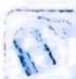

## 13.1 基本不等式放缩

## 研究密钥

放缩法是贯穿不等式证明始终的、指导变形方向的一种思考方法,它将不等式的一边放大或缩小,即寻找一个中间量,根据不等式的传递性得证.在寻找中间量时,根据不等式的特征,有时可以利用基本不等式来进行放大或缩小,转化为证明一个更强的结论.

用来放缩的基本不等式及其变形如下.

$$
(1) a, b \in \mathbf {R} _ {+}, \sqrt {a b} \leqslant \frac {a + b}{2} (\text {   二元   }), \sqrt [ 3 ]{a b c} \leqslant \frac {a + b + c}{3} (\text {   三元   });
$$

(2) $a^{2}+b^{2}\geqslant2ab(a,b\in\mathbb{R})$ ;

$$
(3) a b \leqslant \left(\frac {a + b}{2}\right) ^ {2} \leqslant \frac {a ^ {2} + b ^ {2}}{2}, \sqrt {a b} \leqslant \frac {a + b}{2} \leqslant \sqrt {\frac {a ^ {2} + b ^ {2}}{2}} (a > 0, b > 0).
$$

![[高中/总复习/专题/高考数学培优40讲/高考数学培优40讲-01-函数与导数/第13讲_导数中常见的放缩与估值/13_1_基本不等式放缩/例题/Q00010262.md]]
![[高中/总复习/专题/高考数学培优40讲/高考数学培优40讲-01-函数与导数/第13讲_导数中常见的放缩与估值/13_1_基本不等式放缩/例题/Q00010263.md]]
