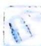

> [!faq]- 《高考数学培优40讲》例题解析
>
> > [!success]- **【答案】** 详见解析
>
> > [!note]- **【分析】**
> > 本题未单列分析。
>
> > [!note]- **【解析】**
> > 解析 求导得 $f'(x)=\frac{\mathrm{e}^{x}(x-1)-2x^{2}\cos x}{x^{2}}$ ，当 $x\in\left(\frac{\pi}{2},\frac{3\pi}{2}\right)$ 时， $\cos x<0,f'(x)>0$ ;
> > 当 $x \in \left(\frac{3\pi}{2}, +\infty\right)$ 时， $\mathrm{e}^{x}(x - 1) - 2x^{2}\cos x > \mathrm{e}^{x}(x - 1) - 2x^{2}$ .
> > 令 $\varphi(x) = \mathrm{e}^{x}(x - 1) - 2x^{2},\varphi'(x) = x\mathrm{e}^{x} - 4x,\varphi''(x) = (x + 1)\mathrm{e}^{x} - 4.$
> > 当 $x \in \left(\frac{3\pi}{2}, +\infty\right)$ 时, $\varphi''(x) > 0$ , $\varphi'(x)$ 单调递增, $\varphi'(x) > \varphi'\left(\frac{3\pi}{2}\right) > 0$ , 从而 $\varphi(x)$ 单调递增, $\varphi(x) > \varphi\left(\frac{3\pi}{2}\right) > 0$ .
> > 所以当 $x \in \left(\frac{3\pi}{2}, +\infty\right)$ 时， $f'(x) > 0$ ，从而在 $\left(\frac{\pi}{2}, +\infty\right)$ 上， $f'(x) > 0$ ，即 $f(x)$ 在 $\left(\frac{\pi}{2}, +\infty\right)$ 上单调递增。
> > 为了考虑 $f^{\prime}(x)$ 在 $\left(0, \frac{\pi}{2}\right)$ 上的符号，设 $g(x) = \mathrm{e}^{x}(x - 1) - 2x^{2}\cos x$ ，则 $g^{\prime}(x) = x(\mathrm{e}^{x} + 2x\sin x - 4\cos x)$ .
> > 设 $h(x)=\mathrm{e}^{x}+2x\sin x-4\cos x$ ，则 $h'(x)=\mathrm{e}^{x}+6\sin x+2x\cos x>0$ ，所以 $g'(x)$ 在 $\left(0,\frac{\pi}{2}\right)$ 上有唯一零点 $x_{1}$ ，即 $g(x)$ 在 $(0,x_{1})$ 上单调递减，在 $(x_{1},+\infty)$ 上单调递增，其中 $x_{1}\in\left(0,\frac{\pi}{2}\right)$ .
> > 又 $g(0)=-1<0, g\left(\frac{\pi}{2}\right)=\mathrm{e}^{\frac{\pi}{2}}\left(\frac{\pi}{2}-1\right)>0$ , 所以 $f'(x)$ 在 $\left(0,\frac{\pi}{2}\right)$ 上有唯一零点 $x_{0}$ ，即 $f(x)$ 在 $(0,x_{0})$ 上单调递减，在 $(x_{0},+\infty)$ 上单调递增，其中 $x_{0}\in\left(0,\frac{\pi}{2}\right)$ ，于是， $x_{0}$ 是 $f(x)$ 唯一的极小值点. $f(x_{0})=\frac{\mathrm{e}^{x_{0}}}{x_{0}}-2\sin x_{0}>\frac{\mathrm{e}x_{0}}{x_{0}}-2\sin\frac{\pi}{2}=\mathrm{e}-2,f(x_{0})<f\left(\frac{\pi}{2}\right)=\frac{\mathrm{e}^{\frac{\pi}{2}}}{\frac{\pi}{2}}-2\sin\frac{\pi}{2}=\frac{2\mathrm{e}^{\frac{\pi}{2}}}{\pi}-2<1.2.$
> > 评注
> > (1)解题过程中最后用到了 $\frac{2\mathrm{e}^{\frac{\pi}{2}}}{\pi} < 3.2$ ，要证明此式，只需证 $\ln 1.6\pi > \frac{\pi}{2}, \ln 1.6\pi > \ln 5 = \ln \frac{5}{4} + 2\ln 2 > 2 \times \frac{\frac{5}{4} - 1}{\frac{5}{4} + 1} + 2 \times 0.69 > \frac{\pi}{2}$ .
> > (2) $f(x)=\frac{\mathrm{e}^{x}}{x}-2\sin x$ 在 $(0,+\infty)$ 上的极小值的精确值为0.893617557.
> > 
