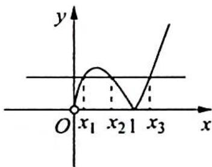
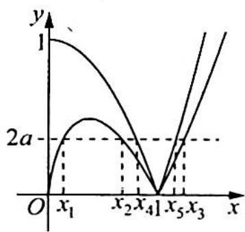

> [!faq]- 《高考数学培优40讲》例题解析
>
> > [!success]- **【答案】** 详见解析
>
> > [!note]- **【分析】**
> > 本题未单列分析。
>
> > [!note]- **【解析】**
> > 解析 (1) $h(x) = 0 \Leftrightarrow |f(x)| = 2a$ ，而 $f'(x) = 2\ln x + 2$ ，当 $0 < x < \frac{1}{e}$ 时， $f'(x) < 0$ ；当 $x > \frac{1}{e}$ 时， $f'(x) > 0$ ，则 $f(x)$ 在 $\left(0, \frac{1}{e}\right)$ 上单调递减，在 $\left(\frac{1}{e}, +\infty\right)$ 上单调递增。
> > 当 $x$ 趋于0时， $f(x)$ 趋于 $0, f\left(\frac{1}{e}\right) = -\frac{2}{e} < 0, f(1) = 0$ ，函数 $y = |f(x)|$ 的图像如图1所示。
> > 由图可得 $2a \in \left(0, \frac{2}{\mathrm{e}}\right)$ , 即 $a \in \left(0, \frac{1}{\mathrm{e}}\right)$ , 且 $0 < x_{1} < \frac{1}{\mathrm{e}} < x_{2} < 1 < x_{3}$ .
> > 
> > 令 $\varphi(x) = |f(x)| = -2x\ln x, x \in (0,1)$ , 于是得 $\varphi(x)$ 在 $\left(0, \frac{1}{e}\right)$ 上单调递增, 在 $\left(\frac{1}{e}, 1\right)$ 上单调递减.
> > 图 1
> > 令 $G(x)=\varphi(x)-\varphi\left(\frac{2}{e}-x\right), x\in\left(0,\frac{1}{e}\right)$ ，即 $G(x)=-2x\ln x+2\left(\frac{2}{e}-x\right)\ln\left(\frac{2}{e}-x\right), x\in$ $\left(0,\frac{1}{e}\right), G'(x)=-2\ln x-2x\cdot\frac{1}{x}-2\ln\left(\frac{2}{e}-x\right)+2\left(\frac{2}{e}-x\right)\cdot\frac{1}{\frac{2}{e}-x}\cdot(-1)=-2\ln x-$ $2\ln\left(\frac{2}{e}-x\right)-4=-2\ln x\left(\frac{2}{e}-x\right)-4.$
> > 当 $0 < x < \frac{1}{\mathrm{e}}$ 时， $x\left(\frac{2}{\mathrm{e}} - x\right) < \frac{1}{\mathrm{e}^2}$ ，于是得 $G'(x) > 0$ ，所以 $G(x)$ 在 $\left(0, \frac{1}{\mathrm{e}}\right)$ 上单调递增， $G(x) < G\left(\frac{1}{\mathrm{e}}\right) = 0$ ，而 $x_1 \in \left(0, \frac{1}{\mathrm{e}}\right)$ ，则 $\varphi(x_1) < \varphi\left(\frac{2}{\mathrm{e}} - x_1\right)$ .
> > 又 $\varphi(x_1) = \varphi(x_2) = 2a$ ，即 $\varphi(x_2) < \varphi\left(\frac{2}{e} - x_1\right)$ ，显然 $\frac{2}{e} - x_1 \in \left(\frac{1}{e}, 1\right), x_2 \in \left(\frac{1}{e}, 1\right)$ .
> > 因为 $\varphi(x)$ 在 $\left(\frac{1}{\mathrm{e}}, 1\right)$ 上单调递减，所以 $x_2 > \frac{2}{\mathrm{e}} - x_1, x_1 + x_2 > \frac{2}{\mathrm{e}}$ .
> > (2)由于 $\ln x + 1\leqslant x$ ，故 $(2x\ln x)'\leqslant (x^2 -1)'.$
> > 又当 $x = 1$ 时， $y_{1} = 2x\ln x = 0, y_{2} = x^{2} - 1 = 0$ ，所以当 $x \geqslant 1$ 时， $0 \leqslant 2x\ln x \leqslant x^{2} - 1$ .
> > 令 $F(x)=2\ln x-x+\frac{1}{x}$ ，当 0<x<1 时， $F'(x)=\frac{2}{x}-1-\frac{1}{x^{2}}=-\frac{(x-1)^{2}}{x^{2}}<0$ ，故 $F(x)=2\ln x-x+\frac{1}{x}$ 在 $(0,1]$ 上单调递减；当 $0<x\leqslant1$ 时， $F(x)\geqslant F(1)=0$ ，即 $2\ln x-x+\frac{1}{x}\geqslant0$ ，
> > 于是 $x^{2} - 1 \leqslant 2x\ln x < 0$ ，从而得 $\forall x > 0, |2x\ln x| \leqslant |x^{2} - 1|$ ，即 $|f(x)| \leqslant |x^{2} - 1|$ ，当且仅当 $x = 1$ 时取“=”，在同一坐标系中做出函数 $y = |f(x)|$ 与 $y = |x^{2} - 1|$ 的图像，如图2所示。
> > 
> > 由(1)知 $a \in \left(0, \frac{1}{\mathrm{e}}\right)$ , 设直线 $y = 2a$ 与 $y = |x^2 - 1|$ 在 $x > 0$ 时的交点的横坐标为 $x_4, x_5 (x_4 < 1 < x_5)$ .
> > 图 2
> > 观察图像知， $\frac{1}{e}<x_{2}<x_{4}<1<x_{5}<x_{3}$ ，即 $x_{3}-x_{2}>x_{5}-x_{4}$ ，由 $|x^{2}-1|=2a$ 得 $x_{4}=$ $\sqrt{1-2a}, x_{5}=\sqrt{1+2a}$ ，所以 $x_{3}-x_{2}>\sqrt{1+2a}-\sqrt{1-2a}$ .
