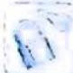

## 1.1 对称性及延拓

## 研究密钥

函数对称性是函数奇偶性的延伸, 函数奇偶性是函数对称性的特例. 和为定值 $2a$ 的两个自变量通过函数 $f$ 作用产生的函数值恒相等, 则 $f(x)$ 为轴对称函数, 其图像关于 $x=a$ 对称; 若通过函数 $f$ 作用产生的函数值之和恒为定值 $2b$ , 则为中心对称函数, 函数图像关于点 $(a,b)$ 对称, 否则不具有对称性.

于是, 函数 $y = f(x)$ 的图像关于点 $A(a, b)$ 对称的充要条件是 $f(x) + f(2a - x) = 2b$ ;

函数 $y = f(x)$ 的图像关于直线 $x = a$ 对称的充要条件是 $f(a + x) = f(a - x)$ ，或 $f(x) = f(2a - x)$ .

由此可知,两个自变量之和为定值是函数具有对称性的前提条件,即必要条件,这是判断函数对称性的首要着眼点.

![[高中/总复习/专题/高考数学培优40讲/高考数学培优40讲-01-函数与导数/第1讲_函数的性质及延拓/1_1_对称性及延拓/例题/Q00010051.md]]
![[高中/总复习/专题/高考数学培优40讲/高考数学培优40讲-01-函数与导数/第1讲_函数的性质及延拓/1_1_对称性及延拓/例题/Q00010052.md]]
![[高中/总复习/专题/高考数学培优40讲/高考数学培优40讲-01-函数与导数/第1讲_函数的性质及延拓/1_1_对称性及延拓/例题/Q00010053.md]]
![[高中/总复习/专题/高考数学培优40讲/高考数学培优40讲-01-函数与导数/第1讲_函数的性质及延拓/1_1_对称性及延拓/例题/Q00010054.md]]
![[高中/总复习/专题/高考数学培优40讲/高考数学培优40讲-01-函数与导数/第1讲_函数的性质及延拓/1_1_对称性及延拓/例题/Q00010055.md]]
![[高中/总复习/专题/高考数学培优40讲/高考数学培优40讲-01-函数与导数/第1讲_函数的性质及延拓/1_1_对称性及延拓/例题/Q00010056.md]]
![[高中/总复习/专题/高考数学培优40讲/高考数学培优40讲-01-函数与导数/第1讲_函数的性质及延拓/1_1_对称性及延拓/例题/Q00010057.md]]
![[高中/总复习/专题/高考数学培优40讲/高考数学培优40讲-01-函数与导数/第1讲_函数的性质及延拓/1_1_对称性及延拓/例题/Q00010058.md]]
![[高中/总复习/专题/高考数学培优40讲/高考数学培优40讲-01-函数与导数/第1讲_函数的性质及延拓/1_1_对称性及延拓/例题/Q00010059.md]]
![[高中/总复习/专题/高考数学培优40讲/高考数学培优40讲-01-函数与导数/第1讲_函数的性质及延拓/1_1_对称性及延拓/例题/Q00010060.md]]
