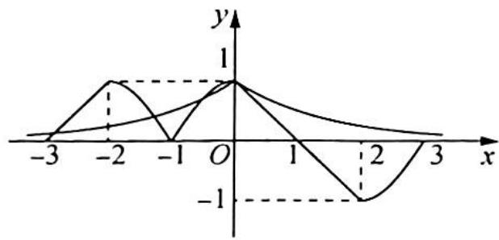
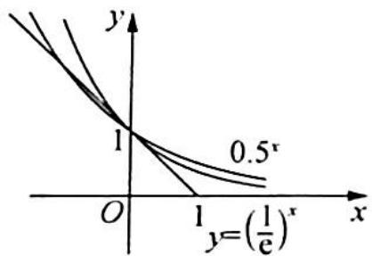

> [!faq]- 《高考数学培优40讲》例题解析
>
> > [!success]- **【答案】** 详见解析
>
> > [!note]- **【分析】**
> > 分析 ▶ 先根据①②可知函数的对称中心和对称轴,再分别画出 $f(x)$ 和 $g(x)$ 的部分图像,由图像观察交点的个数.
>
> > [!note]- **【解析】**
> > 解析 根据题意,① $f\left( {2 - x}\right)  + f\left( x\right)  = 0$ ,可得函数 $f\left( x\right)$ 的图像关于点(1,0)对称.
> > - **②**：$f(x-2)-f(-x)=0$ ，得函数 $f(x)$ 的图像关于x=-1对称，则函数 $f(x)$ 与 $g(x)$ 在区间 $[-3,3]$ 上的图像如图所示，由图可知 $f(x)$ 与 $g(x)$ 的图像在 $[-3,3]$ 上有4个交点.
> > 
> > 本题的关键是当 $x \in (0,1]$ 时， $f(x)$ 和 $g(x)$ 的图像没有公共点。
> > $\left(\frac{1}{2}\right)^x > \left(\frac{1}{\mathrm{e}}\right)^x \geqslant -x + 1, x > 0$ ，无零点。如图所示。
> > 
> > ## 研究反思
> > ## 利用函数周期性求值
> > 运用周期性求函数值的问题,一般在形式上具有“大数”函数值(如 f(2023))的求解问题.通过周期转化到“小数”或已知的区间上来求值.根据周期性求值的特点可延拓到类周期函数问题,因为二者的解题方向思路是一致的.
> > 我们知道,如果函数 $f(x)$ 满足 $f(x + T) = f(x)$ , 则函数 $f(x)$ 是周期函数, 那么我们再多想一步, 如果等式两边系数不相等, 在周期区间段进行了放缩, 这时虽不是周期函数, 但是许多方法是相通的. 请接下来思考下面的问题.
