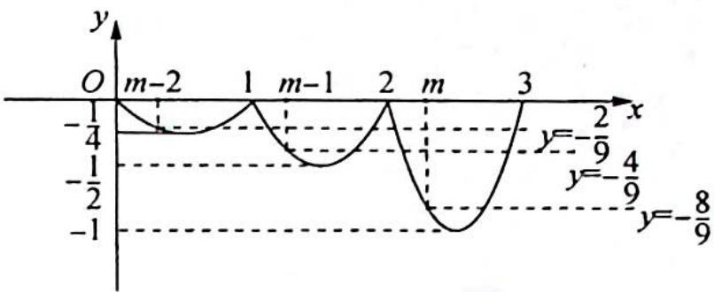

> [!faq]- 《高考数学培优40讲》例题解析
>
> > [!success]- **【答案】** B
>
> > [!note]- **【分析】**
> > 分析 ▶ 根据条件判断, 此函数为一个类周期函数, 画出函数图像. 类周期函数的特征是间隔相同的点的纵坐标为等比数列, 因此判断 $f(x) = -\frac{8}{9}$ 的解位于哪一区间, 利用数形结合求
> >
> > 出 $m$ 的临界值.
>
> > [!note]- **【解析】**
> > ## 解析 ▶ 由题意可得函数 $f(x)$ 的图像如图所示:
> > 根据图像可得 $f(x) = -\frac{8}{9}$ 的解位于区间[2,3]内，经类周期变换可以转化到区间[0,1]内，令 $f(x) = x(x - 1) = -\frac{2}{9}$ ，即 $x^{2} - x + \frac{2}{9} = 0$ ，解得 $x_{1} = \frac{1}{3}, x_{2} = \frac{2}{3}$ ，则 $m - 2 = \frac{1}{3}$ ，即 $m = \frac{7}{3}$ .
> > 
> > 根据图像可得 m 的取值范围是 $\left(-\infty, \frac{7}{3}\right]$ .
> >
> > 故选 **B**.
