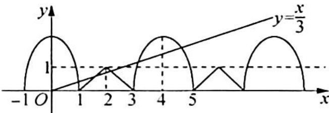

> [!faq]- 《高考数学培优40讲》例题解析
>
> > [!success]- **【答案】** B
>
> > [!note]- **【分析】**
> > 本题未单列分析。
>
> > [!note]- **【解析】**
> > 解析 ▶ 因为当 $x \in (-1, 1]$ 时, 将函数化为方程 $x^{2} + \frac{y^{2}}{m^{2}} = 1 (y \geqslant 0)$ , 实质上为一个半椭圆, 同时在坐标系中作出当 $x \in (1, 3]$ 的图像, 再根据周期性作出函数其他部分的图像, 其图像如图所示.
> > 由图易知直线 $y=\frac{x}{3}$ 与第二个椭圆 $(x-4)^{2}+\frac{y^{2}}{m^{2}}=1(y\geqslant0)$ 相交，而与第三个半椭圆 $(x-8)^{2}+\frac{y^{2}}{m^{2}}=1(y\geqslant0)$ 无公共点时，方程恰有 5 个实数解.
> > 
> > 将 $y = \frac{x}{3}$ 代入 $(x - 4)^2 + \frac{y^2}{m^2} = 1 (y \geqslant 0)$ ，得 $(9m^2 + 1)x^2 - 72m^2x + 135m^2 = 0$ ，令 $t = 9m^2 (t > 0)$ ，则有 $(t + 1)x^2 - 8tx + 15t = 0$ .
> > 由 $\Delta=(8t)^{2}-4\times15t(t+1)>0$ 得 t>15，由 $9m^{2}>15$ ，且 m>0 得 $m>\frac{\sqrt{15}}{3}$ .
> > 同样由 $y = \frac{x}{3}$ 与第三个半椭圆 $(x - 8)^2 + \frac{y^2}{m^2} = 1 (y \geqslant 0)$ 无交点，联立得 $(1 + 9m^2)x^2 - 144m^2x + 63 \times 9m^2 = 0$ .
> > 由 $\Delta < 0$ 得 $(144m^2)^2 - 4 \times 63 \times 9m^2 (1 + 9m^2) < 0$ ，解得 $m < \sqrt{7}$ .
> > 综上可知 $m \in \left(\frac{\sqrt{15}}{3}, \sqrt{7}\right)$ .
> >
> > 故选 **B**.
