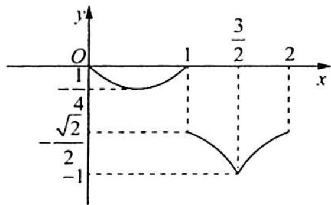

> [!faq]- 《高考数学培优40讲》例题解析
>
> > [!success]- **【答案】** B
>
> > [!note]- **【分析】**
> > 本题未单列分析。
>
> > [!note]- **【解析】**
> > 解析 由题意可得函数 $f(x)$ 在 $[0,2)$ 上的图像如图所示.
> > 当 $x \in [-4, -2)$ 时， $f(x) \geqslant \frac{m^2}{4} - m + \frac{1}{2}$ 恒成立，即 $f(x)_{\min} \geqslant \frac{m^2}{4} - m + \frac{1}{2}$ ，由图像可得函数在 $[0, 2)$ 上的最小值为 $-1$ 。
> > 
> > 根据 $f(x + 2) = 2f(x)$ 可得，函数在 $[-4, - 2)$ 上的最小值为 $-\frac{1}{4}$ ，所以 $-\frac{1}{4} \geqslant \frac{m^2}{4} - m + \frac{1}{2}$ ，即 $m^2 - 4m + 3 \leqslant 0$ ，解得 $1 \leqslant m \leqslant 3$ 。
> >
> > 故选 **B**.
