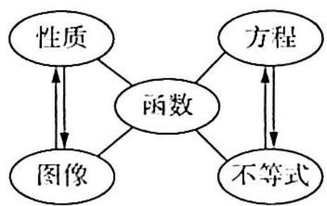

# 第1讲

# 函数的性质及延拓

函数是贯穿整个中学数学的一根主线, 其内容包括两个方面: 性质和图像. 其中, 函数的概念、定义域、值域、解析式、奇偶性、单调性、周期性是函数性质的重要组成部分, 也是高考重点考查的知识, 函数的图像主要包括基本初等函数的图像及图像变换, 函数知识的外延主要结合在方程 (零点)、不等式等方面. 处理这两类问题的主导思想是转化, 其转化的方向为借助函数的图像与性质求解. 在转化的路径上, 我们研发了函数解题思维 “∞” 图 (如图所示).

数量关系包括等量关系和不等量关系,它是数学的核心研究对象.从形式上看,函数方程(零点)呈现的是等量关系,函数不等式呈现的是不等量关系.处理数量关系的本质是建立数量关系的模型.函数这部分的重要数学思想是转化思想,将函数、方程、不等式问题转化为函数图像和函数性质求解.从更大范围来讲,学好函数是整个数学学习的基石,在数学的其他分支上都需要用函数的思想方法来处理问题.

![[高中/总复习/专题/高考数学培优40讲/高考数学培优40讲-01-函数与导数/第1讲_函数的性质及延拓/1_1_对称性及延拓/1_1_对称性及延拓.md]]
![[高中/总复习/专题/高考数学培优40讲/高考数学培优40讲-01-函数与导数/第1讲_函数的性质及延拓/1_2_单调性及延拓/1_2_单调性及延拓.md]]
![[高中/总复习/专题/高考数学培优40讲/高考数学培优40讲-01-函数与导数/第1讲_函数的性质及延拓/1_3_周期性及延拓/1_3_周期性及延拓.md]]
![[高中/总复习/专题/高考数学培优40讲/高考数学培优40讲-01-函数与导数/第1讲_函数的性质及延拓/训练_1/训练_1.md]]
