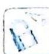

## 2.1 函数图像的变换

研究密钥

利用函数图像解决问题的基础是作函数图像,这往往成为同学们求解问题的拦路虎,作函数图像有两种常见的方法:

(1) 描点法. 当函数表达式 (或变形后的表达式) 是熟悉的基本函数时, 就可以根据这些函数的特征直接作出图像.

(2)图像变换法. 描点法是用有限点来逼近函数图像, 因而对于较复杂的函数图像不易作准确. 对于高中生, 除了会用描点法作图外, 还应掌握用变换法作图. 常见函数图像的变换有四种: 平移变换、翻折变换、对称变换、伸缩变换.

同学们经常遇到这样的问题,在存在多种变换的作图时,不知道应先进行哪一种变换.如作函数 $y=3\sin\left(2x+\frac{\pi}{3}\right)$ 的图像时,要用到左右平移、横向伸缩、纵向伸缩三种变换,究竟应先进行哪种变换?按不同变换顺序作出的图像是否一样?这是变换作图中的关键问题.

正确方法应按下面步骤进行:(1)找出母函数;(2)分解函数,按分解顺序作图.

![[高中/总复习/专题/高考数学培优40讲/高考数学培优40讲-01-函数与导数/第2讲_函数的图像及延拓/2_1_函数图像的变换/例题/Q00010080.md]]
![[高中/总复习/专题/高考数学培优40讲/高考数学培优40讲-01-函数与导数/第2讲_函数的图像及延拓/2_1_函数图像的变换/例题/Q00010081.md]]
