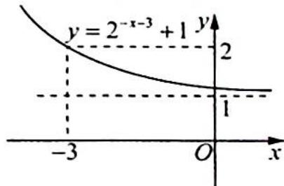
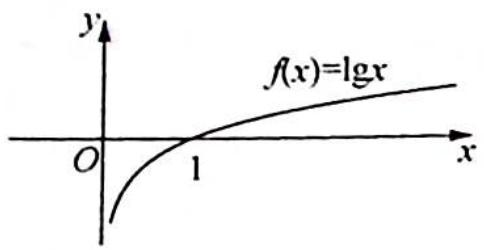
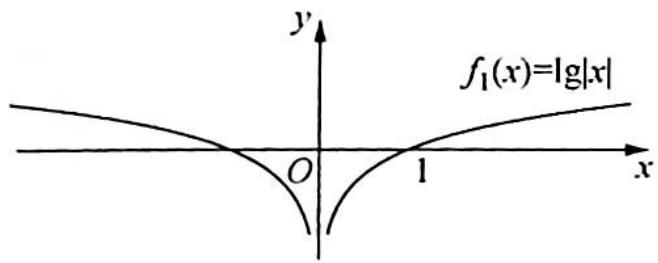
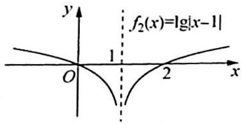
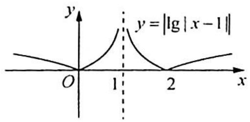
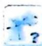

> [!faq]- 《高考数学培优40讲》例题解析
>
> > [!success]- **【答案】** 详见解析
>
> > [!note]- **【分析】**
> > 分析 (1) 基本图像是 $y = 2^x$ ，由 $y = 2^x$ 到 $y = 2^{-x - 3} + 1$ 有两种变换途径.
> >
> > 途径一： $y=2^{x}\Rightarrow y=2^{x-3}\Rightarrow y=2^{-x-3}\Rightarrow y=2^{-x-3}+1$ ;
> >
> > 途径二: $y = 2^x \Rightarrow y = 2^{-x} \Rightarrow y = 2^{-x-3} \Rightarrow y = 2^{-x-3} + 1$ , 按照分解的顺序依次作图.
> >
> > (2) 基本图像是 $y = \lg x, y = \lg x \Rightarrow y = \lg |x| \Rightarrow y = \lg |x - 1| \Rightarrow y = |\lg |x - 1||$ ，按照分解的顺序依次作图.
>
> > [!note]- **【解析】**
> > 解析 (1)途径一: $y = 2^x \Rightarrow y = 2^{x-3} \Rightarrow y = 2^{-x-3} \Rightarrow y = 2^{-x-3} + 1$ , 其中①平移变换(向右平移3个单位);
> > - **②**：对称变换(关于y轴对称);
> > - **③**：平移变换(向上平移1个单位).
> > 途径二: $y = 2^x \Rightarrow y = 2^{-x} \Rightarrow y = 2^{-x-3} \Rightarrow y = 2^{-x-3} + 1$ , 其中①对称变换(关于 $y$ 轴对称);
> > - **②**：平移变换(向左平移 3 个单位);
> > - **③**：平移变换(向上平移 1 个单位).
> > 无论用哪种途径,得到的最终的函数图像如图1所示:
> > (2) 设 $f(x) = \lg x \xrightarrow{\text{将 } f(x) = \lg x \text{ 的图像向左翻折}} f_1(x) = f(|x|) = \lg |x|$ $\xrightarrow{\text{将 } f_1(x) = |\lg |x| \text{ 的图像向右平移 1 个单位}} f_2(x) = f_1(x-1) = \lg |x-1|$
> > 
> > 图1
> > 将 $f_{2}(x) = \lg |x - 1|$ 的图像向上翻折 $y = |f_{2}(x)| = |\lg |x - 1||$ ，如图2所示：
> > 
> > 
> > 
> > 
> > 图2
> > ## 评注
> > 由上面作图的过程可以看出用图像变换法作函数图像应注意以下三点:①找出母函数;
> > - **②**：正确分解函数(每分解一次,应使图像产生一次基本变换);
> > - **③**：严格按照函数分解顺序作图,一个函数有多少种分解方法,就有多少种作图方法.
> > 第(1)问中两种变换途径中细节稍微不同,也是学生常犯错误之一,学生常认为从 “ $y=2^{-x}\Rightarrow y=2^{-x-3}$ ”是向右平移3个单位.辨别正误的办法是:函数 $y=f(x)$ 的图像如何变换,关键取决于解析式中x(或y)发生了什么变化.第②步中-x-3=-(x+3)是将x变换为 $x+3$ ,所以是向左平移3个单位.
> > 
> > ## 研究反思
> > ## 图像变换的顺序对最终结果有影响吗？
> > 在基础函数上进行变换时, 常见变换有平移、伸缩、翻折、旋转, 无论怎样分解函数进行图像变换, 最终结果是不受变换顺序影响的. 原因很简单, 因为一个函数的图像是确定的, 只要严格按照规则, 变换先后顺序不影响最后的结果.
> > 变换时要抓住这个规律:变换时都是以 x 自变量为中心变换,例如要由 x 变换为 $3x+2$ , 第一种方法是 x 先 +2, 即左移, 再由 x 变换为 3x, 因为是以 x 为中心; 第二种方法是先变换 3x, 再左移, 这里注意这时候 x 和 3 相连, 以 x 为中心则是 $3\left(x+\frac{2}{3}\right)$ , 左移 $\frac{2}{3}$ 个单位. 总结一下就是所有的平移是相对于 x 的系数是“1”, 若 x 的系数不是“1”, 必须要先化为“1”.
