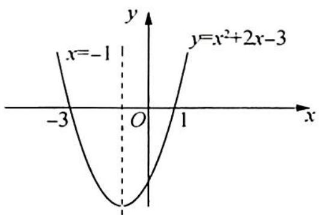
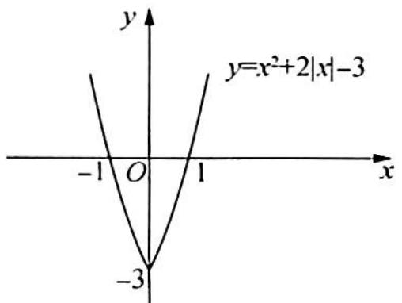
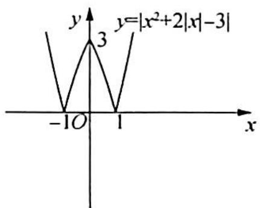
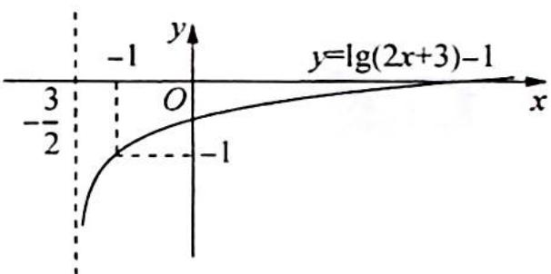

> [!faq]- 《高考数学培优40讲》例题解析
>
> > [!success]- **【答案】** 详见解析
>
> > [!note]- **【分析】**
> > 本题未单列分析。
>
> > [!note]- **【解析】**
> > 解析 (1)作出函数 $y = x^{2} + 2x - 3$ 的图像, 如图(a)所示; 保留 $x \geqslant 0$ 的部分, 再作其关于 $y$ 轴对称的图像, 两部分图像即函数 $y = x^{2} + 2|x| - 3$ 的图像, 如图 (b) 所示; 然后保留 $x$ 轴上方的部分, 将 $x$ 轴下方的图像翻折到 $x$ 轴上方, 即得到 $y = |x^{2} + 2|x| - 3|$ 的图像, 如图 (c) 所示.
> > (2) $y = \lg \frac{2x + 3}{10} = \lg (2x + 3) - 1$ , 基本图像是 $y = \lg x$ , 有以下两种变换途径:
> > 途径一: $y=\lg x$ (母函数) $\xrightarrow{①}y=\lg(x+3)$
> > $$
> > \xrightarrow {\text {②}} y = \lg (2 x + 3) \xrightarrow {\text {③}} y = \lg (2 x + 3) - 1.
> > $$
> > 途径二: $y = \lg x \xrightarrow{①} y = \lg (2x) \xrightarrow{②} y = \lg (2x + 3) \xrightarrow{③} y = \lg (2x + 3) - 1.$
> > 无论用哪种途径,得到的最终的函数图像如图(d)所示.
> > 
> > 图(a)
> > 
> > 图(b)
> > 
> > 图(c)
> > 
> > 图(d)
> > 评注
> > 注意函数 $y = 2^{|x - 1|}$ 与 $y = 2^{|x| - 1}$ 的图像在画法上的区别：
> > $$
> > y = 2 ^ {| x - 1 |} \Leftarrow y = 2 ^ {| x |} \Leftarrow y = 2 ^ {x}; y = 2 ^ {| x | - 1} \Leftarrow y = 2 ^ {x - 1} \Leftarrow y = 2 ^ {x}.
> > $$
