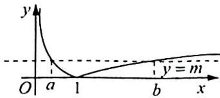

> [!faq]- 《高考数学培优40讲》例题解析
>
> > [!success]- **【答案】** C
>
> > [!note]- **【分析】**
> > 分析 首先作出 $f(x)$ 的图像, 因为 $f(a)=f(b)$ , 所以 0<a<1<b, 所以 $f(a)=|\lg a|=-\lg a$ , $f(b)=|\lg b|= \lg b$ , 根据 $f(a)=f(b)$ 可得关于 a, b 的等式, 要求的是 $a+2b$ , 把 b 用 a 表示, 实现消元的目的, 利用对勾函数的单调性求值域.
>
> > [!note]- **【解析】**
> > 解析 ➤ 首先作出 $f(x)$ 的图像, 如图所示.
> > 因为 $f(a)=f(b)$ ，所以 0<a<1<b，即 $f(a)=|\lg a|=-\lg a, f(b)=|\lg b|=\lg b$ ，所以 $-\lg a=\lg b, ab=1$ ，则 $a+2b=a+\frac{2}{a}$ 为对勾函数。
> > 因为 0 < a < 1 ，由对勾函数 $y = x + \frac{2}{x}$ 的单调性，可知 $a + 2b = a + \frac{2}{a}$ 在 (0,1) 上单调递减，故 $a + \frac{2}{a} > 1 + 2 = 3$ 。故选 C.
> > 
