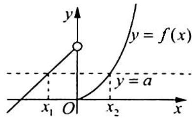

> [!faq]- 《高考数学培优40讲》例题解析
>
> > [!success]- **【答案】** B
>
> > [!note]- **【分析】**
> > 本题未单列分析。
>
> > [!note]- **【解析】**
> > 解析 画出函数 $y = f(x)$ 的图像, 如图所示.
> > 由题意可得 $f(x_1) = f(x_2)$ , 即 $x_1 + 1 = 2^{x_2} - 1$ , 可得 $x_1 = 2^{x_2} - 2$ , $x_1 + x_2 = 2^{x_2} + x_2 - 2$ .
> > 
> > 由图可知 $x_{1} \in [-1,0)$ , 即 $-1 \leqslant 2^{x_{2}} - 2 < 0$ , 可得 $1 \leqslant 2^{x_{2}} < 2$ , 则 $x_{2} \in [0,1)$ , 令 $g(x) = 2^{x} + x - 2, x \in [0,1)$ , 函数 $g(x)$ 是单调递增函数, 可得 $g(x)_{\min} = g(0) = -1, g(1) = 1$ , 则 $g(x) \in [-1,1)$ .
> >
> > 故选 **B**.
