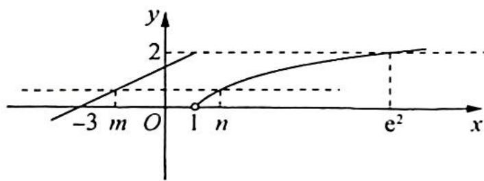

> [!faq]- 《高考数学培优40讲》例题解析
>
> > [!success]- **【答案】** C
>
> > [!note]- **【分析】**
> > 本题未单列分析。
>
> > [!note]- **【解析】**
> > ## 解析 由题意可得函数 $f(x)$ 的图像如图所示.
> > 根据图像可得， $-3 < m \leqslant 1, 1 < n \leqslant \mathrm{e}^2, \frac{1}{2} m + \frac{3}{2} = \ln n,$ $m = 2\ln n - 3$ ，所以 $n - m = n - 2\ln n + 3.$
> > 
> > 令 $g(n) = n - 2\ln n + 3$ ，则 $g'(n) = 1 - \frac{2}{n} = \frac{n - 2}{n}$ .
> > 当 $1 < n < 2$ 时, $g'(x) < 0$ , $g(x)$ 单调递减; 当 $2 < n < \mathrm{e}^2$ 时, $g'(x) > 0$ , $g(x)$ 单调递增, 所以 $g(x)_{\min} = g(2) = 5 - 2\ln 2$ .
> > 又 $g(1) = 4, g(\mathrm{e}^2) = \mathrm{e}^2 - 1 > 4$ ，所以 $g(x)_{\max} = \mathrm{e}^2 - 1$ 。
> >
> > 故选 **C**.
