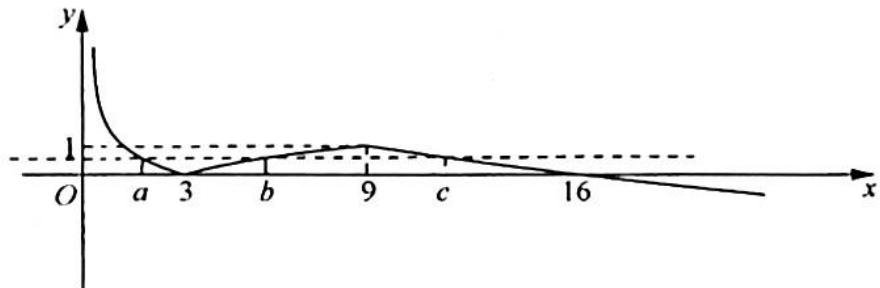

> [!faq]- 《高考数学培优40讲》例题解析
>
> > [!success]- **【答案】** 详见解析
>
> > [!note]- **【分析】**
> > 分析 ▶ 画出此分段函数的图像,拉一根等高线确定 a, b, c 的范围(可不妨设 a < b < c),再进一步挖掘条件 $f(a) = f(b)$ , 根据 a, b 的范围去掉绝对值符号, 化简转化 abc 的值.
>
> > [!note]- **【解析】**
> > 解析 由题意可得函数 $f(x)$ 的图像如图所示.
> > 
> > 由图像可得 $a < 3, 3 < b < 9, 9 < c < 16$ ，且 $1 - \log_3 a = \log_3 b - 1$ ，所以 $\log_3 a + \log_3 b = \log_3 ab = 2, ab = 9$ ，故 $abc \in (81, 144)$ .
