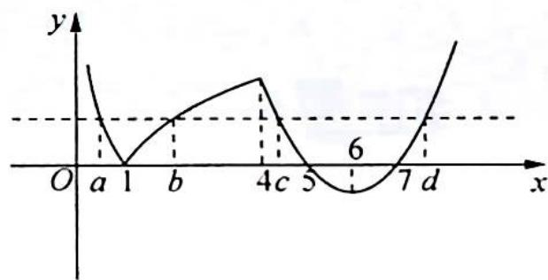

> [!faq]- 《高考数学培优40讲》例题解析
>
> > [!success]- **【答案】** 详见解析
>
> > [!note]- **【分析】**
> > 本题未单列分析。
>
> > [!note]- **【解析】**
> > 解析 由题意可得函数 $f(x)$ 的图像如图所示.
> > 由图像可得 $a < 1, 1 < b < 4, 4 < c < 5, 7 < d$ ，且 $\log_2\frac{1}{a} = \log_2b$ ，解得 $ab = 1, c + d = 6 \times 2 = 12$ ，所以 $abcd = cd = c(12 - c) = -(c - 6)^2 + 36$ . 当 $c = 4$ 时， $abcd$ 有最小值32；当 $c = 5$ 时， $abcd$ 有最大值35. 故填(32,35).
> > 
