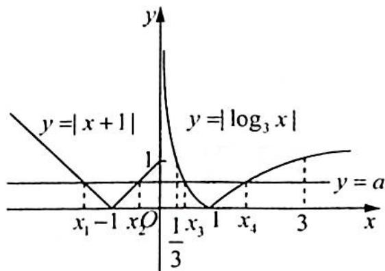

> [!faq]- 《高考数学培优40讲》例题解析
>
> > [!success]- **【答案】** D
>
> > [!note]- **【分析】**
> > 分析 ▶ 由方程 $f(x) = a$ 得到 $x_{1}, x_{2}$ 关于 $x = -1$ 对称, $x_{3}x_{4} = 1$ . 化简 $x_{3}(x_{1} + x_{2}) + \frac{1}{x_{3}^{2}x_{4}} = -2x_{3} + \frac{1}{x_{3}}$ , 再利用函数单调性求出范围.
>
> > [!note]- **【解析】**
> > 解析 作出函数 $f(x) = \begin{cases} |x + 1|, & x \leqslant 0 \\ |\log_3 x|, & x > 0 \end{cases}$ 的图像如图所示.
> > 因为方程 $f(x) = a$ 有四个不同的解 $x_{1}, x_{2}, x_{3}, x_{4}$ 且 $x_{1} < x_{2} < x_{3} < x_{4}$ .
> > 根据图像可知, 当 $x \leqslant 0$ 时, $f(x) = |x + 1|$ , 则横坐标为 $x_{1}$ 与 $x_{2}$ 两点的中点横坐标为 $x = -1$ , 即 $x_{1} + x_{2} = -2$ ; 当 $x > 0$ 时, 由于 $y = |\log_{3} x|$ 在 $(0,1)$ 上是减函数, 在 $(1,+\infty)$ 上是增函数, 又因为 $x_{3} < x_{4}$ , $|\log_{3} x_{3}| = |\log_{3} x_{4}|$ , 则 $\frac{1}{3} \leqslant x_{3} < 1 < x_{4}$ , 有 $-\log_{3} x_{3} = \log_{3} x_{4}$ , 即 $x_{3} x_{4} = 1$ .
> > 
> > 所以 $x_{3}(x_{1} + x_{2}) + \frac{1}{x_{3}^{2}x_{4}} = -2x_{3} + \frac{1}{x_{3}},\frac{1}{3}\leqslant x_{3} <   1.$
> > 令函数 $h(t) = -2t + \frac{1}{t}$ , 由反比例函数和一次函数的性质得函数 $h(t)$ 在 $(0,1)$ 上单调递减, 故 $h(t) > h(1) = -2 + 1 = -1$ , $h(t) \leqslant h\left(\frac{1}{3}\right) = -\frac{2}{3} + 3 = \frac{7}{3}$ , 所以 $-2x_{3} + \frac{1}{x_{3}} \in \left(-1, \frac{7}{3}\right]$ .
> >
> > 故选 **D**.
