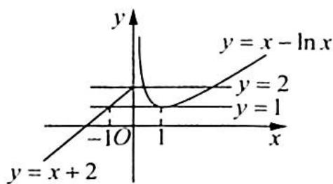

> [!faq]- 《高考数学培优40讲》例题解析
>
> > [!success]- **【答案】** 详见解析
>
> > [!note]- **【分析】**
> > 分析 ▶ 通过求导运算得到当 x>0 时 $f(x)$ 的图像, 从而得到 $f(x)$ 整体的图像; 由 $f(x_{1})=f(x_{2})$ 得到 $x_{1}$ 与 $x_{2}$ 的关系, 从而将问题转化为求解 $f^{2}(x_{2})-2f(x_{2})$ 的值域; 利用二次函数来求解出值域.
>
> > [!note]- **【解析】**
> > 解析 当 $x > 0$ 时, $f'(x) = 1 - \frac{1}{x} = \frac{x - 1}{x}$ .
> > 当 $x > 1$ 时, $f'(x) > 0$ ; 当 $0 < x < 1$ 时, $f'(x) < 0$ , 即 $f(x)$ 在 $(0,1)$ 上单调递减; 在 $(1, +\infty)$ 上单调递增, 所以 $f(x)_{\min} = f(1) = 1 - \ln 1 = 1$ , 可知函数图像如图所示.
> > 因为 $f(x_{1}) = f(x_{2}), x_{1} \leqslant 0, x_{2} > 0$ ，可知 $x_{1} + 2 = x_{2} - \ln x_{2}$ ，即 $x_{1} = x_{2} - \ln x_{2} - 2$ ，所以 $x_{1}f(x_{2}) = (x_{2} - \ln x_{2} - 2)(x_{2} - \ln x_{2}) = [f(x_{2}) - 2]\cdot f(x_{2}) = f^{2}(x_{2}) - 2f(x_{2})$ .
> > 
> > 由图像可知 $f(x_{2})\in [1,2]$ ，则 $[x_1f(x_2)]_{\min} = 1^2 -2\times 1 = -1;$ $[x_1f(x_2)]_{\max} = 2^2 -2\times 2 = 0.$ 所以 $x_{1}f(x_{2})\in [-1,0]$ .故填[-1,0].
