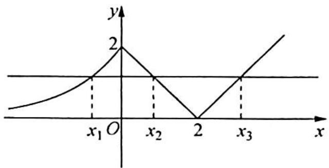
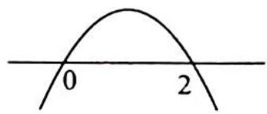

> [!faq]- 《高考数学培优40讲》例题解析
>
> > [!success]- **【答案】** B
>
> > [!note]- **【分析】**
> > 本题未单列分析。
>
> > [!note]- **【解析】**
> > 解析 ▶ 函数 $f(x)$ 的图像如图所示, 易知 $x_{2} + x_{3} = 4, x_{2} \in (0, 2)$ , 所以 $y = \frac{x_{2} f(x_{1})}{x_{2} + x_{3}} = \frac{x_{2} f(x_{2})}{4} = \frac{1}{4} x_{2}(2 - x_{2})$ .
> > 
> > 
> > 当 $x = 1$ 时， $y_{\max} = \frac{1}{4}$ . 故 $y \in \left(0, \frac{1}{4}\right]$ .
> >
> > 故选 **B**.
