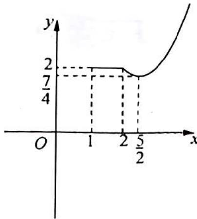

> [!faq]- 《高考数学培优40讲》例题解析
>
> > [!success]- **【答案】** D
>
> > [!note]- **【分析】**
> > 分析 将问题转化为 $F(x) = f(x) + f(2 - x)$ 与 $y = b$ 有4个交点, 求 $b$ 的取值范围问题. 作出 $F(x)$ 的图像. 由于 $F(x)$ 的对称轴为 $x = 1$ , 所以看 $b$ 取何值时与 $F(x)$ 在 $[1, +\infty)$ 上的图像有2个交点.
>
> > [!note]- **【解析】**
> > 解析 $y = f(x) - g(x) = f(x) - b + f(2 - x).$
> > 令 $f(x) - b + f(2 - x) = 0$ ，则 $b = f(x) + f(2 - x)$ ，令 $F(x) = f(x) + f(2 - x)$ ，函数 $F(x)$ 的图像关于 $x = 1$ 对称。
> > $F(x)=\left\{\begin{aligned}&2-|x|+2-|x-2|,&1\leqslant x\leqslant2\\ &(x-2)^{2}+2-|x-2|,&x>2\end{aligned}\right.$ ，即 $F(x)=\left\{\begin{aligned}&2-x+2-(2-x)=2,&1\leqslant x\leqslant2\\ &(x-2)^{2}+2-(x-2)=x^{2}-5x+8,&x>2\end{aligned}\right.$
> > 作出 $F(x)$ 的部分图像如图所示, 要使得函数 $y = f(x) - g(x)$ 恰有 4 个零点, 则 $b = F(x)$ 在 $x \geqslant 1$ 时有两个交点, 由图像可得 $\frac{7}{4} < b < 2$ . 故选 D.
> > 
