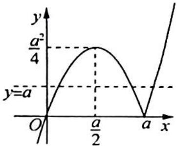
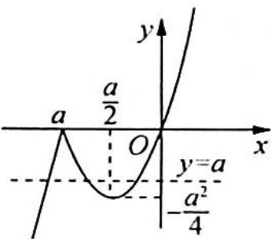

> [!faq]- 《高考数学培优40讲》例题解析
>
> > [!success]- **【答案】** C
>
> > [!note]- **【分析】**
> > 本题未单列分析。
>
> > [!note]- **【解析】**
> > 解析 ▶ 令 $f(x) = x \mid x - a \mid = \begin{cases} x^2 - ax, & x \geqslant a \\ ax - x^2, & x < a \end{cases}$ ，方程 $x \mid x - a \mid = a$ 有三个不同的实数根可转化为直线 $y = a$ 与函数 $f(x)$ 的图像有三个交点.
> > (1)当 $a > 0$ 时,画出 $f(x)$ 的图像,如图(a)所示,当 $0 < a < \frac{a^2}{4}$ ,即 $a > 4$ 时,直线 $y = a$ 与 $f(x)$ 有三个交点;
> > (2)当 $a < 0$ 时, 画出 $f(x)$ 的图像, 如图(b)所示, 当 $-\frac{a^2}{4} < a < 0$ , 即 $a < -4$ 时, 直线 $y = a$ 与 $f(x)$ 有三个交点;
> > (3)当 $a = 0$ 时,原方程为 $x \mid  x \mid   = 0$ ,只有一个根 $x = 0$ ,不符合题意.
> > 综上所述， $a$ 的取值范围为 $a > 4$ 或 $a < -4$ . 故选 C.
> > 
> > 图(a)
> > 
> > 图(b)
