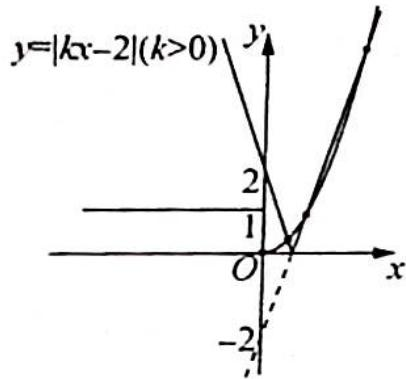
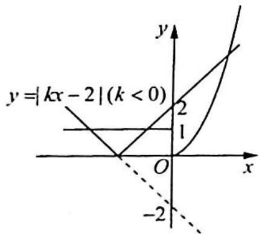
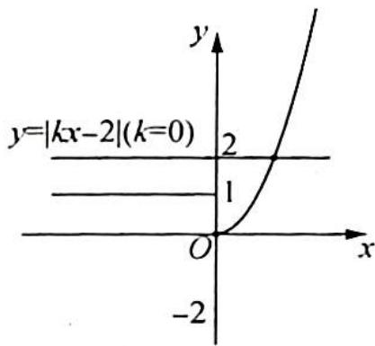

> [!faq]- 《高考数学培优40讲》例题解析
>
> > [!success]- **【答案】** D
>
> > [!note]- **【分析】**
> > 分析 ➤ 问题转化为求 $f(x)$ 的图像与 $\left|kx^{2}-2x\right|$ 的图像有 4 个交点时 k 的取值范围. 当 $x \neq 0$ 时转化为 $y_{1} = |kx - 2|$ 与 $y_{2} = \begin{cases} x^{2}, & x > 0 \\ 1, & x < 0 \end{cases}$ 有 3 个交点. 以下分 k > 0, k < 0, k = 0 几种情况下看图像交点个数为 3 时, 求 k 的取值范围.
>
> > [!note]- **【解析】**
> > 解析 ▶ 函数 $g(x)$ 恰有 4 个零点, 即 $f(x)$ 的图像和 $\left| kx^{2}-2x \right|$ 的图像有 4 个交点.
> > 令 $g(x) = 0$ ，得 $f(x) = |kx^{2} - 2x|$ ，即 $|kx^{2} - 2x| = \left\{ \begin{array}{ll}x^3, & x\geqslant 0\\ -x, & x <   0 \end{array} \right.$
> > 当 $x = 0$ 时, 满足方程, 即无论 $k$ 取何值, $g\left( x\right)$ 在 $x = 0$ 处都有一个零点;
> > 当 $x \neq 0$ 时，方程可以转化为 $|kx - 2| = \begin{cases} x^2, & x > 0 \\ 1, & x < 0 \end{cases}$ ，图像如图所示。
> > 
> > 
> > 
> > - **①**：当 $k > 0$ 时，要使得 $y_{1} = |kx - 2|$ 的图像和 $y_{2} = \left\{ \begin{array}{l} x^{2}, x > 0 \\ 1, x < 0 \end{array} \right.$ 的图像有3个交点，只需要满足 $\left\{ \begin{array}{l} y = kx - 2 \\ y = x^{2} \end{array} \right.$ 有两个根，即 $x^{2} - kx + 2 = 0$ 有两个根，所以 $\Delta = k^2 - 8 > 0$ ，解得 $k > 2\sqrt{2}$ .
> > - **②**：当 k<0 时， $|kx-2|$ 的图像和 $y_{2}$ 的图像始终有 3 个交点，所以 k<0 时都符合题意.
> > - **③**：当 k=0 时， $g(x)$ 只有两个零点 x=0 和 $x=\sqrt{2}$ ，不符合题意。
> > 综上所述， $k$ 的取值范围是 $(- \infty, 0) \cup (2 \sqrt{2}, + \infty)$ .
> >
> > 故选 **D**.
