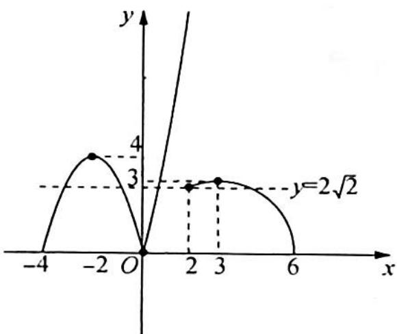

> [!faq]- 《高考数学培优40讲》例题解析
>
> > [!success]- **【答案】** D
>
> > [!note]- **【分析】**
> > 分析 ▶ $f(x)$ 与 $y=ax^{2}$ 有 5 个交点,由于 $y=ax^{2}$ 的图像在变化,不好确定 a 的范围,因此等式两边除以 $x^{2}$ ,分离出参数得到 $a=g(x)$ ,再通过上下平移水平直线,根据交点个数得 a 的取值范围.
>
> > [!note]- **【解析】**
> > 解析 ▶ 当 x=0 时, $f(x)-ax^{2}=0$ 恒成立,即无论 a 取何值, $f(x)-ax^{2}=0$ 在 x=0 处
> > 始终有一个根.当 $x\neq0$ 时,由 $f(x)-ax^{2}=0$ 可得 $a=\frac{f(x)}{x^{2}}=\left\{\begin{aligned}\frac{|x|}{x^{2}(x+4)},&-4<x<2\\\frac{1}{x^{2}}\sqrt{\frac{x^{3}}{6-x}},&2\leqslant x<6\end{aligned}\right.$
> > 即 $a = \begin{cases} \frac{1}{-x(x + 4)}, & -4 < x < 0 \\ \frac{1}{x(x + 4)}, & 0 < x < 2 \\ \frac{1}{x^2}\sqrt{\frac{x^3}{6 - x}}, & 2 \leqslant x < 6 \end{cases}$ , 所以 $\frac{1}{a} = \begin{cases} -x(x + 4), & -4 < x < 0 \\ x(x + 4), & 0 < x < 2 \\ \sqrt{x(6 - x)}, & 2 \leqslant x < 6 \end{cases}$ .
> > 要使得方程 $f(x) - ax^{2} = 0$ 有5个不等实根，只需要满足 $y = \frac{1}{a}$ 的图像与 $y = \left\{ \begin{array}{ll} - x(x + 4), & -4 < x < 0\\ x(x + 4), & 0 < x < 2\\ \sqrt{x(6 - x)}, & 2\leqslant x < 6 \end{array} \right.$ 的图像有4个交点，如图所示.
> > 
> > 由图像可得, $0<\frac{1}{a}<2\sqrt{2}$ 或 $\frac{1}{a}=3$ , 解得 $a>\frac{\sqrt{2}}{4}$ 或 $a=\frac{1}{3}$ .
> >
> > 故选 **D**.
