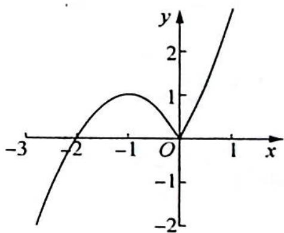

> [!faq]- 《高考数学培优40讲》例题解析
>
> > [!success]- **【答案】** D
>
> > [!note]- **【分析】**
> > 本题未单列分析。
>
> > [!note]- **【解析】**
> > ## 解析 ▶ 显然 x=0 是原方程的一个解, 且 $k \neq 0$ .
> > 当 $x \neq 0$ 时，分离参数 $\frac{1}{k} = |x|(x + 2)$ ，其中 $x \neq 0$ 且 $x \neq -2$ .
> > 由此可知方程 $\frac{1}{k} = |x|(x + 2)$ 在 $x \neq 0$ 且 $x \neq -2$ 的情形下有 3 个实数根.
> > 令 $g(x) = |x|(x + 2) = \begin{cases} x(x + 2), & x > 0 \\ -x(x + 2), & x < 0 \text{且} x \neq -2 \end{cases}$ ，作出函数 $g(x)$ 的图像如图所示。
> > 
> > 当 $0 < \frac{1}{k} < 1$ ，即 $k > 1$ 时，水平直线 $y = \frac{1}{k}$ 与 $y = g(x)$ 的图像恰有3个交点，即 $k$ 的取值范围为 $k > 1$ .
> >
> > 故选 **D**.
