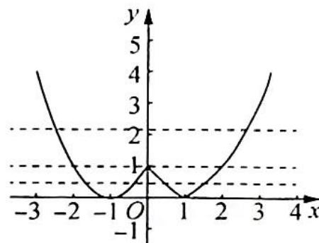

> [!faq]- 《高考数学培优40讲》例题解析
>
> > [!success]- **【答案】** C
>
> > [!note]- **【分析】**
> > 分析 ▶ 作出 $f(x)$ 的图像, 令 $t = f(x)$ , 根据方程确定至多存在两个 $t$ 的值, 使得 $y = t$ 与 $t = f(x)$ 有 7 个交点, 求出 $t$ 的值或取值范围, 进而转化为求方程 $t^2 - (m + 1)t + 2m^2 = 0$ 在 $t$ 的值或取值范围有解, 利用一元二次方程根的分布, 即可求解.
>
> > [!note]- **【解析】**
> > 解析 ▶ 作出函数 $f(x)$ 的图像, 如图所示.
> > 令 $t = f(x)$ , 方程 $f^{2}(x) - (m + 1)f(x) + 2m^{2} = 0$ , 即 $t^{2} - (m + 1)t + 2m^{2} = 0$ . 当 $t < 0$ 时, 方程 $t = f(x)$ 没有实数解; 当 $t = 0$ 或 $t > 1$ 时, 方程 $t = f(x)$ 有 2 个实数解; 当 $0 < t < 1$ , 方程有 4 个实数解; 当 $t = 1$ 时, 方程有 3 个解.
> > 
> > 要使方程 $f^{2}(x) - (m + 1)f(x) + 2m^{2} = 0$ 有七个不同的实根, 则方程 $t^{2} - (m + 1)t + 2m^{2} = 0$ 有一根为 1 , 另一根大于 0 且小于 1 , 当 $t = 1$ 时, 有 $2m^{2} - m = 0$ , 所以 $m = 0$ 或 $m = \frac{1}{2}$ .
> > 当 m=0 时， $t^{2}-t=0$ ，t=0 或 t=1，不满足题意；当 $m=\frac{1}{2}$ 时， $t^{2}-\frac{3}{2}t+\frac{1}{2}=0$ ，t=1 或 $t=\frac{1}{2}$ ，满足题意。
> > 所以 $m=\frac{1}{2}$ .
> >
> > 故选 **C**.
