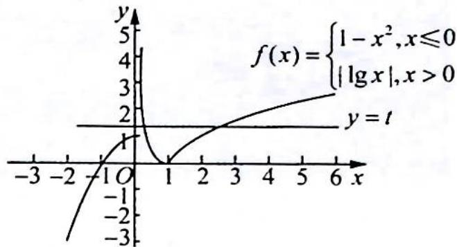

> [!faq]- 《高考数学培优40讲》例题解析
>
> > [!success]- **【答案】** 详见解析
>
> > [!note]- **【分析】**
> > 分析 ▶ 令 $t = f(x)$ , 则方程 $[f(x)]^{2} - 4mf(x) + m^{2} + 2 = 0$ 转化为 $t^{2} - 4mt + m^{2} + 2 = 0$ , 作出函数 $f(x)$ 的图像, 由题意得原问题等价于 $t^{2} - 4mt + m^{2} + 2 = 0$ 有两个大于 1 的不等实数根, 根据一元二次方程根的分布列出不等式组求解即可得到答案.
>
> > [!note]- **【解析】**
> > 解析 ▶ 作出函数 $f(x)$ 的图像, 如图所示.
> > 令 $t = f(x)$ , 则方程 $[f(x)]^2 - 4mf(x) + m^2 + 2 = 0$ 转化为 $t^2 - 4mt + m^2 + 2 = 0$ .
> > 由题意得,方程 $[f(x)]^2 - 4mf(x) + m^2 + 2 = 0$ 有 4 个不相等的实数根,而一元二次方程最多有两个实数根,即 $t^2 - 4mt + m^2 +$
> > 
> > 2=0 有两个大于 1 的不等实数根. 令 $h(t)=t^{2}-4mt+m^{2}+2$ ，则 $\left\{\begin{aligned}\Delta&=(-4m)^{2}-4(m^{2}+2)>0\\ -\frac{-4m}{2}>1\\ h(1)&=1^{2}-4m+m^{2}+2>0\end{aligned}\right.$ 解得 m>3 或 $\frac{\sqrt{6}}{3}<m<1$ ，则实数 m 的取值范围为 m>3 或 $\frac{\sqrt{6}}{3}<m<1$ .
