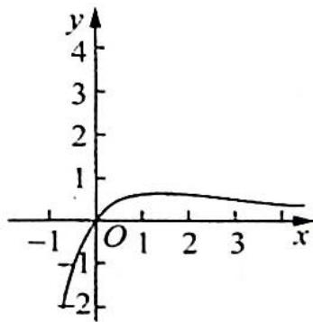

> [!faq]- 《高考数学培优40讲》例题解析
>
> > [!success]- **【答案】** C
>
> > [!note]- **【分析】**
> > 分析 ▶ 先画出函数 $f(x)$ 的图像, 令 $f(x)=t$ , 由题意中的恰有 3 个不同的实数解, 确定方程 $t^{2}+mt+m-1=0$ 的根的取值情况, 继而求出 m 的范围.
>
> > [!note]- **【解析】**
> > 解析 因为 $f(x)=\frac{x}{e^{x}}$ ，则 $f'(x)=\frac{e^{x}-xe^{x}}{(e^{x})^{2}}=\frac{1-x}{e^{x}}$ .
> > 当 $x \in (-\infty, 1)$ 时， $f'(x) > 0$ ， $f(x)$ 单调递增；当 $x \in (1, +\infty)$ 时， $f'(x) < 0$ ， $f(x)$ 单调递增。
> > 减，且 $f(x)_{\max} = f(1) = \frac{1}{\mathrm{e}}, f(x)$ 的图像如图所示. 令 $f(x) = t$ ，则有 $t^2 + mt + m - 1 = 0$ ，即 $(t + m - 1)(t + 1) = 0$ ，解得 $t_1 = 1 - m, t_2 = -1.$
> > 
> > 因为直线 $y=t_{2}$ 与函数图像有一个交点, 所以直线 $y=t_{1}$ 与函数图像有两个交点, 即 $0<1-m<\frac{1}{e}$ , 即 $1-\frac{1}{e}<m<1$ .
> >
> > 故选 **C**.
