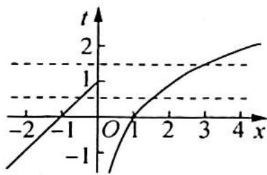

> [!faq]- 《高考数学培优40讲》例题解析
>
> > [!success]- **【答案】** 详见解析
>
> > [!note]- **【分析】**
> > 分析 ▶ 令 $t = f(x)$ , 则原方程的解变为方程组 $f(t) = a$ 的解, 作出函数 $y = f(x)$ , 采用数形结合法求解.
>
> > [!note]- **【解析】**
> > 解析 ▶ 函数 $g(x)$ 的零点即为方程 $g(x)=0$ 的解, 令 $t=f(x)$ , 则原方程的解变为方程组 $f(t)=a$ 的解, 作出函数 $y=f(x)$ 的图像, 如图所示.
> > 由图像可知, 当 $t > 1$ 时, 有唯一的 $x$ 与之对应; 当 $t \leqslant 1$ 时, 有两个不同的 $x$ 与之对应.
> > 
> > 由方程组 $f(t) = a$ 有三个不同的 $x$ 知, 需要有两个不同的 $t$ , 且一个 $t > 1$ , 一个 $t \leqslant 1$ , 结合图像可知, 当 $a \in (0,1]$ 时, 满足一个 $t \in (-1,0]$ , 一个 $t \in (1,2]$ , 符合要求.
> > 综上可知,实数 a 的取值范围为 $(0,1]$ .
