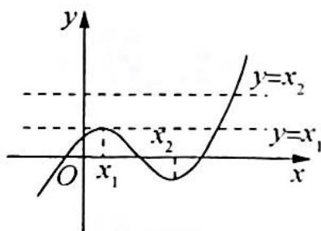
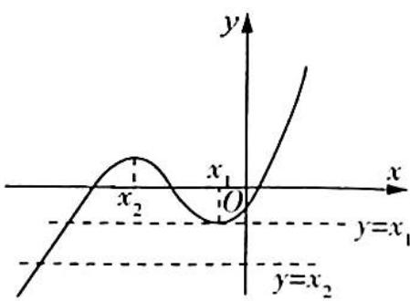

> [!faq]- 《高考数学培优40讲》例题解析
>
> > [!success]- **【答案】** A
>
> > [!note]- **【分析】**
> > 分析 ▶ 由题意求导结合极值点的性质可得原方程等价于 $f(x)=x_{1}$ 或 $f(x)=x_{2}$ , 按照 $x_{1}<x_{2}, x_{1}>x_{2}$ 分类, 作出函数图像, 数形结合即可得解.
>
> > [!note]- **【解析】**
> > 解析 由题意 $f'(x) = 3x^{2} + 2ax + b, x_{1}, x_{2}$ 为函数 $f(x)$ 的极值点，所以 $f'(x) = 3x^{2} + 2ax + b = 0$ 有两个解 $x_{1}, x_{2}$ ，即 $f(x) = x_{1}$ 或 $f(x) = x_{2}$ .
> > 当 $x_{1} < x_{2}$ 时, 则 $x_{1}$ 为函数 $f(x)$ 的极大值点, 且 $f(x_{1}) = x_{1}, x_{2}$ 为函数 $f(x)$ 的极小值点, 画出函数图像, 如图 1 所示. 此时 $f(x) = x_{1}$ 有两个不同实根, $f(x) = x_{2}$ 有一个实根, $3(f(x))^{2} + 2af(x) + b = 0$ 有三个不同实根.
> > 
> > 图1
> > 当 $x_{1} > x_{2}$ 时, 则 $x_{1}$ 为函数 $f(x)$ 的极小值点, 且 $f(x_{1}) = x_{1}, x_{2}$ 为函数 $f(x)$ 的极大值点, 画出函数图像, 如图2所示. 此时 $f(x) = x_{1}$ 有两个不同实根, $f(x) = x_{2}$ 有一个实根, $3(f(x))^{2} + 2af(x) + b = 0$ 有三个不同实根.
> > 
> > 综上所述, $3(f(x))^{2}+2af(x)+b=0$ 有三个不同实根. 故选A.
> > 图 2
