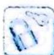

## 3.2 转化不等关系

## 研究密钥

构造函数研究不等式要抓住所解不等式的结构特征,适当构造函数。一般对称不等式都可构造出函数来进一步研究。函数构造好了,后面解题过程才会顺畅。先把原不等式转化为 $f(A)>f(B)$ 的形式;接下来再判断函数 $f(x)$ 的单调性,根据函数的单调性将抽象函数不等式中的函数符号“f”去掉,得到具体的不等式来解。

![[高中/总复习/专题/高考数学培优40讲/高考数学培优40讲-01-函数与导数/第3讲_函数构造与函数方程思想/函数构造/3_2_转化不等关系/例题/Q00010107.md]]
![[高中/总复习/专题/高考数学培优40讲/高考数学培优40讲-01-函数与导数/第3讲_函数构造与函数方程思想/函数构造/3_2_转化不等关系/例题/Q00010108.md]]
![[高中/总复习/专题/高考数学培优40讲/高考数学培优40讲-01-函数与导数/第3讲_函数构造与函数方程思想/函数构造/3_2_转化不等关系/例题/Q00010109.md]]
![[高中/总复习/专题/高考数学培优40讲/高考数学培优40讲-01-函数与导数/第3讲_函数构造与函数方程思想/函数构造/3_2_转化不等关系/例题/Q00010110.md]]
![[高中/总复习/专题/高考数学培优40讲/高考数学培优40讲-01-函数与导数/第3讲_函数构造与函数方程思想/函数构造/3_2_转化不等关系/例题/Q00010111.md]]
