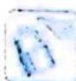
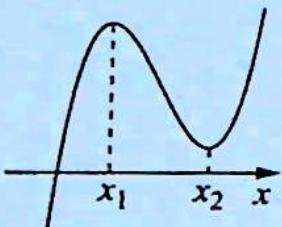
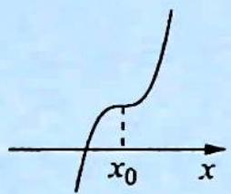
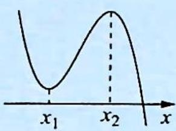
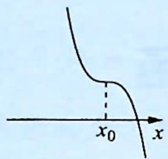

## 4.1 三次函数的图像

## 研究密钥

三次函数 $f(x)=ax^{3}+bx^{2}+cx+d(a\neq0)$ 的大致图像如“N”型, 其中 $\Delta$ 为导函数的判别式.

<table><tr><td rowspan="2"></td><td colspan="2">a&gt;0</td><td colspan="2">a&lt;0</td></tr><tr><td>Δ&gt;0</td><td>Δ≤0</td><td>Δ&gt;0</td><td>Δ≤0</td></tr><tr><td>图像</td><td></td><td></td><td></td><td></td></tr><tr><td>单调区间</td><td>在(-∞,x1),(x2,+∞)上是增函数;在(x1,x2)上是减函数</td><td>在R上是增函数</td><td>在(x1,x2)上是增函数;在(-∞,x1),(x2,+∞)上是减函数</td><td>在R上是减函数</td></tr><tr><td>极值</td><td>f(x)极大值=f(x1),f(x)极小值=f(x2)</td><td>无极值</td><td>f(x)极小值=f(x1),f(x)极大值=f(x2)</td><td>无极值</td></tr></table>

![[高中/总复习/专题/高考数学培优40讲/高考数学培优40讲-01-函数与导数/第4讲_三次函数的图像与性质/4_1_三次函数的图像/例题/Q00010120.md]]
![[高中/总复习/专题/高考数学培优40讲/高考数学培优40讲-01-函数与导数/第4讲_三次函数的图像与性质/4_1_三次函数的图像/例题/Q00010121.md]]
