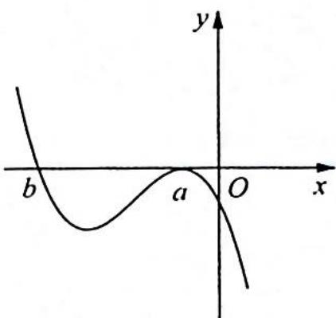
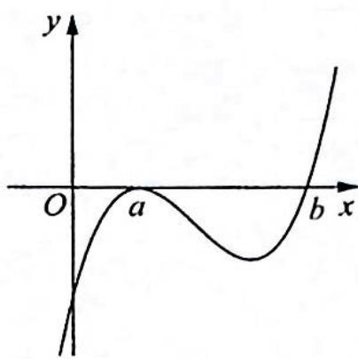

> [!faq]- 《高考数学培优40讲》例题解析
>
> > [!success]- **【答案】** D
>
> > [!note]- **【分析】**
> > 分析 当 a=b 时, $f(x)=a(x-a)^{3}$ 无极值点; 当 $a\neq b$ 时, 分 a<0 和 a>0 两种情况, 结合三次函数的性质可得答案.
>
> > [!note]- **【解析】**
> > 解析 ▶ 若 a=b，则 $f(x)=a(x-a)^{3}$ 为单调函数，无极值点，不符合题意，故 $a\neq b$ .
> > 所以 $f(x)$ 有 x=a 和 x=b 两个不同零点，且在 x=a 左右附近是不变号，在 x=b 左右附近是变号的。
> > 依题意, $x = a$ 为函数 $f(x) = a(x - a)^2 (x - b)$ 的极大值点, 所以在 $x = a$ 左右附近都是小于零的. 当 $a < 0$ 时, 有 $x > b$ , $f(x) \leqslant 0$ , 画出 $f(x)$ 的图像如图(a)所示. 由图可知 $b < a, a < 0$ , 故 $ab > a^2$ . 当 $a > 0$ 时, 有 $x > b$ , $f(x) > 0$ , 画出 $f(x)$ 的图像如图(b)所示. 由图可知 $b > a, a > 0$ , 故 $ab > a^2$ . 综上所述, $ab > a^2$ 成立. 故选 D.
> > 
> > 图(a)
> > 
> > 图(b)
