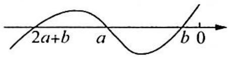
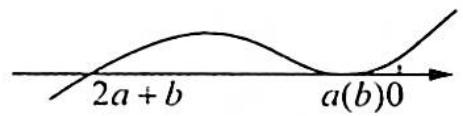
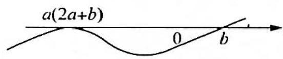
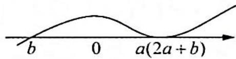

> [!faq]- 《高考数学培优40讲》例题解析
>
> > [!success]- **【答案】** C
>
> > [!note]- **【分析】**
> > 分析 ▶ 分 a > 0 与 a < 0 两种情况讨论, 结合三次函数的性质分析即可得到答案.
>
> > [!note]- **【解析】**
> > 解析 设 $f(x)=(x-a)(x-b)[x-(2a+b)], ab \neq 0.$
> > - **①**：当 $a, b, 2a + b$ 互不相等, 若对于 $\forall x \geqslant 0$ , 都有 $f(x) \geqslant 0$ , 则 $a < 0, b < 0$ . 如图 (a) 所示.
> > - **②**：当 $a, b, 2a + b$ 中有相等的情形, 则只能是 $a = b$ 或 $a = 2a + b$ . 当 $a = b$ 时, 如图 (b) 所示, 则 $a < 0, b < 0$ .
> > 当 $a = 2a + b$ 时，即 $a + b = 0$ ，如图(c)所示，显然不满足题意，故舍去.
> > 当 $a = 2a + b$ 时，即 $a + b = 0$ ，如图(d)所示，则 $b < 0$ 即可.
> > 
> > 图(a)
> > 
> > 图(b)
> > 
> > 图(c)
> > 
> > 图(d)
> > 综上所述,满足题设条件的 b<0. 故选 C.
> > ## 评注
> > 运用数形结合思想,抓住三次函数图像的特征,合理分类讨论,判断 a,b 的范围,得到共同性质.
> > 
